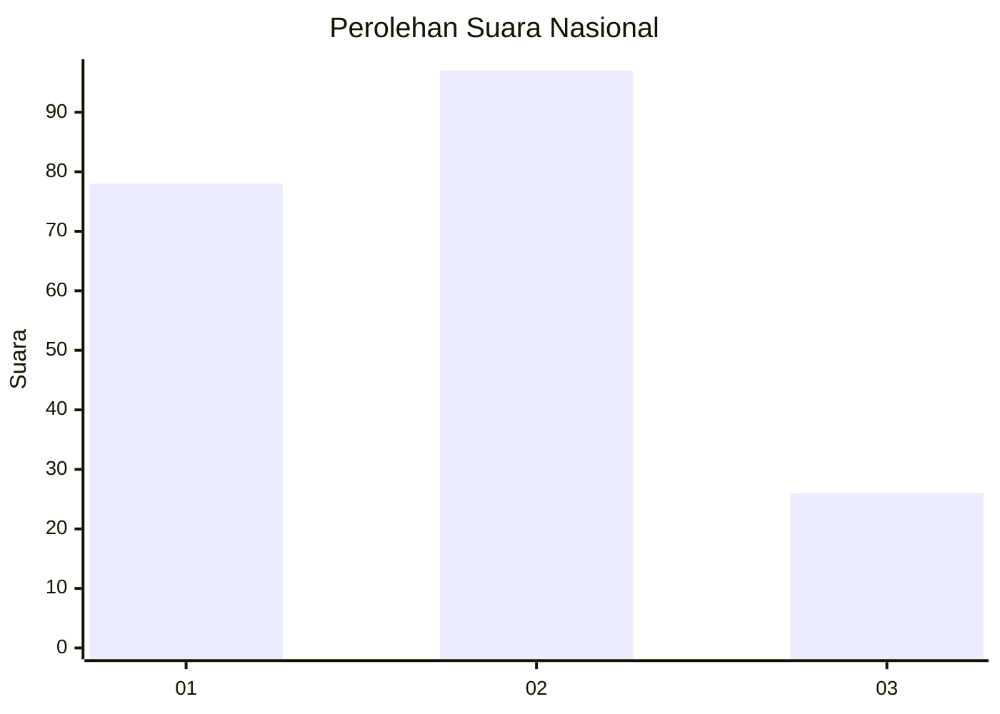
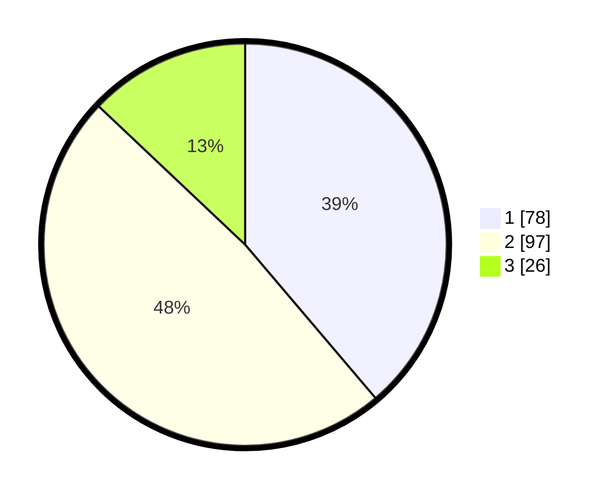

# Hasil

## Grafik

## Tabel

| No.    | Nama Paslon    | Suara | Suara (raw) | Persentase |
|:------ |:-------------- | -----:| -----------:| ----------:|
| 100025 | ANIES MUHAIMIN | 78    | [78][p-1]   | 38,81      |
| 100026 | PRABOWO GIBRAN | 97    | [97][p-2]   | 48,26      |
| 100027 | GANJAR MAHFUD  | 26    | [26][p-3]   | 12,94      |

[p-1]: https://github.com/gigit-pemilu/pemilu-2024/blob/main/pilpres/hitung-suara/sub/31-dki-jakarta/sub/72-jakarta-utara/sub/06-kelapa-gading/sub/1002-pegangsaan-dua/sub/015-tps/sub/paslon-1.txt
[p-2]: https://github.com/gigit-pemilu/pemilu-2024/blob/main/pilpres/hitung-suara/sub/31-dki-jakarta/sub/72-jakarta-utara/sub/06-kelapa-gading/sub/1002-pegangsaan-dua/sub/015-tps/sub/paslon-2.txt
[p-3]: https://github.com/gigit-pemilu/pemilu-2024/blob/main/pilpres/hitung-suara/sub/31-dki-jakarta/sub/72-jakarta-utara/sub/06-kelapa-gading/sub/1002-pegangsaan-dua/sub/015-tps/sub/paslon-3.txt

## Foto C Plano

https://sirekap-obj-formc.kpu.go.id/7c53/pemilu/ppwp/31/72/06/10/02/3172061002015-20240218-204418--6da0fbc6-adce-45c0-a441-7184d96db7cf.jpg

https://sirekap-obj-formc.kpu.go.id/7c53/pemilu/ppwp/31/72/06/10/02/3172061002015-20240218-204514--874bd931-6f54-4554-82a8-ec1cc6b90bd4.jpg

https://sirekap-obj-formc.kpu.go.id/7c53/pemilu/ppwp/31/72/06/10/02/3172061002015-20240218-204631--9faa8a41-c4c9-462a-aa50-9608ed715f9c.jpg

## Metadata

| Key        | Value               |
| ---------- | ------------------- |
| Time Stamp | 2024-02-21 19:00:00 |

