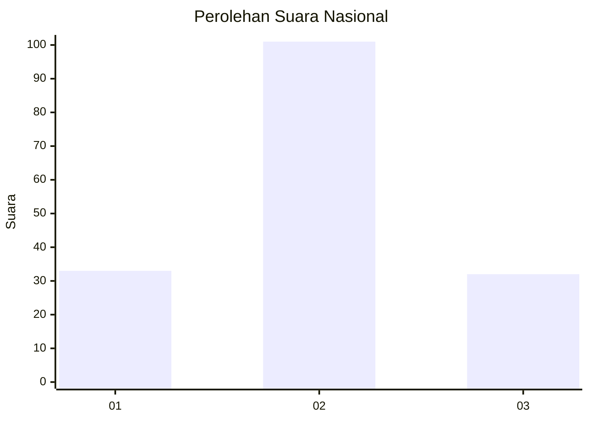
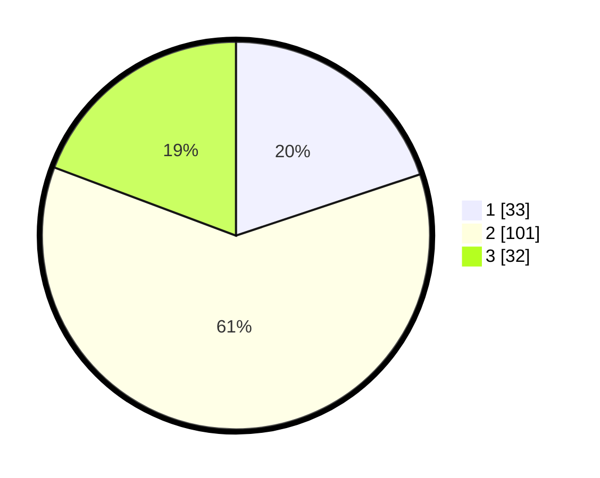

# Hasil

## Grafik

## Tabel

| No.    | Nama Paslon    | Suara | Suara (raw) | Persentase |
|:------ |:-------------- | -----:| -----------:| ----------:|
| 100025 | ANIES MUHAIMIN | 33    | [33][p-1]   | 19,88      |
| 100026 | PRABOWO GIBRAN | 101   | [101][p-2]  | 60,84      |
| 100027 | GANJAR MAHFUD  | 32    | [32][p-3]   | 19,28      |

[p-1]: https://github.com/gigit-pemilu/pemilu-2024/blob/main/pilpres/hitung-suara/sub/31-dki-jakarta/sub/72-jakarta-utara/sub/06-kelapa-gading/sub/1002-pegangsaan-dua/sub/021-tps/sub/paslon-1.txt
[p-2]: https://github.com/gigit-pemilu/pemilu-2024/blob/main/pilpres/hitung-suara/sub/31-dki-jakarta/sub/72-jakarta-utara/sub/06-kelapa-gading/sub/1002-pegangsaan-dua/sub/021-tps/sub/paslon-2.txt
[p-3]: https://github.com/gigit-pemilu/pemilu-2024/blob/main/pilpres/hitung-suara/sub/31-dki-jakarta/sub/72-jakarta-utara/sub/06-kelapa-gading/sub/1002-pegangsaan-dua/sub/021-tps/sub/paslon-3.txt

## Foto C Plano

https://sirekap-obj-formc.kpu.go.id/8f2d/pemilu/ppwp/31/72/06/10/02/3172061002021-20240219-142344--89b96b55-3193-4df9-9a4a-892863b15a55.jpg

https://sirekap-obj-formc.kpu.go.id/8f2d/pemilu/ppwp/31/72/06/10/02/3172061002021-20240219-142606--34692551-04bd-4057-8021-34513566682a.jpg

https://sirekap-obj-formc.kpu.go.id/8f2d/pemilu/ppwp/31/72/06/10/02/3172061002021-20240219-142652--f760273f-51d5-4f6e-b6c0-50965833a993.jpg

## Metadata

| Key        | Value               |
| ---------- | ------------------- |
| Time Stamp | 2024-02-21 20:00:00 |

