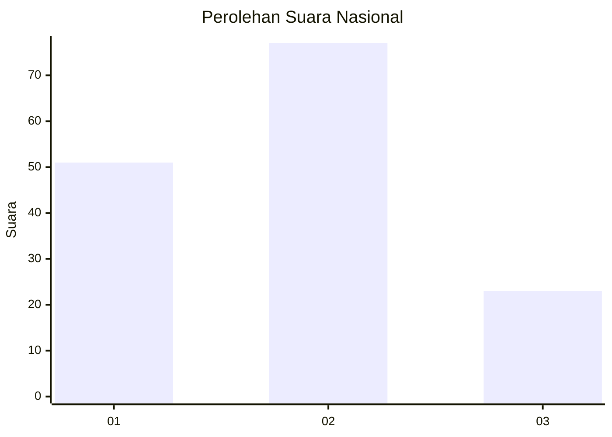
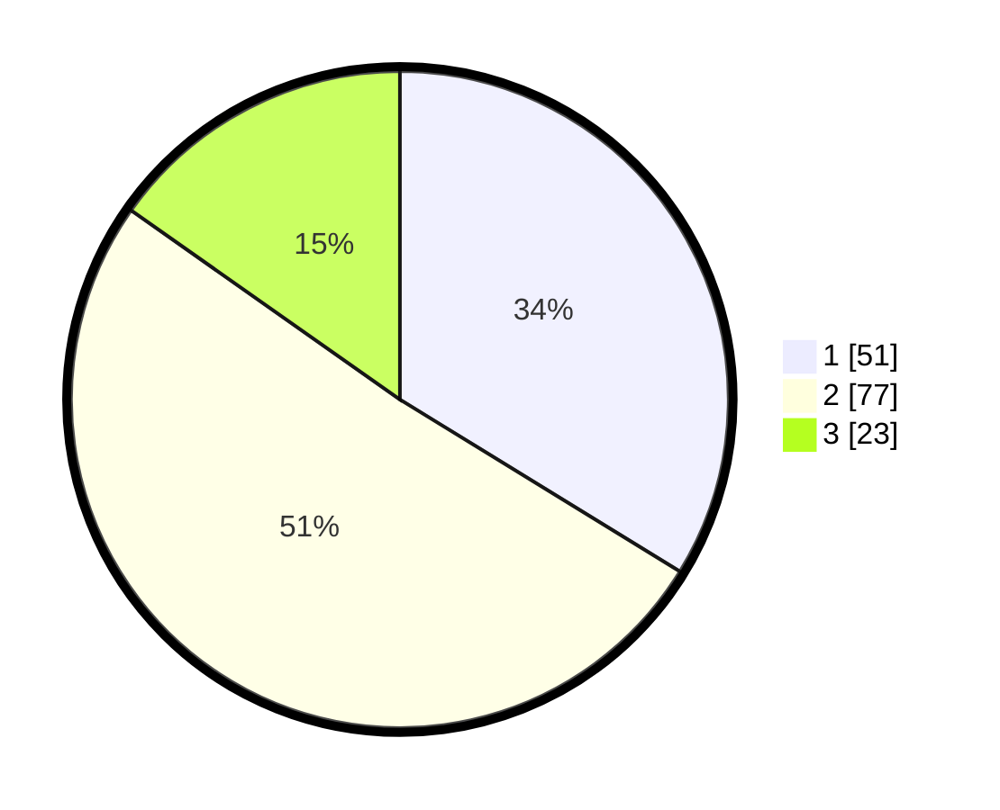

# Hasil

## Grafik

## Tabel

| No.    | Nama Paslon    | Suara | Suara (raw) | Persentase |
|:------ |:-------------- | -----:| -----------:| ----------:|
| 100025 | ANIES MUHAIMIN | 51    | [51][p-1]   | 33,77      |
| 100026 | PRABOWO GIBRAN | 77    | [77][p-2]   | 50,99      |
| 100027 | GANJAR MAHFUD  | 23    | [23][p-3]   | 15,23      |

[p-1]: https://github.com/gigit-pemilu/pemilu-2024/blob/main/pilpres/hitung-suara/sub/31-dki-jakarta/sub/72-jakarta-utara/sub/06-kelapa-gading/sub/1002-pegangsaan-dua/sub/027-tps/sub/paslon-1.txt
[p-2]: https://github.com/gigit-pemilu/pemilu-2024/blob/main/pilpres/hitung-suara/sub/31-dki-jakarta/sub/72-jakarta-utara/sub/06-kelapa-gading/sub/1002-pegangsaan-dua/sub/027-tps/sub/paslon-2.txt
[p-3]: https://github.com/gigit-pemilu/pemilu-2024/blob/main/pilpres/hitung-suara/sub/31-dki-jakarta/sub/72-jakarta-utara/sub/06-kelapa-gading/sub/1002-pegangsaan-dua/sub/027-tps/sub/paslon-3.txt

## Foto C Plano

https://sirekap-obj-formc.kpu.go.id/7abc/pemilu/ppwp/31/72/06/10/02/3172061002027-20240219-201550--82d6c5af-112f-4ea6-ab29-1cc79acf811b.jpg

https://sirekap-obj-formc.kpu.go.id/7abc/pemilu/ppwp/31/72/06/10/02/3172061002027-20240219-201607--fcef3647-8832-49de-84e6-1e1417a16d5a.jpg

https://sirekap-obj-formc.kpu.go.id/7abc/pemilu/ppwp/31/72/06/10/02/3172061002027-20240219-201641--85285f9a-c4f9-44b5-ab16-ea7d466f10eb.jpg

## Metadata

| Key        | Value               |
| ---------- | ------------------- |
| Time Stamp | 2024-02-21 20:00:00 |

