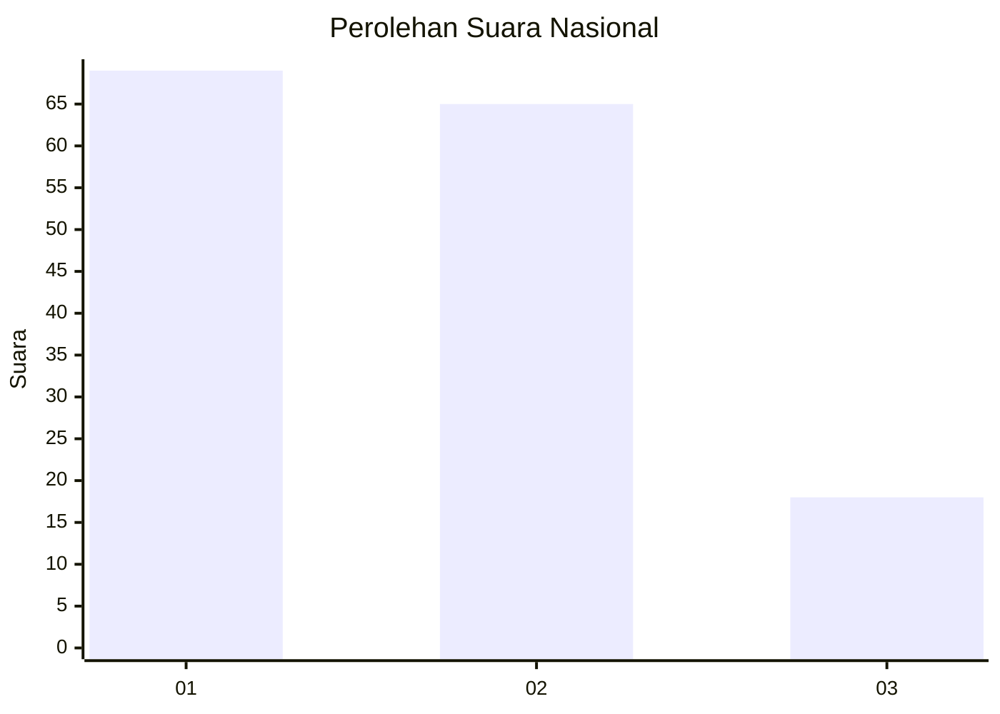
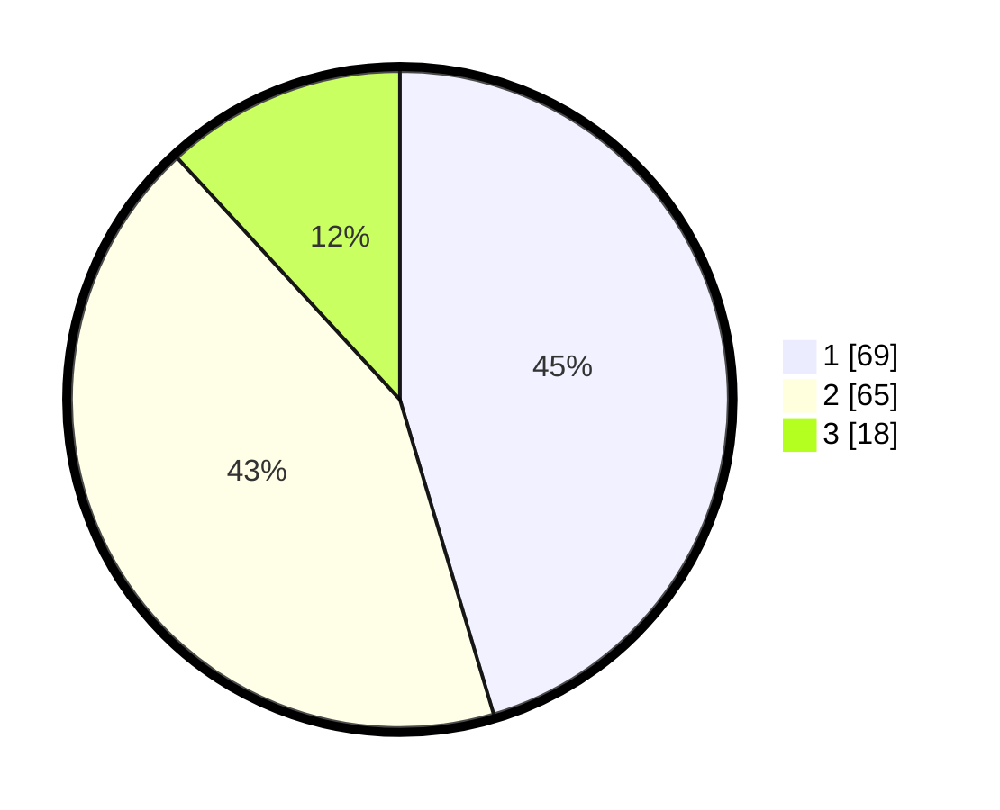

# Hasil

## Grafik

## Tabel

| No.    | Nama Paslon    | Suara | Suara (raw) | Persentase |
|:------ |:-------------- | -----:| -----------:| ----------:|
| 100025 | ANIES MUHAIMIN | 69    | [69][p-1]   | 45,39      |
| 100026 | PRABOWO GIBRAN | 65    | [65][p-2]   | 42,76      |
| 100027 | GANJAR MAHFUD  | 18    | [18][p-3]   | 11,84      |

[p-1]: https://github.com/gigit-pemilu/pemilu-2024/blob/main/pilpres/hitung-suara/sub/31-dki-jakarta/sub/72-jakarta-utara/sub/06-kelapa-gading/sub/1002-pegangsaan-dua/sub/033-tps/sub/paslon-1.txt
[p-2]: https://github.com/gigit-pemilu/pemilu-2024/blob/main/pilpres/hitung-suara/sub/31-dki-jakarta/sub/72-jakarta-utara/sub/06-kelapa-gading/sub/1002-pegangsaan-dua/sub/033-tps/sub/paslon-2.txt
[p-3]: https://github.com/gigit-pemilu/pemilu-2024/blob/main/pilpres/hitung-suara/sub/31-dki-jakarta/sub/72-jakarta-utara/sub/06-kelapa-gading/sub/1002-pegangsaan-dua/sub/033-tps/sub/paslon-3.txt

## Foto C Plano

https://sirekap-obj-formc.kpu.go.id/6ba4/pemilu/ppwp/31/72/06/10/02/3172061002033-20240220-163907--30d58440-002d-42ec-b877-e89436b0028c.jpg

https://sirekap-obj-formc.kpu.go.id/6ba4/pemilu/ppwp/31/72/06/10/02/3172061002033-20240220-163932--4740520e-0899-4664-97d8-928e801009ae.jpg

https://sirekap-obj-formc.kpu.go.id/6ba4/pemilu/ppwp/31/72/06/10/02/3172061002033-20240220-164001--23e6c4a2-7c85-4f06-a282-e00366f35ebb.jpg

## Metadata

| Key        | Value               |
| ---------- | ------------------- |
| Time Stamp | 2024-02-21 20:00:00 |

