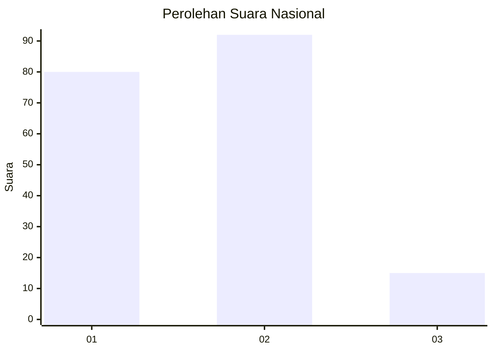
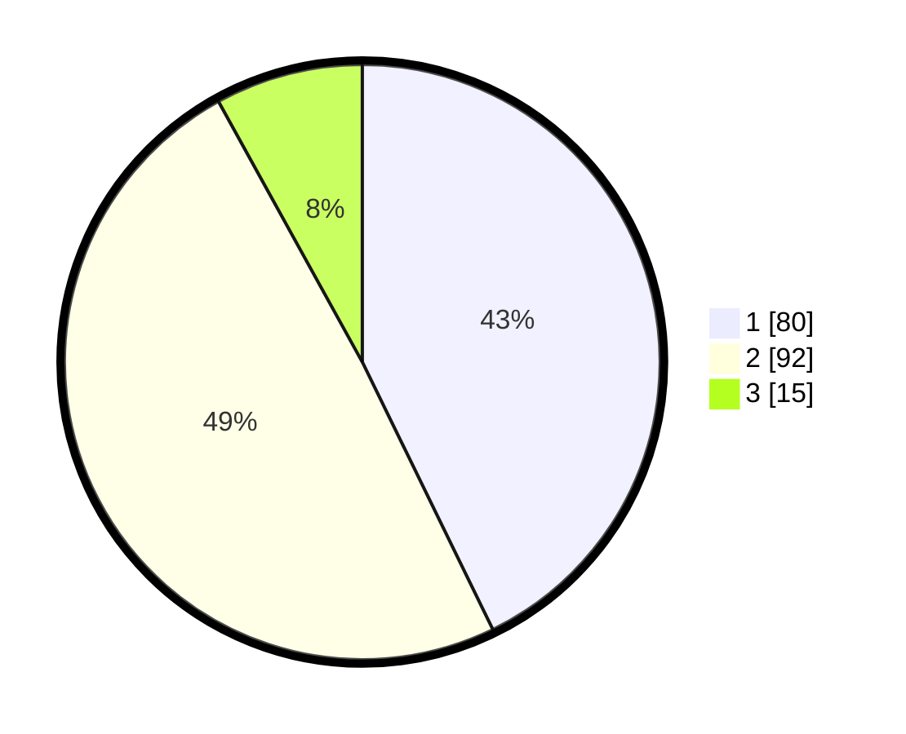

# Hasil

## Grafik

## Tabel

| No.    | Nama Paslon    | Suara | Suara (raw) | Persentase |
|:------ |:-------------- | -----:| -----------:| ----------:|
| 100025 | ANIES MUHAIMIN | 80    | [80][p-1]   | 42,78      |
| 100026 | PRABOWO GIBRAN | 92    | [92][p-2]   | 49,20      |
| 100027 | GANJAR MAHFUD  | 15    | [15][p-3]   | 8,02       |

[p-1]: https://github.com/gigit-pemilu/pemilu-2024/blob/main/pilpres/hitung-suara/sub/31-dki-jakarta/sub/72-jakarta-utara/sub/06-kelapa-gading/sub/1002-pegangsaan-dua/sub/038-tps/sub/paslon-1.txt
[p-2]: https://github.com/gigit-pemilu/pemilu-2024/blob/main/pilpres/hitung-suara/sub/31-dki-jakarta/sub/72-jakarta-utara/sub/06-kelapa-gading/sub/1002-pegangsaan-dua/sub/038-tps/sub/paslon-2.txt
[p-3]: https://github.com/gigit-pemilu/pemilu-2024/blob/main/pilpres/hitung-suara/sub/31-dki-jakarta/sub/72-jakarta-utara/sub/06-kelapa-gading/sub/1002-pegangsaan-dua/sub/038-tps/sub/paslon-3.txt

## Foto C Plano

https://sirekap-obj-formc.kpu.go.id/3244/pemilu/ppwp/31/72/06/10/02/3172061002038-20240221-132421--bb1bb0de-e80e-4821-9566-1bcb44e3ec42.jpg

https://sirekap-obj-formc.kpu.go.id/3244/pemilu/ppwp/31/72/06/10/02/3172061002038-20240221-132505--86e86315-1900-4e3c-bb5b-98e23fa3a8de.jpg

https://sirekap-obj-formc.kpu.go.id/3244/pemilu/ppwp/31/72/06/10/02/3172061002038-20240221-132538--95a02065-d072-46ab-889f-9a8df2574cba.jpg

## Metadata

| Key        | Value               |
| ---------- | ------------------- |
| Time Stamp | 2024-02-21 15:00:00 |

