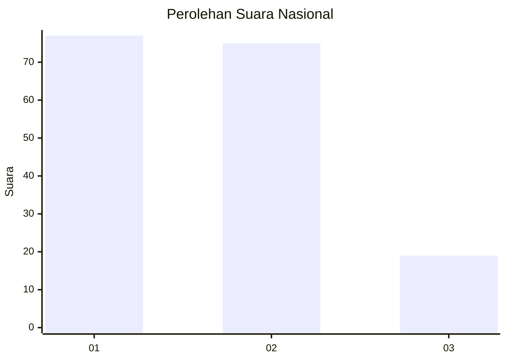
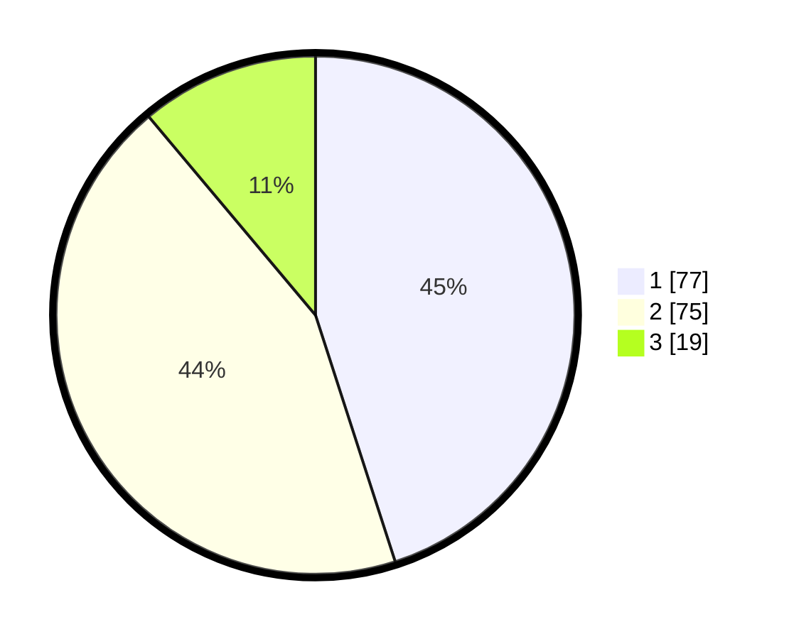

# Hasil

## Grafik

## Tabel

| No.    | Nama Paslon    | Suara | Suara (raw) | Persentase |
|:------ |:-------------- | -----:| -----------:| ----------:|
| 100025 | ANIES MUHAIMIN | 77    | [77][p-1]   | 45,03      |
| 100026 | PRABOWO GIBRAN | 75    | [75][p-2]   | 43,86      |
| 100027 | GANJAR MAHFUD  | 19    | [19][p-3]   | 11,11      |

[p-1]: https://github.com/gigit-pemilu/pemilu-2024/blob/main/pilpres/hitung-suara/sub/31-dki-jakarta/sub/72-jakarta-utara/sub/06-kelapa-gading/sub/1002-pegangsaan-dua/sub/040-tps/sub/paslon-1.txt
[p-2]: https://github.com/gigit-pemilu/pemilu-2024/blob/main/pilpres/hitung-suara/sub/31-dki-jakarta/sub/72-jakarta-utara/sub/06-kelapa-gading/sub/1002-pegangsaan-dua/sub/040-tps/sub/paslon-2.txt
[p-3]: https://github.com/gigit-pemilu/pemilu-2024/blob/main/pilpres/hitung-suara/sub/31-dki-jakarta/sub/72-jakarta-utara/sub/06-kelapa-gading/sub/1002-pegangsaan-dua/sub/040-tps/sub/paslon-3.txt

## Foto C Plano

https://sirekap-obj-formc.kpu.go.id/d424/pemilu/ppwp/31/72/06/10/02/3172061002040-20240221-150102--e68830f4-f08c-48d1-9922-d2f3a8667fb5.jpg

https://sirekap-obj-formc.kpu.go.id/d424/pemilu/ppwp/31/72/06/10/02/3172061002040-20240221-150259--2c7c74c9-5150-4630-b50e-543f3b36bc8b.jpg

https://sirekap-obj-formc.kpu.go.id/d424/pemilu/ppwp/31/72/06/10/02/3172061002040-20240221-150323--31eb2505-b8d3-4bd3-9357-e9695402a2ef.jpg

## Metadata

| Key        | Value               |
| ---------- | ------------------- |
| Time Stamp | 2024-02-21 20:00:00 |

