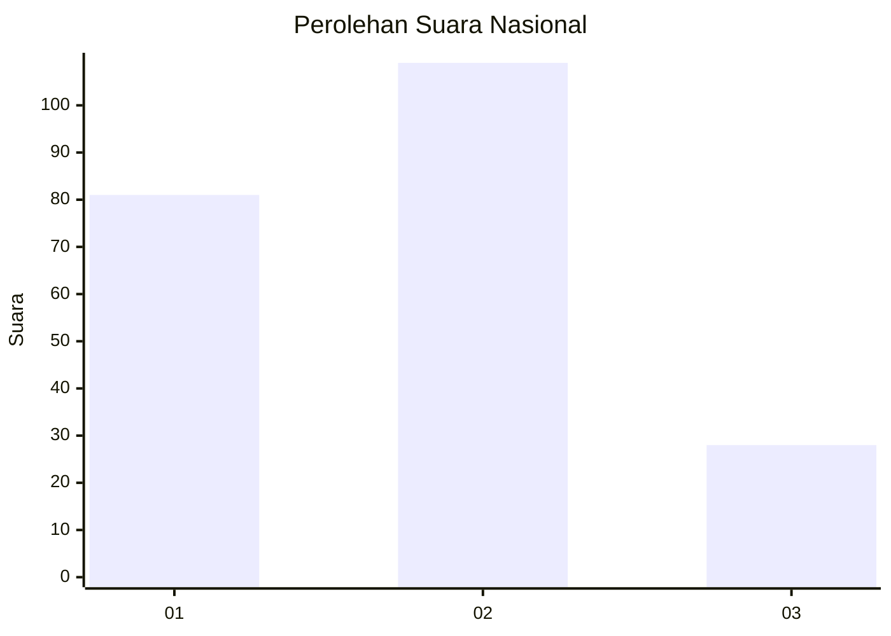
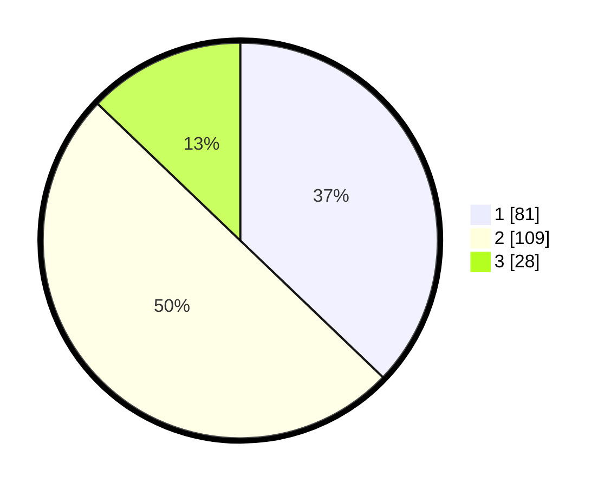

# Hasil

## Grafik

## Tabel

| No.    | Nama Paslon    | Suara | Suara (raw) | Persentase |
|:------ |:-------------- | -----:| -----------:| ----------:|
| 100025 | ANIES MUHAIMIN | 81    | [81][p-1]   | 37,16      |
| 100026 | PRABOWO GIBRAN | 109   | [109][p-2]  | 50,00      |
| 100027 | GANJAR MAHFUD  | 28    | [28][p-3]   | 12,84      |

[p-1]: https://github.com/gigit-pemilu/pemilu-2024/blob/main/pilpres/hitung-suara/sub/31-dki-jakarta/sub/72-jakarta-utara/sub/06-kelapa-gading/sub/1002-pegangsaan-dua/sub/042-tps/sub/paslon-1.txt
[p-2]: https://github.com/gigit-pemilu/pemilu-2024/blob/main/pilpres/hitung-suara/sub/31-dki-jakarta/sub/72-jakarta-utara/sub/06-kelapa-gading/sub/1002-pegangsaan-dua/sub/042-tps/sub/paslon-2.txt
[p-3]: https://github.com/gigit-pemilu/pemilu-2024/blob/main/pilpres/hitung-suara/sub/31-dki-jakarta/sub/72-jakarta-utara/sub/06-kelapa-gading/sub/1002-pegangsaan-dua/sub/042-tps/sub/paslon-3.txt

## Foto C Plano

https://sirekap-obj-formc.kpu.go.id/7999/pemilu/ppwp/31/72/06/10/02/3172061002042-20240221-154646--4fb64cfb-4e94-475b-bdc6-43a5814e1af2.jpg

https://sirekap-obj-formc.kpu.go.id/7999/pemilu/ppwp/31/72/06/10/02/3172061002042-20240221-154812--7edbe909-d152-4c21-853a-6d785184034b.jpg

https://sirekap-obj-formc.kpu.go.id/7999/pemilu/ppwp/31/72/06/10/02/3172061002042-20240221-155024--1526ad15-dfd0-496d-b4b3-b6418d1d6fa5.jpg

## Metadata

| Key        | Value               |
| ---------- | ------------------- |
| Time Stamp | 2024-02-21 20:00:00 |

