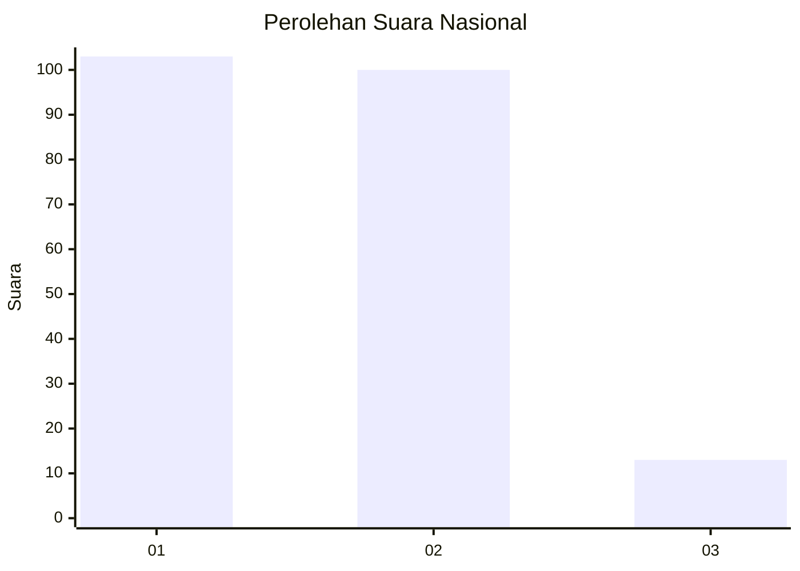
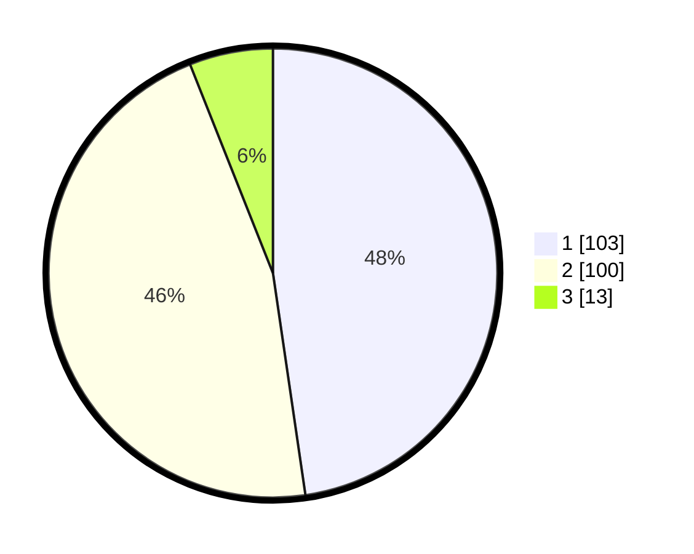

# Hasil

## Grafik

## Tabel

| No.    | Nama Paslon    | Suara | Suara (raw) | Persentase |
|:------ |:-------------- | -----:| -----------:| ----------:|
| 100025 | ANIES MUHAIMIN | 103   | [103][p-1]  | 47,69      |
| 100026 | PRABOWO GIBRAN | 100   | [100][p-2]  | 46,30      |
| 100027 | GANJAR MAHFUD  | 13    | [13][p-3]   | 6,02       |

[p-1]: https://github.com/gigit-pemilu/pemilu-2024/blob/main/pilpres/hitung-suara/sub/31-dki-jakarta/sub/72-jakarta-utara/sub/06-kelapa-gading/sub/1002-pegangsaan-dua/sub/043-tps/sub/paslon-1.txt
[p-2]: https://github.com/gigit-pemilu/pemilu-2024/blob/main/pilpres/hitung-suara/sub/31-dki-jakarta/sub/72-jakarta-utara/sub/06-kelapa-gading/sub/1002-pegangsaan-dua/sub/043-tps/sub/paslon-2.txt
[p-3]: https://github.com/gigit-pemilu/pemilu-2024/blob/main/pilpres/hitung-suara/sub/31-dki-jakarta/sub/72-jakarta-utara/sub/06-kelapa-gading/sub/1002-pegangsaan-dua/sub/043-tps/sub/paslon-3.txt

## Foto C Plano

https://sirekap-obj-formc.kpu.go.id/fdc3/pemilu/ppwp/31/72/06/10/02/3172061002043-20240221-161934--793129e0-2590-4daa-b399-c9211263d02a.jpg

https://sirekap-obj-formc.kpu.go.id/fdc3/pemilu/ppwp/31/72/06/10/02/3172061002043-20240221-162035--f34041b1-737a-410f-9373-963df12d34af.jpg

https://sirekap-obj-formc.kpu.go.id/fdc3/pemilu/ppwp/31/72/06/10/02/3172061002043-20240221-162110--818acc32-6b0d-407b-a64b-049374ed2061.jpg

## Metadata

| Key        | Value               |
| ---------- | ------------------- |
| Time Stamp | 2024-02-21 20:00:00 |

