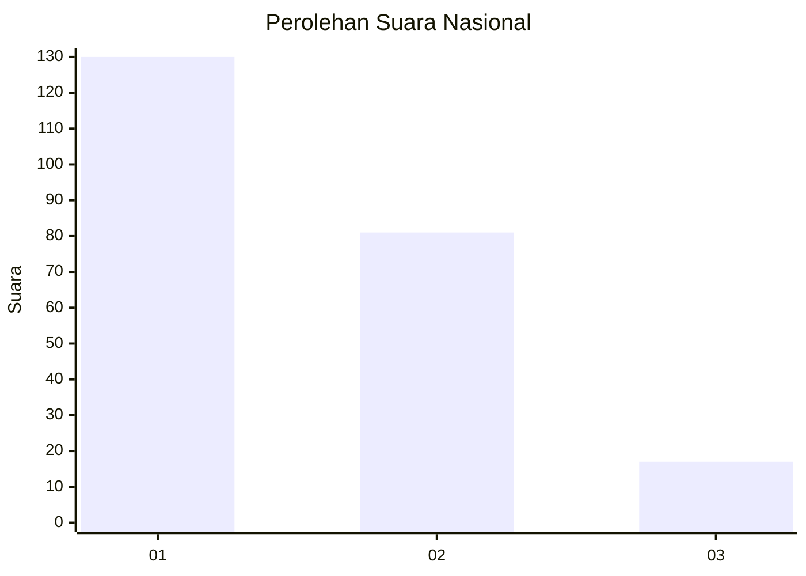
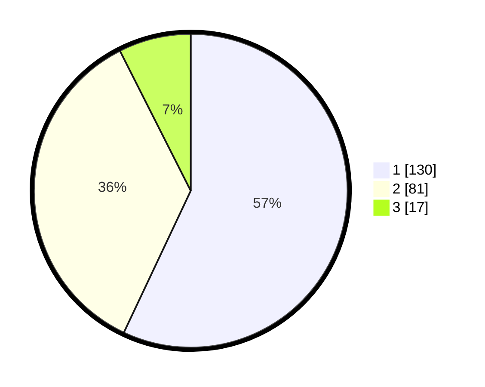

# Hasil

## Grafik

## Tabel

| No.    | Nama Paslon    | Suara | Suara (raw) | Persentase |
|:------ |:-------------- | -----:| -----------:| ----------:|
| 100025 | ANIES MUHAIMIN | 130   | [130][p-1]  | 57,02      |
| 100026 | PRABOWO GIBRAN | 81    | [81][p-2]   | 35,53      |
| 100027 | GANJAR MAHFUD  | 17    | [17][p-3]   | 7,46       |

[p-1]: https://github.com/gigit-pemilu/pemilu-2024/blob/main/pilpres/hitung-suara/sub/31-dki-jakarta/sub/72-jakarta-utara/sub/06-kelapa-gading/sub/1002-pegangsaan-dua/sub/044-tps/sub/paslon-1.txt
[p-2]: https://github.com/gigit-pemilu/pemilu-2024/blob/main/pilpres/hitung-suara/sub/31-dki-jakarta/sub/72-jakarta-utara/sub/06-kelapa-gading/sub/1002-pegangsaan-dua/sub/044-tps/sub/paslon-2.txt
[p-3]: https://github.com/gigit-pemilu/pemilu-2024/blob/main/pilpres/hitung-suara/sub/31-dki-jakarta/sub/72-jakarta-utara/sub/06-kelapa-gading/sub/1002-pegangsaan-dua/sub/044-tps/sub/paslon-3.txt

## Foto C Plano

https://sirekap-obj-formc.kpu.go.id/b872/pemilu/ppwp/31/72/06/10/02/3172061002044-20240221-171726--c14a166e-62ff-4a87-ba2e-f917fe379ac2.jpg

https://sirekap-obj-formc.kpu.go.id/b872/pemilu/ppwp/31/72/06/10/02/3172061002044-20240221-171829--ae8ec1bf-89f2-4c0c-980d-677ef133329d.jpg

https://sirekap-obj-formc.kpu.go.id/b872/pemilu/ppwp/31/72/06/10/02/3172061002044-20240221-172123--eec0e1c5-b69d-498f-8b57-786c2083c0ca.jpg

## Metadata

| Key        | Value               |
| ---------- | ------------------- |
| Time Stamp | 2024-02-21 20:00:00 |

