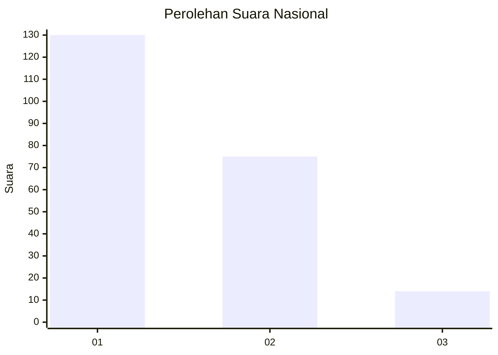
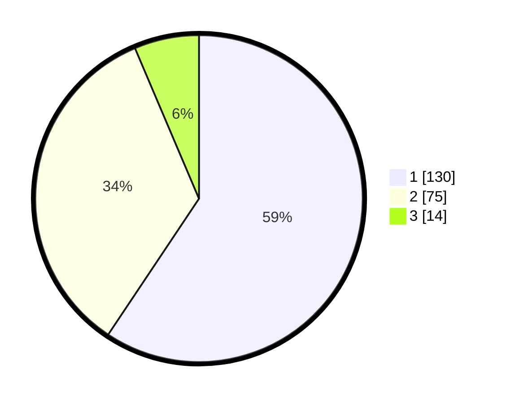

# Hasil

## Grafik

## Tabel

| No.    | Nama Paslon    | Suara | Suara (raw) | Persentase |
|:------ |:-------------- | -----:| -----------:| ----------:|
| 100025 | ANIES MUHAIMIN | 130   | [130][p-1]  | 59,36      |
| 100026 | PRABOWO GIBRAN | 75    | [75][p-2]   | 34,25      |
| 100027 | GANJAR MAHFUD  | 14    | [14][p-3]   | 6,39       |

[p-1]: https://github.com/gigit-pemilu/pemilu-2024/blob/main/pilpres/hitung-suara/sub/31-dki-jakarta/sub/72-jakarta-utara/sub/06-kelapa-gading/sub/1002-pegangsaan-dua/sub/045-tps/sub/paslon-1.txt
[p-2]: https://github.com/gigit-pemilu/pemilu-2024/blob/main/pilpres/hitung-suara/sub/31-dki-jakarta/sub/72-jakarta-utara/sub/06-kelapa-gading/sub/1002-pegangsaan-dua/sub/045-tps/sub/paslon-2.txt
[p-3]: https://github.com/gigit-pemilu/pemilu-2024/blob/main/pilpres/hitung-suara/sub/31-dki-jakarta/sub/72-jakarta-utara/sub/06-kelapa-gading/sub/1002-pegangsaan-dua/sub/045-tps/sub/paslon-3.txt

## Foto C Plano

https://sirekap-obj-formc.kpu.go.id/15f1/pemilu/ppwp/31/72/06/10/02/3172061002045-20240221-195258--bac4bd3e-48d4-4ab0-ab75-c002ec074d3f.jpg

https://sirekap-obj-formc.kpu.go.id/15f1/pemilu/ppwp/31/72/06/10/02/3172061002045-20240221-195502--c30d0cce-420b-4135-91f0-81ab67ebcaf5.jpg

https://sirekap-obj-formc.kpu.go.id/15f1/pemilu/ppwp/31/72/06/10/02/3172061002045-20240221-195538--e157bc46-af7b-457c-a2ec-3dbc4152f079.jpg

## Metadata

| Key        | Value               |
| ---------- | ------------------- |
| Time Stamp | 2024-02-21 21:00:04 |

