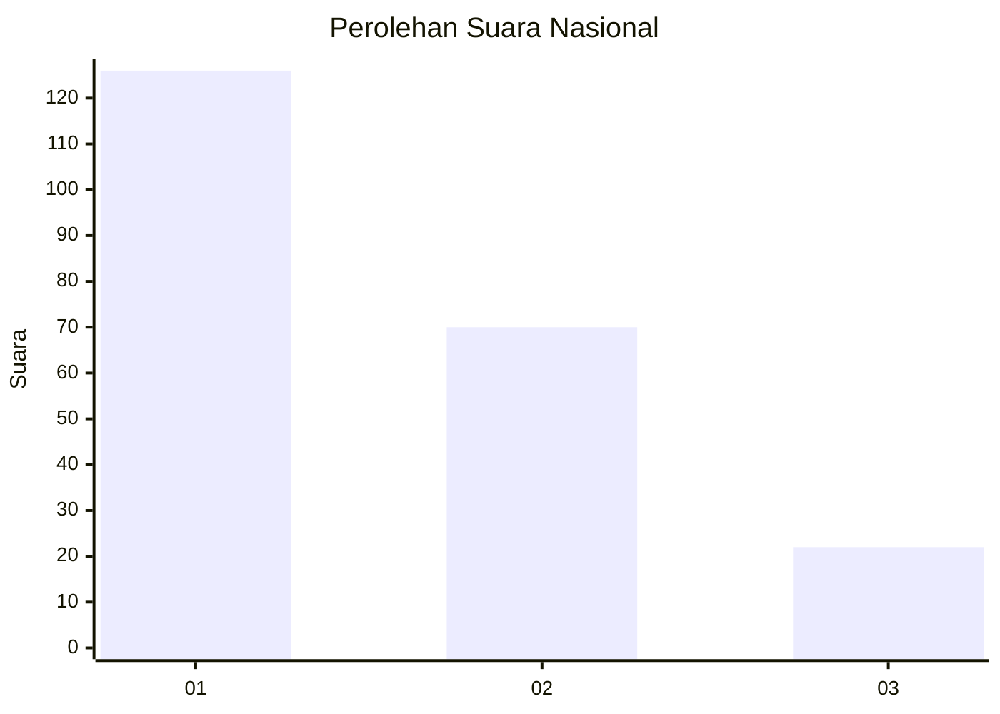
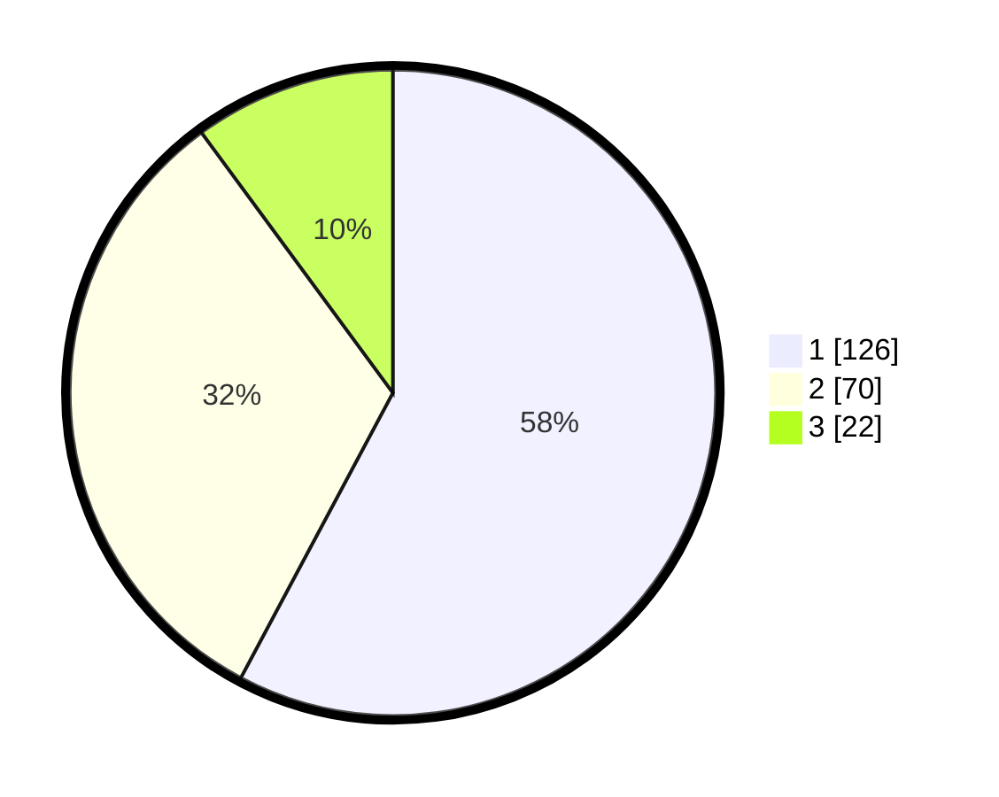

# Hasil

## Grafik

## Tabel

| No.    | Nama Paslon    | Suara | Suara (raw) | Persentase |
|:------ |:-------------- | -----:| -----------:| ----------:|
| 100025 | ANIES MUHAIMIN | 126   | [126][p-1]  | 57,80      |
| 100026 | PRABOWO GIBRAN | 70    | [70][p-2]   | 32,11      |
| 100027 | GANJAR MAHFUD  | 22    | [22][p-3]   | 10,09      |

[p-1]: https://github.com/gigit-pemilu/pemilu-2024/blob/main/pilpres/hitung-suara/sub/31-dki-jakarta/sub/72-jakarta-utara/sub/06-kelapa-gading/sub/1002-pegangsaan-dua/sub/049-tps/sub/paslon-1.txt
[p-2]: https://github.com/gigit-pemilu/pemilu-2024/blob/main/pilpres/hitung-suara/sub/31-dki-jakarta/sub/72-jakarta-utara/sub/06-kelapa-gading/sub/1002-pegangsaan-dua/sub/049-tps/sub/paslon-2.txt
[p-3]: https://github.com/gigit-pemilu/pemilu-2024/blob/main/pilpres/hitung-suara/sub/31-dki-jakarta/sub/72-jakarta-utara/sub/06-kelapa-gading/sub/1002-pegangsaan-dua/sub/049-tps/sub/paslon-3.txt

## Foto C Plano

https://sirekap-obj-formc.kpu.go.id/73e3/pemilu/ppwp/31/72/06/10/02/3172061002049-20240221-210626--2f1667f6-2d7d-4ba1-b697-8c98f00d05cd.jpg

https://sirekap-obj-formc.kpu.go.id/73e3/pemilu/ppwp/31/72/06/10/02/3172061002049-20240221-210657--87886b20-0b68-453a-b466-37ec3e51acca.jpg

https://sirekap-obj-formc.kpu.go.id/73e3/pemilu/ppwp/31/72/06/10/02/3172061002049-20240221-210744--9b57cda0-0aef-4e99-a757-ff2547c98be8.jpg

## Metadata

| Key        | Value               |
| ---------- | ------------------- |
| Time Stamp | 2024-02-22 10:00:00 |

