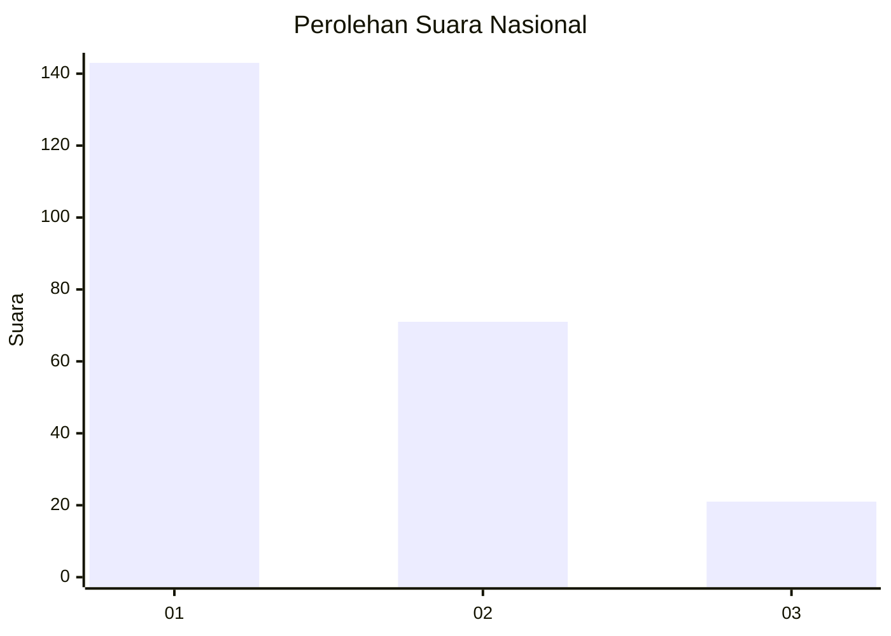
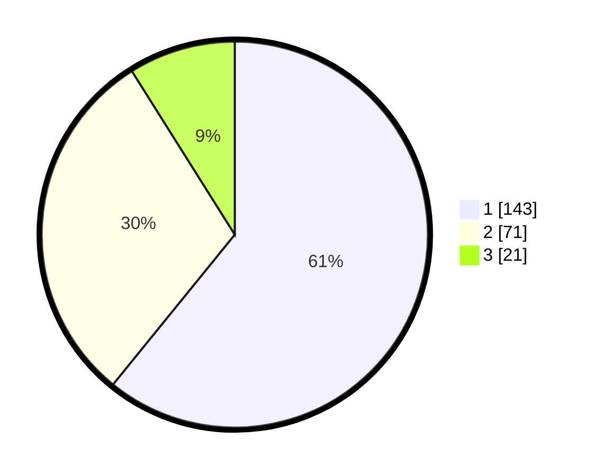

# Hasil

## Grafik

## Tabel

| No.    | Nama Paslon    | Suara | Suara (raw) | Persentase |
|:------ |:-------------- | -----:| -----------:| ----------:|
| 100025 | ANIES MUHAIMIN | 143   | [143][p-1]  | 60,85      |
| 100026 | PRABOWO GIBRAN | 71    | [71][p-2]   | 30,21      |
| 100027 | GANJAR MAHFUD  | 21    | [21][p-3]   | 8,94       |

[p-1]: https://github.com/gigit-pemilu/pemilu-2024/blob/main/pilpres/hitung-suara/sub/31-dki-jakarta/sub/72-jakarta-utara/sub/06-kelapa-gading/sub/1002-pegangsaan-dua/sub/052-tps/sub/paslon-1.txt
[p-2]: https://github.com/gigit-pemilu/pemilu-2024/blob/main/pilpres/hitung-suara/sub/31-dki-jakarta/sub/72-jakarta-utara/sub/06-kelapa-gading/sub/1002-pegangsaan-dua/sub/052-tps/sub/paslon-2.txt
[p-3]: https://github.com/gigit-pemilu/pemilu-2024/blob/main/pilpres/hitung-suara/sub/31-dki-jakarta/sub/72-jakarta-utara/sub/06-kelapa-gading/sub/1002-pegangsaan-dua/sub/052-tps/sub/paslon-3.txt

## Foto C Plano

https://sirekap-obj-formc.kpu.go.id/af70/pemilu/ppwp/31/72/06/10/02/3172061002052-20240222-110134--0b892017-458c-4264-8dad-71bd88957246.jpg

https://sirekap-obj-formc.kpu.go.id/af70/pemilu/ppwp/31/72/06/10/02/3172061002052-20240222-110207--b5e54536-854c-4df6-b974-dbf5788b2b86.jpg

https://sirekap-obj-formc.kpu.go.id/af70/pemilu/ppwp/31/72/06/10/02/3172061002052-20240222-110240--f9679e4f-08ae-4301-a44c-66c3eb68cea3.jpg

## Metadata

| Key        | Value               |
| ---------- | ------------------- |
| Time Stamp | 2024-02-22 12:00:00 |

