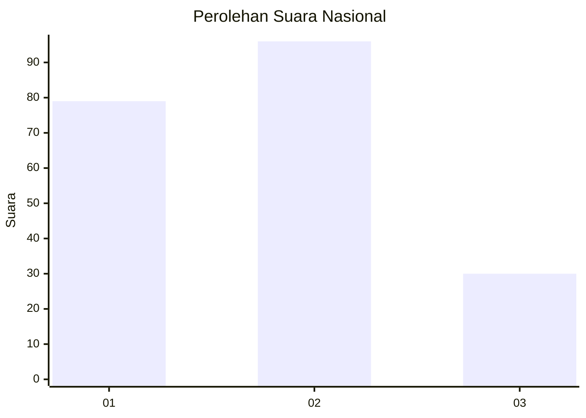
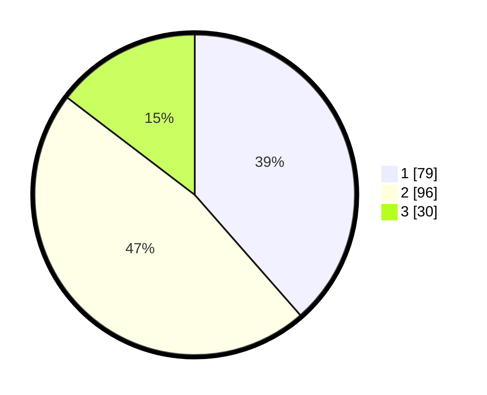

# Hasil

## Grafik

## Tabel

| No.    | Nama Paslon    | Suara | Suara (raw) | Persentase |
|:------ |:-------------- | -----:| -----------:| ----------:|
| 100025 | ANIES MUHAIMIN | 79    | [79][p-1]   | 38,54      |
| 100026 | PRABOWO GIBRAN | 96    | [96][p-2]   | 46,83      |
| 100027 | GANJAR MAHFUD  | 30    | [30][p-3]   | 14,63      |

[p-1]: https://github.com/gigit-pemilu/pemilu-2024/blob/main/pilpres/hitung-suara/sub/31-dki-jakarta/sub/72-jakarta-utara/sub/06-kelapa-gading/sub/1002-pegangsaan-dua/sub/055-tps/sub/paslon-1.txt
[p-2]: https://github.com/gigit-pemilu/pemilu-2024/blob/main/pilpres/hitung-suara/sub/31-dki-jakarta/sub/72-jakarta-utara/sub/06-kelapa-gading/sub/1002-pegangsaan-dua/sub/055-tps/sub/paslon-2.txt
[p-3]: https://github.com/gigit-pemilu/pemilu-2024/blob/main/pilpres/hitung-suara/sub/31-dki-jakarta/sub/72-jakarta-utara/sub/06-kelapa-gading/sub/1002-pegangsaan-dua/sub/055-tps/sub/paslon-3.txt

## Foto C Plano

https://sirekap-obj-formc.kpu.go.id/c7e8/pemilu/ppwp/31/72/06/10/02/3172061002055-20240222-133746--261291ee-bbf1-4fdc-90e3-1b3516777546.jpg

https://sirekap-obj-formc.kpu.go.id/c7e8/pemilu/ppwp/31/72/06/10/02/3172061002055-20240222-133809--278a89f1-ee73-4420-b4df-99d0806d15e8.jpg

https://sirekap-obj-formc.kpu.go.id/c7e8/pemilu/ppwp/31/72/06/10/02/3172061002055-20240222-133831--0504dccd-2a18-4c27-82cb-ba6c29f027d2.jpg

## Metadata

| Key        | Value               |
| ---------- | ------------------- |
| Time Stamp | 2024-02-22 17:00:00 |

