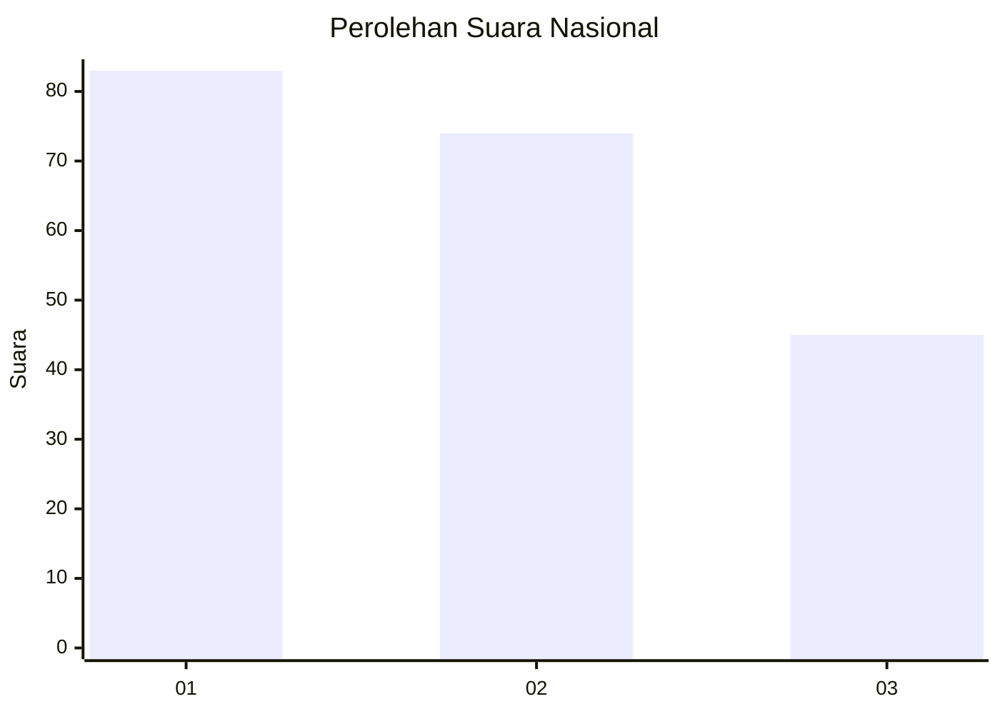
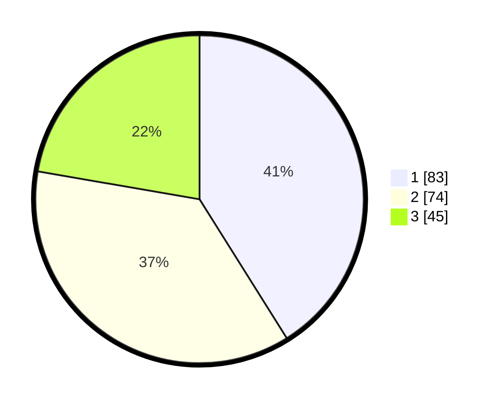

# Hasil

## Grafik

## Tabel

| No.    | Nama Paslon    | Suara | Suara (raw) | Persentase |
|:------ |:-------------- | -----:| -----------:| ----------:|
| 100025 | ANIES MUHAIMIN | 83    | [83][p-1]   | 41,09      |
| 100026 | PRABOWO GIBRAN | 74    | [74][p-2]   | 36,63      |
| 100027 | GANJAR MAHFUD  | 45    | [45][p-3]   | 22,28      |

[p-1]: https://github.com/gigit-pemilu/pemilu-2024/blob/main/pilpres/hitung-suara/sub/31-dki-jakarta/sub/72-jakarta-utara/sub/06-kelapa-gading/sub/1002-pegangsaan-dua/sub/057-tps/sub/paslon-1.txt
[p-2]: https://github.com/gigit-pemilu/pemilu-2024/blob/main/pilpres/hitung-suara/sub/31-dki-jakarta/sub/72-jakarta-utara/sub/06-kelapa-gading/sub/1002-pegangsaan-dua/sub/057-tps/sub/paslon-2.txt
[p-3]: https://github.com/gigit-pemilu/pemilu-2024/blob/main/pilpres/hitung-suara/sub/31-dki-jakarta/sub/72-jakarta-utara/sub/06-kelapa-gading/sub/1002-pegangsaan-dua/sub/057-tps/sub/paslon-3.txt

## Foto C Plano

https://sirekap-obj-formc.kpu.go.id/c0ec/pemilu/ppwp/31/72/06/10/02/3172061002057-20240222-142628--d5ad25ec-0ee0-4cc2-8a49-908d77a7ea0c.jpg

https://sirekap-obj-formc.kpu.go.id/c0ec/pemilu/ppwp/31/72/06/10/02/3172061002057-20240222-142701--b29d8cab-fbde-4916-a89f-160940838078.jpg

https://sirekap-obj-formc.kpu.go.id/c0ec/pemilu/ppwp/31/72/06/10/02/3172061002057-20240222-142755--7ec8e519-06c3-4999-b384-db9f7dc37897.jpg

## Metadata

| Key        | Value               |
| ---------- | ------------------- |
| Time Stamp | 2024-02-22 17:00:00 |

