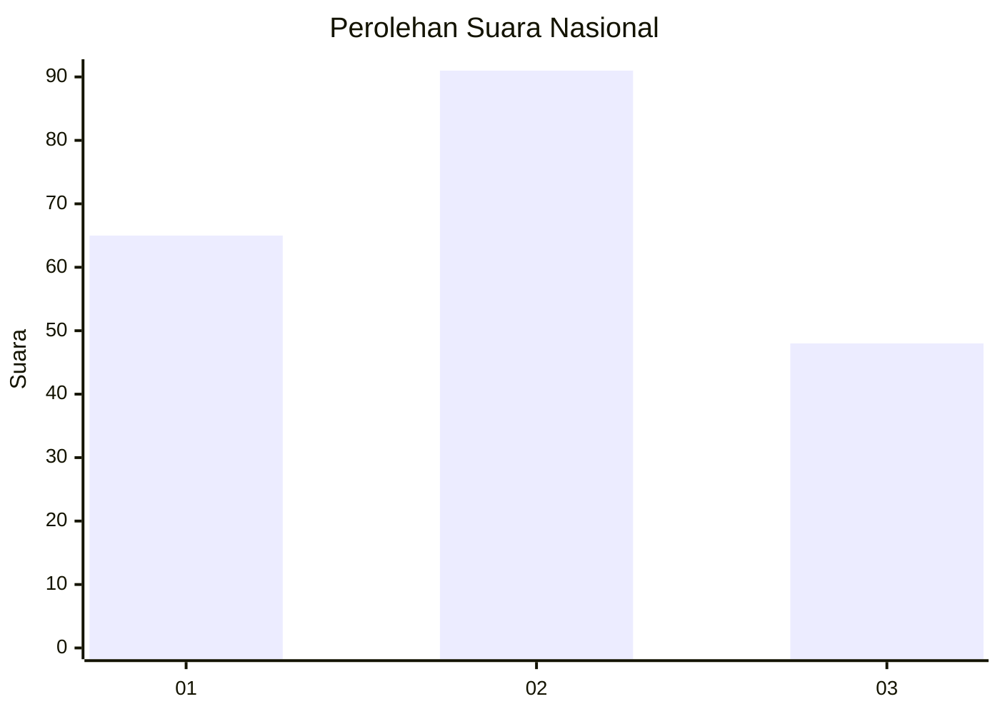
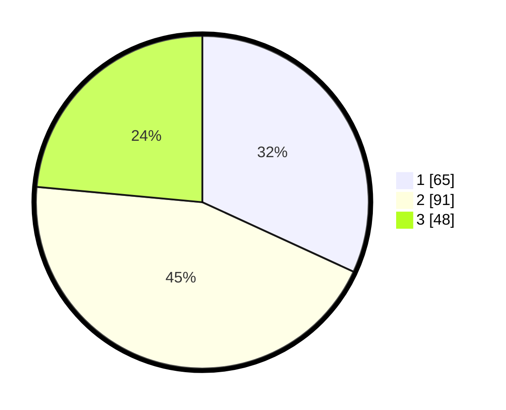

# Hasil

## Grafik

## Tabel

| No.    | Nama Paslon    | Suara | Suara (raw) | Persentase |
|:------ |:-------------- | -----:| -----------:| ----------:|
| 100025 | ANIES MUHAIMIN | 65    | [65][p-1]   | 31,86      |
| 100026 | PRABOWO GIBRAN | 91    | [91][p-2]   | 44,61      |
| 100027 | GANJAR MAHFUD  | 48    | [48][p-3]   | 23,53      |

[p-1]: https://github.com/gigit-pemilu/pemilu-2024/blob/main/pilpres/hitung-suara/sub/31-dki-jakarta/sub/72-jakarta-utara/sub/06-kelapa-gading/sub/1002-pegangsaan-dua/sub/058-tps/sub/paslon-1.txt
[p-2]: https://github.com/gigit-pemilu/pemilu-2024/blob/main/pilpres/hitung-suara/sub/31-dki-jakarta/sub/72-jakarta-utara/sub/06-kelapa-gading/sub/1002-pegangsaan-dua/sub/058-tps/sub/paslon-2.txt
[p-3]: https://github.com/gigit-pemilu/pemilu-2024/blob/main/pilpres/hitung-suara/sub/31-dki-jakarta/sub/72-jakarta-utara/sub/06-kelapa-gading/sub/1002-pegangsaan-dua/sub/058-tps/sub/paslon-3.txt

## Foto C Plano

https://sirekap-obj-formc.kpu.go.id/f2e6/pemilu/ppwp/31/72/06/10/02/3172061002058-20240222-152457--f51e3c40-e10c-4cd2-886b-b5d560b63e1b.jpg

https://sirekap-obj-formc.kpu.go.id/f2e6/pemilu/ppwp/31/72/06/10/02/3172061002058-20240222-152631--8ba8a8a2-816e-43bc-8e37-df7c2eb1dc9f.jpg

https://sirekap-obj-formc.kpu.go.id/f2e6/pemilu/ppwp/31/72/06/10/02/3172061002058-20240222-152756--93285cb2-bf08-46b2-9e95-a8efb22a1a2b.jpg

## Metadata

| Key        | Value               |
| ---------- | ------------------- |
| Time Stamp | 2024-02-22 17:00:00 |

