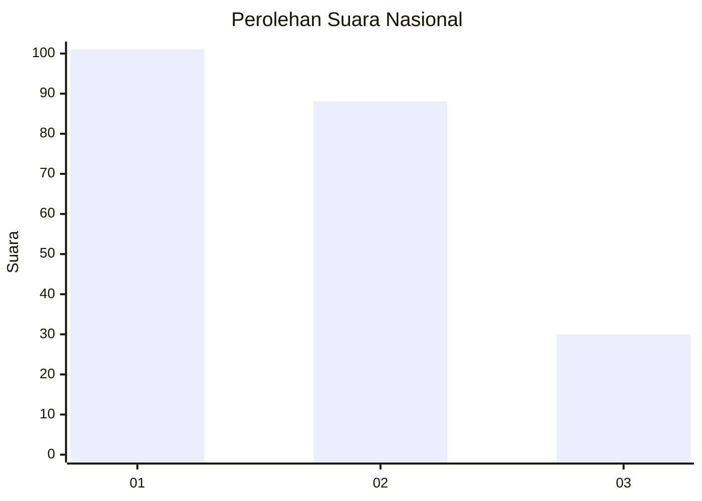
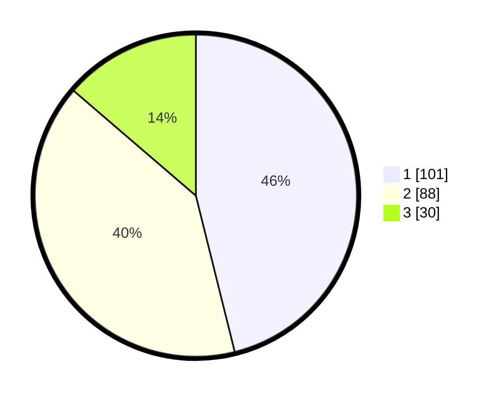

# Hasil

## Grafik

## Tabel

| No.    | Nama Paslon    | Suara | Suara (raw) | Persentase |
|:------ |:-------------- | -----:| -----------:| ----------:|
| 100025 | ANIES MUHAIMIN | 101   | [101][p-1]  | 46,12      |
| 100026 | PRABOWO GIBRAN | 88    | [88][p-2]   | 40,18      |
| 100027 | GANJAR MAHFUD  | 30    | [30][p-3]   | 13,70      |

[p-1]: https://github.com/gigit-pemilu/pemilu-2024/blob/main/pilpres/hitung-suara/sub/31-dki-jakarta/sub/72-jakarta-utara/sub/06-kelapa-gading/sub/1002-pegangsaan-dua/sub/060-tps/sub/paslon-1.txt
[p-2]: https://github.com/gigit-pemilu/pemilu-2024/blob/main/pilpres/hitung-suara/sub/31-dki-jakarta/sub/72-jakarta-utara/sub/06-kelapa-gading/sub/1002-pegangsaan-dua/sub/060-tps/sub/paslon-2.txt
[p-3]: https://github.com/gigit-pemilu/pemilu-2024/blob/main/pilpres/hitung-suara/sub/31-dki-jakarta/sub/72-jakarta-utara/sub/06-kelapa-gading/sub/1002-pegangsaan-dua/sub/060-tps/sub/paslon-3.txt

## Foto C Plano

https://sirekap-obj-formc.kpu.go.id/8064/pemilu/ppwp/31/72/06/10/02/3172061002060-20240222-161222--9634278b-bd10-44b3-83e2-5fa2675d0067.jpg

https://sirekap-obj-formc.kpu.go.id/8064/pemilu/ppwp/31/72/06/10/02/3172061002060-20240222-161205--740ed869-6fc8-455c-8ee9-f5667e947694.jpg

https://sirekap-obj-formc.kpu.go.id/8064/pemilu/ppwp/31/72/06/10/02/3172061002060-20240222-161240--6c8edcce-84c6-4fef-99c8-ebe60e1beaac.jpg

## Metadata

| Key        | Value               |
| ---------- | ------------------- |
| Time Stamp | 2024-02-22 17:00:00 |

