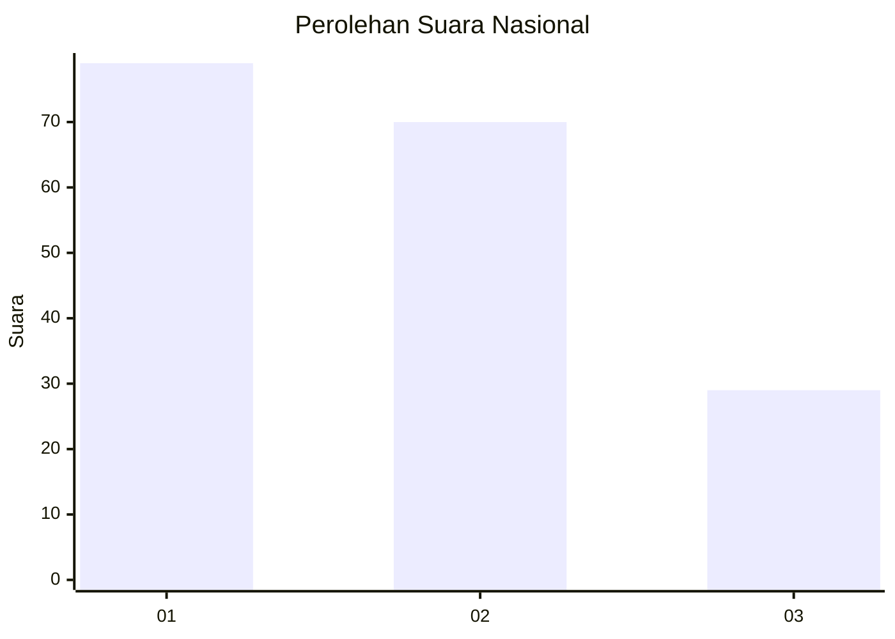
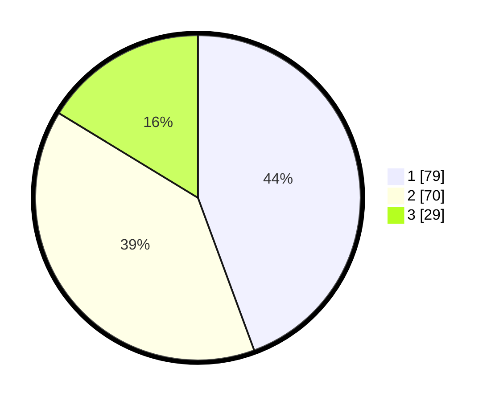

# Hasil

## Grafik

## Tabel

| No.    | Nama Paslon    | Suara | Suara (raw) | Persentase |
|:------ |:-------------- | -----:| -----------:| ----------:|
| 100025 | ANIES MUHAIMIN | 79    | [79][p-1]   | 44,38      |
| 100026 | PRABOWO GIBRAN | 70    | [70][p-2]   | 39,33      |
| 100027 | GANJAR MAHFUD  | 29    | [29][p-3]   | 16,29      |

[p-1]: https://github.com/gigit-pemilu/pemilu-2024/blob/main/pilpres/hitung-suara/sub/31-dki-jakarta/sub/72-jakarta-utara/sub/06-kelapa-gading/sub/1002-pegangsaan-dua/sub/063-tps/sub/paslon-1.txt
[p-2]: https://github.com/gigit-pemilu/pemilu-2024/blob/main/pilpres/hitung-suara/sub/31-dki-jakarta/sub/72-jakarta-utara/sub/06-kelapa-gading/sub/1002-pegangsaan-dua/sub/063-tps/sub/paslon-2.txt
[p-3]: https://github.com/gigit-pemilu/pemilu-2024/blob/main/pilpres/hitung-suara/sub/31-dki-jakarta/sub/72-jakarta-utara/sub/06-kelapa-gading/sub/1002-pegangsaan-dua/sub/063-tps/sub/paslon-3.txt

## Foto C Plano

https://sirekap-obj-formc.kpu.go.id/8c1c/pemilu/ppwp/31/72/06/10/02/3172061002063-20240222-203709--28132625-28bf-4404-a649-583cf8296416.jpg

https://sirekap-obj-formc.kpu.go.id/8c1c/pemilu/ppwp/31/72/06/10/02/3172061002063-20240222-203649--b3572ee7-726e-4c1f-953b-74e8b63eb036.jpg

https://sirekap-obj-formc.kpu.go.id/8c1c/pemilu/ppwp/31/72/06/10/02/3172061002063-20240222-203723--3865a980-4b09-4de5-96b6-fdf4d41c1198.jpg

## Metadata

| Key        | Value               |
| ---------- | ------------------- |
| Time Stamp | 2024-02-24 22:31:28 |

