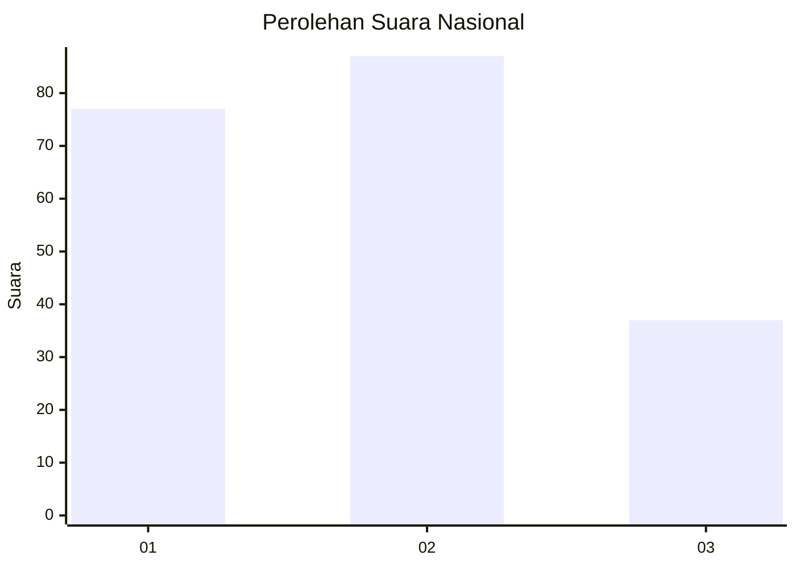
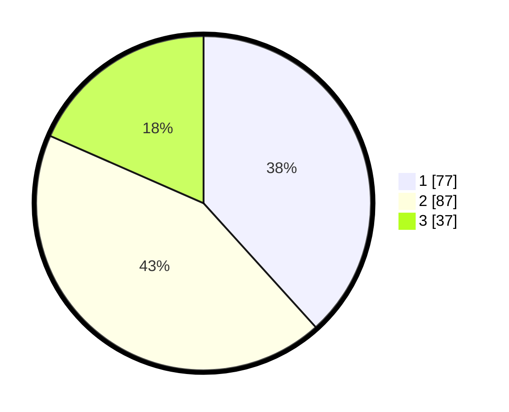

# Hasil

## Grafik

## Tabel

| No.    | Nama Paslon    | Suara | Suara (raw) | Persentase |
|:------ |:-------------- | -----:| -----------:| ----------:|
| 100025 | ANIES MUHAIMIN | 77    | [77][p-1]   | 38,31      |
| 100026 | PRABOWO GIBRAN | 87    | [87][p-2]   | 43,28      |
| 100027 | GANJAR MAHFUD  | 37    | [37][p-3]   | 18,41      |

[p-1]: https://github.com/gigit-pemilu/pemilu-2024/blob/main/pilpres/hitung-suara/sub/31-dki-jakarta/sub/72-jakarta-utara/sub/06-kelapa-gading/sub/1002-pegangsaan-dua/sub/065-tps/sub/paslon-1.txt
[p-2]: https://github.com/gigit-pemilu/pemilu-2024/blob/main/pilpres/hitung-suara/sub/31-dki-jakarta/sub/72-jakarta-utara/sub/06-kelapa-gading/sub/1002-pegangsaan-dua/sub/065-tps/sub/paslon-2.txt
[p-3]: https://github.com/gigit-pemilu/pemilu-2024/blob/main/pilpres/hitung-suara/sub/31-dki-jakarta/sub/72-jakarta-utara/sub/06-kelapa-gading/sub/1002-pegangsaan-dua/sub/065-tps/sub/paslon-3.txt

## Foto C Plano

https://sirekap-obj-formc.kpu.go.id/32d6/pemilu/ppwp/31/72/06/10/02/3172061002065-20240223-104804--f5de63a7-9936-4782-a34f-25a651753035.jpg

https://sirekap-obj-formc.kpu.go.id/32d6/pemilu/ppwp/31/72/06/10/02/3172061002065-20240223-104855--95a942c1-e69c-458e-a05d-93fc65f422cf.jpg

https://sirekap-obj-formc.kpu.go.id/32d6/pemilu/ppwp/31/72/06/10/02/3172061002065-20240223-104938--8e51c9b4-52b6-4ed4-98f5-7c4c347f2564.jpg

## Metadata

| Key        | Value               |
| ---------- | ------------------- |
| Time Stamp | 2024-02-24 22:31:28 |

