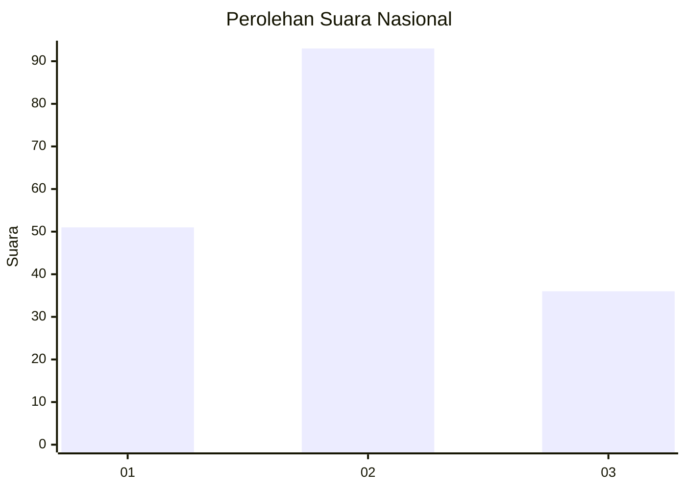
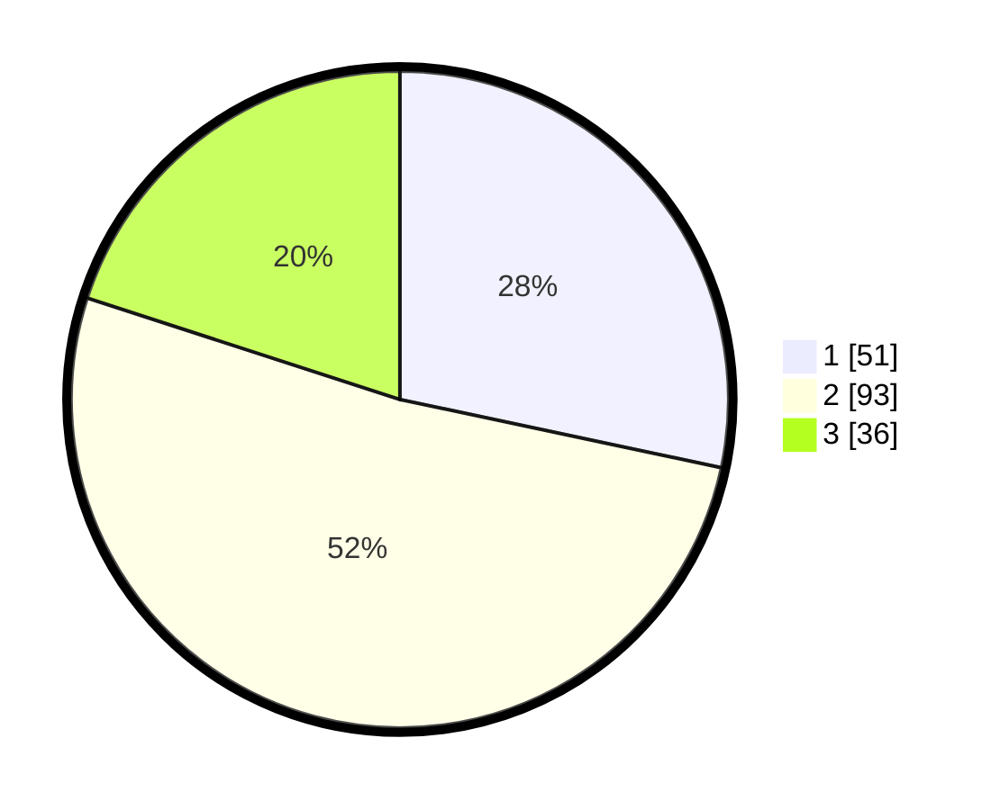

# Hasil

## Grafik

## Tabel

| No.    | Nama Paslon    | Suara | Suara (raw) | Persentase |
|:------ |:-------------- | -----:| -----------:| ----------:|
| 100025 | ANIES MUHAIMIN | 51    | [51][p-1]   | 28,33      |
| 100026 | PRABOWO GIBRAN | 93    | [93][p-2]   | 51,67      |
| 100027 | GANJAR MAHFUD  | 36    | [36][p-3]   | 20,00      |

[p-1]: https://github.com/gigit-pemilu/pemilu-2024/blob/main/pilpres/hitung-suara/sub/31-dki-jakarta/sub/72-jakarta-utara/sub/06-kelapa-gading/sub/1002-pegangsaan-dua/sub/067-tps/sub/paslon-1.txt
[p-2]: https://github.com/gigit-pemilu/pemilu-2024/blob/main/pilpres/hitung-suara/sub/31-dki-jakarta/sub/72-jakarta-utara/sub/06-kelapa-gading/sub/1002-pegangsaan-dua/sub/067-tps/sub/paslon-2.txt
[p-3]: https://github.com/gigit-pemilu/pemilu-2024/blob/main/pilpres/hitung-suara/sub/31-dki-jakarta/sub/72-jakarta-utara/sub/06-kelapa-gading/sub/1002-pegangsaan-dua/sub/067-tps/sub/paslon-3.txt

## Foto C Plano

https://sirekap-obj-formc.kpu.go.id/72c1/pemilu/ppwp/31/72/06/10/02/3172061002067-20240223-133932--aaf35f00-0589-44b8-b073-853ad95a1056.jpg

https://sirekap-obj-formc.kpu.go.id/72c1/pemilu/ppwp/31/72/06/10/02/3172061002067-20240223-133948--0dba1a85-d7da-4eb4-90ca-da7f9bdfb8cd.jpg

https://sirekap-obj-formc.kpu.go.id/72c1/pemilu/ppwp/31/72/06/10/02/3172061002067-20240223-134002--83d9393d-b43d-4680-929f-d2b33b3b630a.jpg

## Metadata

| Key        | Value               |
| ---------- | ------------------- |
| Time Stamp | 2024-02-24 22:31:28 |

