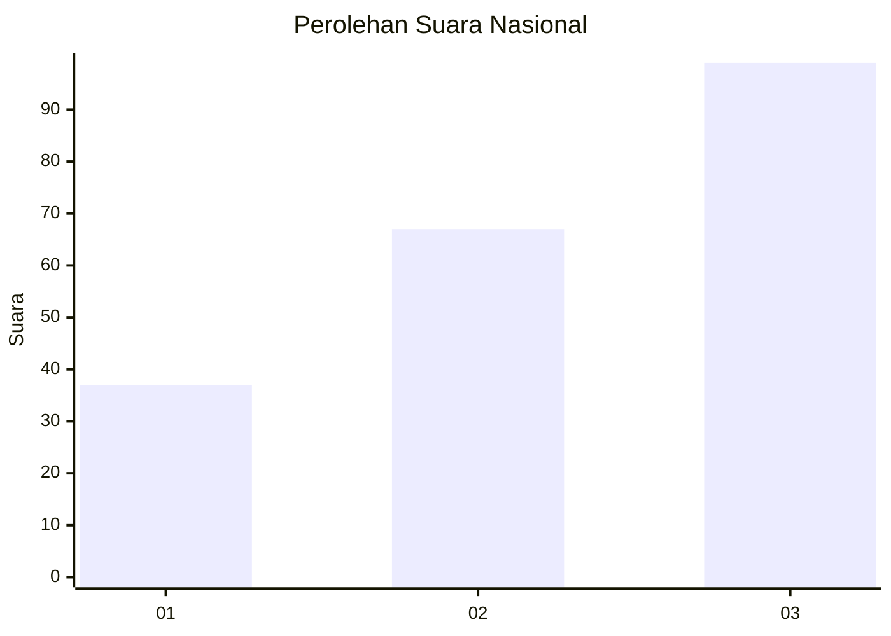
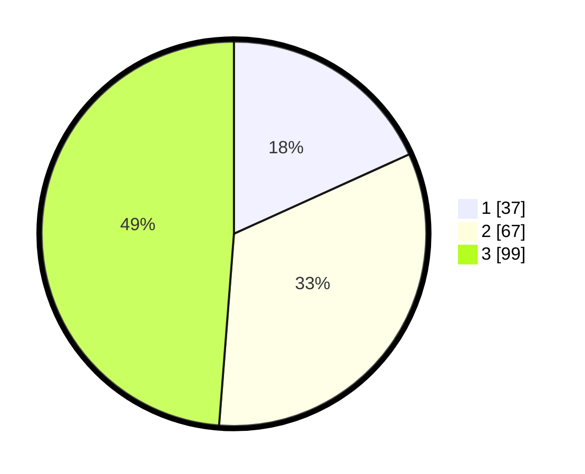

# Hasil

## Grafik

## Tabel

| No.    | Nama Paslon    | Suara | Suara (raw) | Persentase |
|:------ |:-------------- | -----:| -----------:| ----------:|
| 100025 | ANIES MUHAIMIN | 37    | [37][p-1]   | 18,23      |
| 100026 | PRABOWO GIBRAN | 67    | [67][p-2]   | 33,00      |
| 100027 | GANJAR MAHFUD  | 99    | [99][p-3]   | 48,77      |

[p-1]: https://github.com/gigit-pemilu/pemilu-2024/blob/main/pilpres/hitung-suara/sub/31-dki-jakarta/sub/72-jakarta-utara/sub/06-kelapa-gading/sub/1002-pegangsaan-dua/sub/071-tps/sub/paslon-1.txt
[p-2]: https://github.com/gigit-pemilu/pemilu-2024/blob/main/pilpres/hitung-suara/sub/31-dki-jakarta/sub/72-jakarta-utara/sub/06-kelapa-gading/sub/1002-pegangsaan-dua/sub/071-tps/sub/paslon-2.txt
[p-3]: https://github.com/gigit-pemilu/pemilu-2024/blob/main/pilpres/hitung-suara/sub/31-dki-jakarta/sub/72-jakarta-utara/sub/06-kelapa-gading/sub/1002-pegangsaan-dua/sub/071-tps/sub/paslon-3.txt

## Foto C Plano

https://sirekap-obj-formc.kpu.go.id/861f/pemilu/ppwp/31/72/06/10/02/3172061002071-20240223-152703--a2c2e1f3-cbf6-4bbb-929d-e718b4dfe404.jpg

https://sirekap-obj-formc.kpu.go.id/861f/pemilu/ppwp/31/72/06/10/02/3172061002071-20240223-152746--fe49cdb6-b660-40c1-a54e-2a805c3a9462.jpg

https://sirekap-obj-formc.kpu.go.id/861f/pemilu/ppwp/31/72/06/10/02/3172061002071-20240223-152904--86b162bc-56b6-4494-ae9a-565b044422a6.jpg

## Metadata

| Key        | Value               |
| ---------- | ------------------- |
| Time Stamp | 2024-02-24 22:31:28 |

