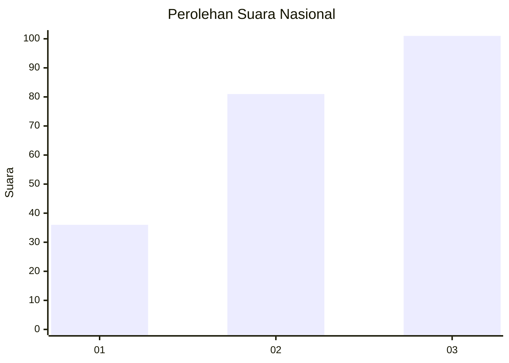
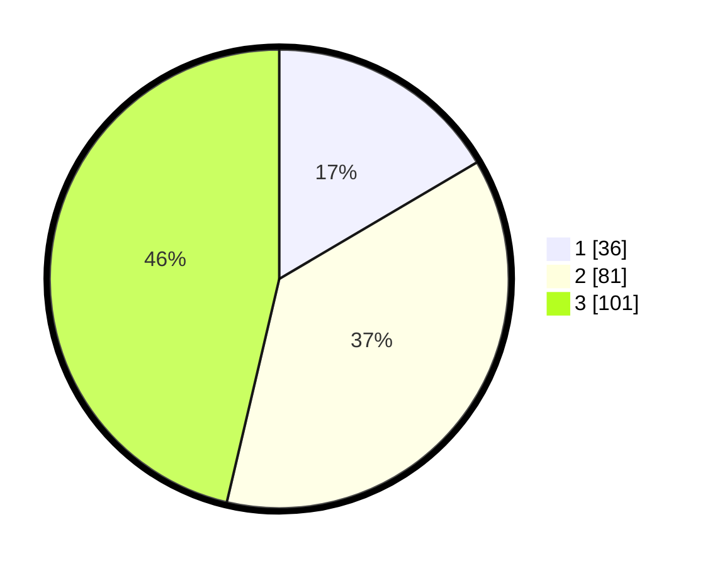

# Hasil

## Grafik

## Tabel

| No.    | Nama Paslon    | Suara | Suara (raw) | Persentase |
|:------ |:-------------- | -----:| -----------:| ----------:|
| 100025 | ANIES MUHAIMIN | 36    | [36][p-1]   | 16,51      |
| 100026 | PRABOWO GIBRAN | 81    | [81][p-2]   | 37,16      |
| 100027 | GANJAR MAHFUD  | 101   | [101][p-3]  | 46,33      |

[p-1]: https://github.com/gigit-pemilu/pemilu-2024/blob/main/pilpres/hitung-suara/sub/31-dki-jakarta/sub/72-jakarta-utara/sub/06-kelapa-gading/sub/1002-pegangsaan-dua/sub/073-tps/sub/paslon-1.txt
[p-2]: https://github.com/gigit-pemilu/pemilu-2024/blob/main/pilpres/hitung-suara/sub/31-dki-jakarta/sub/72-jakarta-utara/sub/06-kelapa-gading/sub/1002-pegangsaan-dua/sub/073-tps/sub/paslon-2.txt
[p-3]: https://github.com/gigit-pemilu/pemilu-2024/blob/main/pilpres/hitung-suara/sub/31-dki-jakarta/sub/72-jakarta-utara/sub/06-kelapa-gading/sub/1002-pegangsaan-dua/sub/073-tps/sub/paslon-3.txt

## Foto C Plano

https://sirekap-obj-formc.kpu.go.id/7e7c/pemilu/ppwp/31/72/06/10/02/3172061002073-20240223-204423--bb3d1c48-9603-4737-85b4-dc67490cd8f2.jpg

https://sirekap-obj-formc.kpu.go.id/7e7c/pemilu/ppwp/31/72/06/10/02/3172061002073-20240223-204542--cbcf2119-ebe2-4362-a5a3-a356eb02a551.jpg

https://sirekap-obj-formc.kpu.go.id/7e7c/pemilu/ppwp/31/72/06/10/02/3172061002073-20240223-204626--5b5ae5bb-2e89-4908-8706-19f9ed9edaf0.jpg

## Metadata

| Key        | Value               |
| ---------- | ------------------- |
| Time Stamp | 2024-02-24 22:31:28 |

