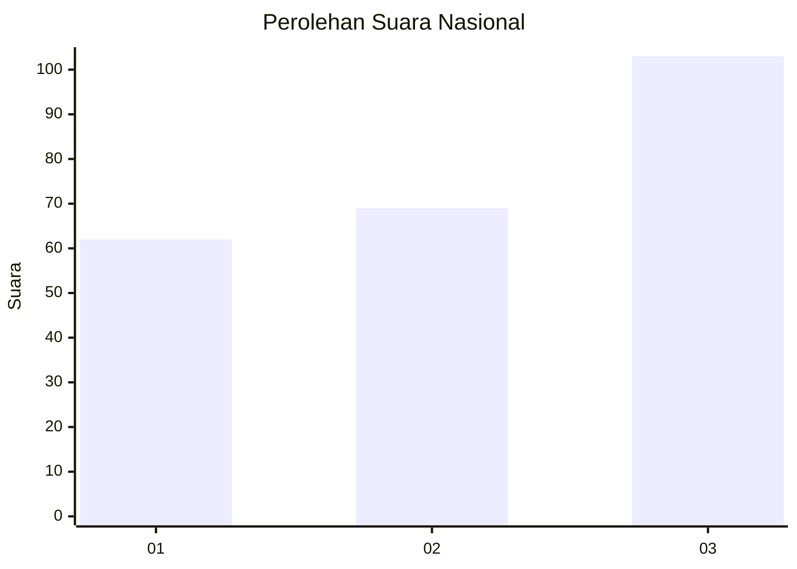
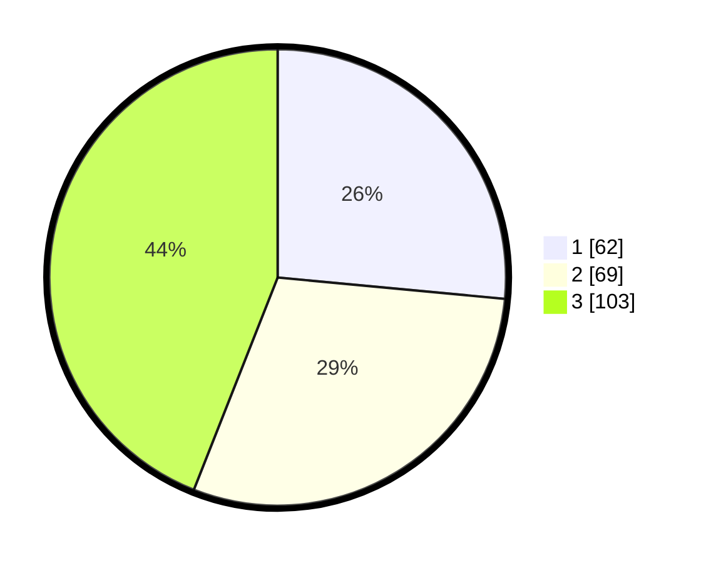

# Hasil

## Grafik

## Tabel

| No.    | Nama Paslon    | Suara | Suara (raw) | Persentase |
|:------ |:-------------- | -----:| -----------:| ----------:|
| 100025 | ANIES MUHAIMIN | 62    | [62][p-1]   | 26,50      |
| 100026 | PRABOWO GIBRAN | 69    | [69][p-2]   | 29,49      |
| 100027 | GANJAR MAHFUD  | 103   | [103][p-3]  | 44,02      |

[p-1]: https://github.com/gigit-pemilu/pemilu-2024/blob/main/pilpres/hitung-suara/sub/31-dki-jakarta/sub/72-jakarta-utara/sub/06-kelapa-gading/sub/1002-pegangsaan-dua/sub/074-tps/sub/paslon-1.txt
[p-2]: https://github.com/gigit-pemilu/pemilu-2024/blob/main/pilpres/hitung-suara/sub/31-dki-jakarta/sub/72-jakarta-utara/sub/06-kelapa-gading/sub/1002-pegangsaan-dua/sub/074-tps/sub/paslon-2.txt
[p-3]: https://github.com/gigit-pemilu/pemilu-2024/blob/main/pilpres/hitung-suara/sub/31-dki-jakarta/sub/72-jakarta-utara/sub/06-kelapa-gading/sub/1002-pegangsaan-dua/sub/074-tps/sub/paslon-3.txt

## Foto C Plano

https://sirekap-obj-formc.kpu.go.id/69ce/pemilu/ppwp/31/72/06/10/02/3172061002074-20240223-211423--3b187cb4-6bc0-4ad9-81dd-30e1d29a8b54.jpg

https://sirekap-obj-formc.kpu.go.id/69ce/pemilu/ppwp/31/72/06/10/02/3172061002074-20240223-211438--0703fa4c-b41e-4815-b597-8bc68690ad49.jpg

https://sirekap-obj-formc.kpu.go.id/69ce/pemilu/ppwp/31/72/06/10/02/3172061002074-20240223-211452--a0a6698b-8e90-4ff6-8258-851502accede.jpg

## Metadata

| Key        | Value               |
| ---------- | ------------------- |
| Time Stamp | 2024-02-24 22:31:28 |

