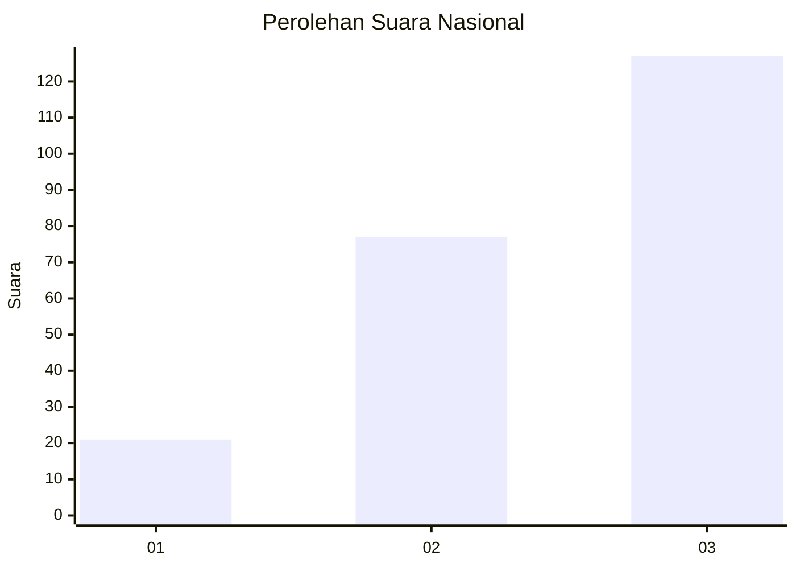
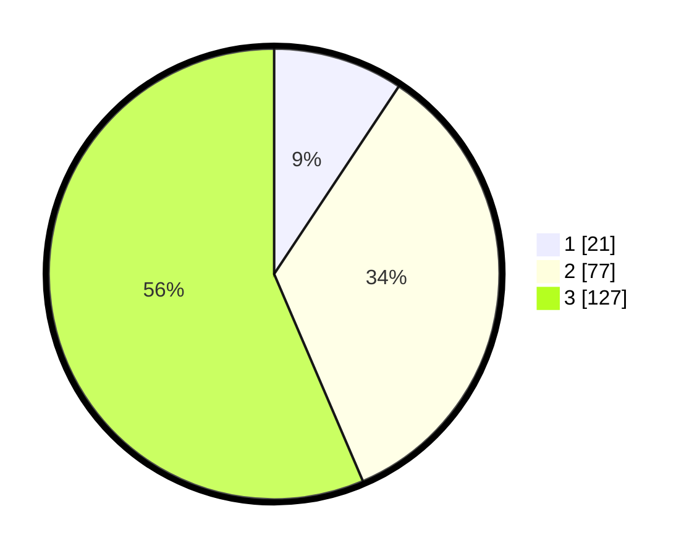

# Hasil

## Grafik

## Tabel

| No.    | Nama Paslon    | Suara | Suara (raw) | Persentase |
|:------ |:-------------- | -----:| -----------:| ----------:|
| 100025 | ANIES MUHAIMIN | 21    | [21][p-1]   | 9,33       |
| 100026 | PRABOWO GIBRAN | 77    | [77][p-2]   | 34,22      |
| 100027 | GANJAR MAHFUD  | 127   | [127][p-3]  | 56,44      |

[p-1]: https://github.com/gigit-pemilu/pemilu-2024/blob/main/pilpres/hitung-suara/sub/31-dki-jakarta/sub/72-jakarta-utara/sub/06-kelapa-gading/sub/1002-pegangsaan-dua/sub/076-tps/sub/paslon-1.txt
[p-2]: https://github.com/gigit-pemilu/pemilu-2024/blob/main/pilpres/hitung-suara/sub/31-dki-jakarta/sub/72-jakarta-utara/sub/06-kelapa-gading/sub/1002-pegangsaan-dua/sub/076-tps/sub/paslon-2.txt
[p-3]: https://github.com/gigit-pemilu/pemilu-2024/blob/main/pilpres/hitung-suara/sub/31-dki-jakarta/sub/72-jakarta-utara/sub/06-kelapa-gading/sub/1002-pegangsaan-dua/sub/076-tps/sub/paslon-3.txt

## Foto C Plano

https://sirekap-obj-formc.kpu.go.id/f377/pemilu/ppwp/31/72/06/10/02/3172061002076-20240224-091340--513a7115-3f31-465a-8dda-0ec6e9f0e170.jpg

https://sirekap-obj-formc.kpu.go.id/f377/pemilu/ppwp/31/72/06/10/02/3172061002076-20240224-091445--115a3917-cfc7-4bc5-aa00-3f7c7935e695.jpg

https://sirekap-obj-formc.kpu.go.id/f377/pemilu/ppwp/31/72/06/10/02/3172061002076-20240224-091517--dda56db5-6389-4f90-9bec-bcb234fe7381.jpg

## Metadata

| Key        | Value               |
| ---------- | ------------------- |
| Time Stamp | 2024-02-24 22:31:28 |

