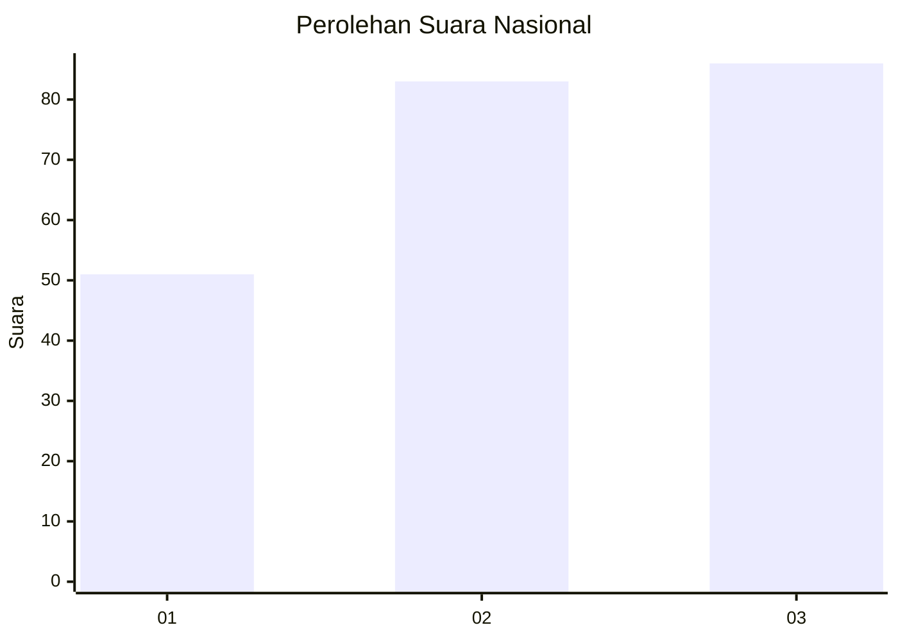
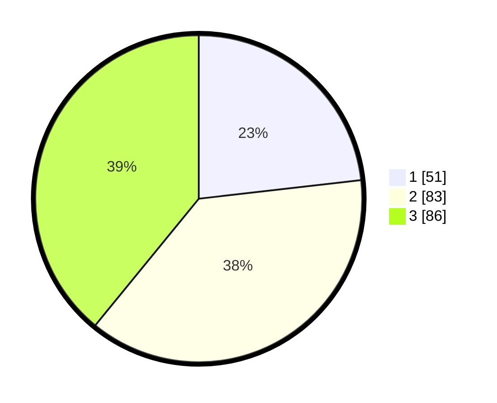

# Hasil

## Grafik

## Tabel

| No.    | Nama Paslon    | Suara | Suara (raw) | Persentase |
|:------ |:-------------- | -----:| -----------:| ----------:|
| 100025 | ANIES MUHAIMIN | 51    | [51][p-1]   | 23,18      |
| 100026 | PRABOWO GIBRAN | 83    | [83][p-2]   | 37,73      |
| 100027 | GANJAR MAHFUD  | 86    | [86][p-3]   | 39,09      |

[p-1]: https://github.com/gigit-pemilu/pemilu-2024/blob/main/pilpres/hitung-suara/sub/31-dki-jakarta/sub/72-jakarta-utara/sub/06-kelapa-gading/sub/1002-pegangsaan-dua/sub/079-tps/sub/paslon-1.txt
[p-2]: https://github.com/gigit-pemilu/pemilu-2024/blob/main/pilpres/hitung-suara/sub/31-dki-jakarta/sub/72-jakarta-utara/sub/06-kelapa-gading/sub/1002-pegangsaan-dua/sub/079-tps/sub/paslon-2.txt
[p-3]: https://github.com/gigit-pemilu/pemilu-2024/blob/main/pilpres/hitung-suara/sub/31-dki-jakarta/sub/72-jakarta-utara/sub/06-kelapa-gading/sub/1002-pegangsaan-dua/sub/079-tps/sub/paslon-3.txt

## Foto C Plano

https://sirekap-obj-formc.kpu.go.id/bc40/pemilu/ppwp/31/72/06/10/02/3172061002079-20240224-112411--6ca3dca1-2906-47b7-84b1-48986a7b4976.jpg

https://sirekap-obj-formc.kpu.go.id/bc40/pemilu/ppwp/31/72/06/10/02/3172061002079-20240224-112538--ddb78fc9-52eb-4613-acff-b3c650b46f69.jpg

https://sirekap-obj-formc.kpu.go.id/bc40/pemilu/ppwp/31/72/06/10/02/3172061002079-20240224-112614--f4c90871-0cbd-4d7b-92dd-ae8e0541c269.jpg

## Metadata

| Key        | Value               |
| ---------- | ------------------- |
| Time Stamp | 2024-02-25 03:00:00 |

