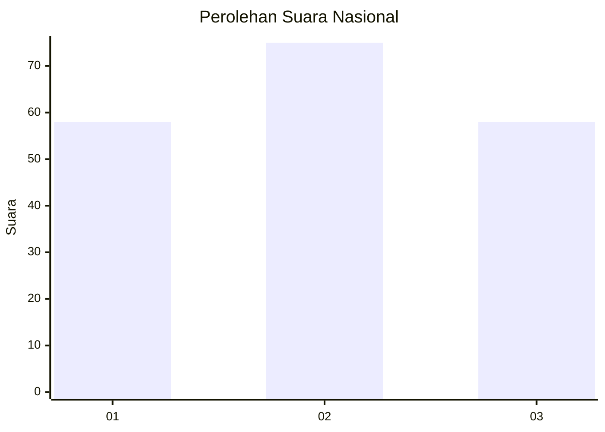
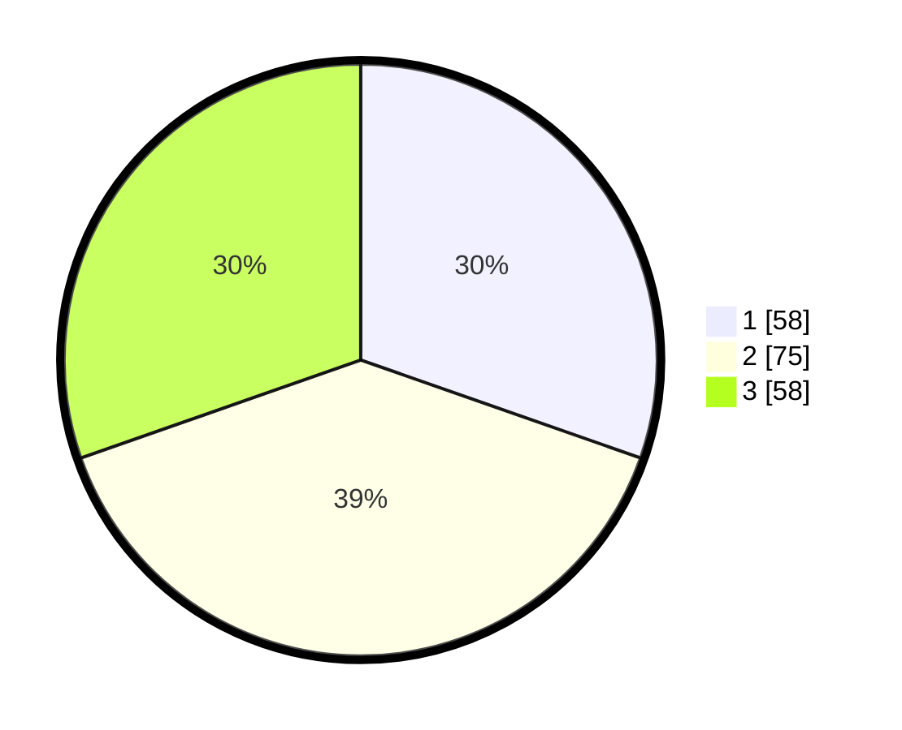

# Hasil

## Grafik

## Tabel

| No.    | Nama Paslon    | Suara | Suara (raw) | Persentase |
|:------ |:-------------- | -----:| -----------:| ----------:|
| 100025 | ANIES MUHAIMIN | 58    | [58][p-1]   | 30,37      |
| 100026 | PRABOWO GIBRAN | 75    | [75][p-2]   | 39,27      |
| 100027 | GANJAR MAHFUD  | 58    | [58][p-3]   | 30,37      |

[p-1]: https://github.com/gigit-pemilu/pemilu-2024/blob/main/pilpres/hitung-suara/sub/31-dki-jakarta/sub/72-jakarta-utara/sub/06-kelapa-gading/sub/1002-pegangsaan-dua/sub/083-tps/sub/paslon-1.txt
[p-2]: https://github.com/gigit-pemilu/pemilu-2024/blob/main/pilpres/hitung-suara/sub/31-dki-jakarta/sub/72-jakarta-utara/sub/06-kelapa-gading/sub/1002-pegangsaan-dua/sub/083-tps/sub/paslon-2.txt
[p-3]: https://github.com/gigit-pemilu/pemilu-2024/blob/main/pilpres/hitung-suara/sub/31-dki-jakarta/sub/72-jakarta-utara/sub/06-kelapa-gading/sub/1002-pegangsaan-dua/sub/083-tps/sub/paslon-3.txt

## Foto C Plano

https://sirekap-obj-formc.kpu.go.id/07b1/pemilu/ppwp/31/72/06/10/02/3172061002083-20240224-131155--e84f2007-7f66-4c20-91fc-6da1dc434c88.jpg

https://sirekap-obj-formc.kpu.go.id/07b1/pemilu/ppwp/31/72/06/10/02/3172061002083-20240224-131218--71862457-2e3b-4107-8fcc-061d07c4d669.jpg

https://sirekap-obj-formc.kpu.go.id/07b1/pemilu/ppwp/31/72/06/10/02/3172061002083-20240224-131240--a6d4180b-3e32-47ac-b634-cdc8eb656fcd.jpg

## Metadata

| Key        | Value               |
| ---------- | ------------------- |
| Time Stamp | 2024-02-25 03:00:00 |

