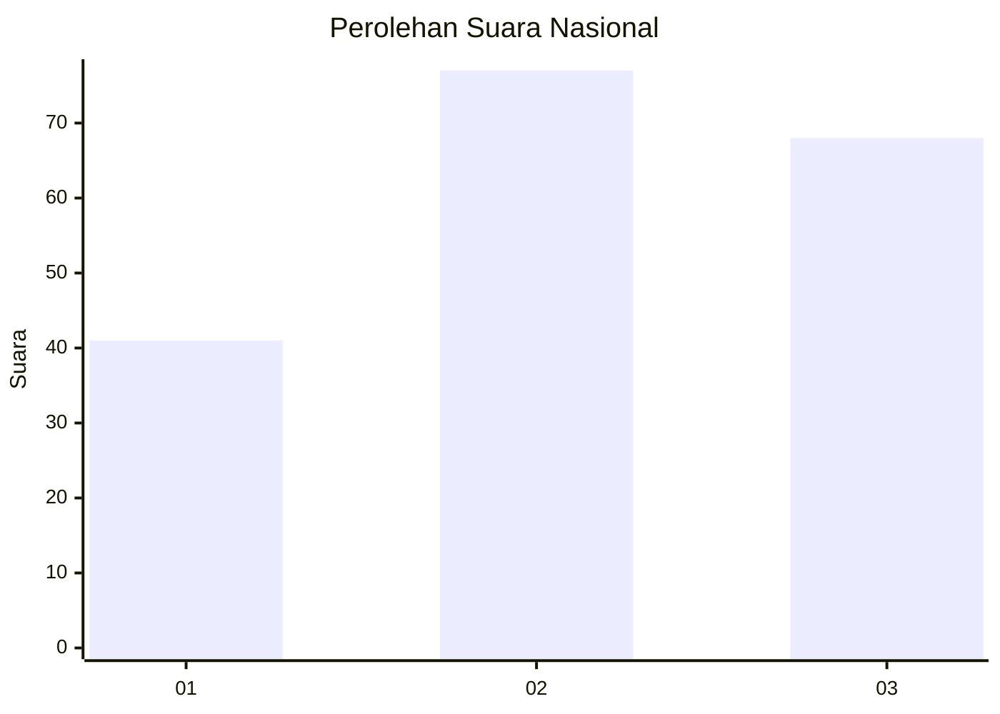
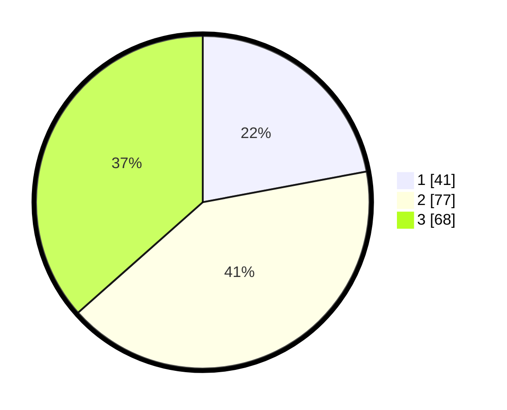

# Hasil

## Grafik

## Tabel

| No.    | Nama Paslon    | Suara | Suara (raw) | Persentase |
|:------ |:-------------- | -----:| -----------:| ----------:|
| 100025 | ANIES MUHAIMIN | 41    | [41][p-1]   | 22,04      |
| 100026 | PRABOWO GIBRAN | 77    | [77][p-2]   | 41,40      |
| 100027 | GANJAR MAHFUD  | 68    | [68][p-3]   | 36,56      |

[p-1]: https://github.com/gigit-pemilu/pemilu-2024/blob/main/pilpres/hitung-suara/sub/31-dki-jakarta/sub/72-jakarta-utara/sub/06-kelapa-gading/sub/1002-pegangsaan-dua/sub/091-tps/sub/paslon-1.txt
[p-2]: https://github.com/gigit-pemilu/pemilu-2024/blob/main/pilpres/hitung-suara/sub/31-dki-jakarta/sub/72-jakarta-utara/sub/06-kelapa-gading/sub/1002-pegangsaan-dua/sub/091-tps/sub/paslon-2.txt
[p-3]: https://github.com/gigit-pemilu/pemilu-2024/blob/main/pilpres/hitung-suara/sub/31-dki-jakarta/sub/72-jakarta-utara/sub/06-kelapa-gading/sub/1002-pegangsaan-dua/sub/091-tps/sub/paslon-3.txt

## Foto C Plano

https://sirekap-obj-formc.kpu.go.id/cf32/pemilu/ppwp/31/72/06/10/02/3172061002091-20240224-173342--50a21e64-335d-4322-8027-817c6c0b53b4.jpg

https://sirekap-obj-formc.kpu.go.id/cf32/pemilu/ppwp/31/72/06/10/02/3172061002091-20240224-173416--0c3c422c-4c95-4926-b1dd-a071679647cb.jpg

https://sirekap-obj-formc.kpu.go.id/cf32/pemilu/ppwp/31/72/06/10/02/3172061002091-20240224-173437--399dc27a-2949-468a-a517-0b3fd2afad76.jpg

## Metadata

| Key        | Value               |
| ---------- | ------------------- |
| Time Stamp | 2024-02-25 03:00:00 |

