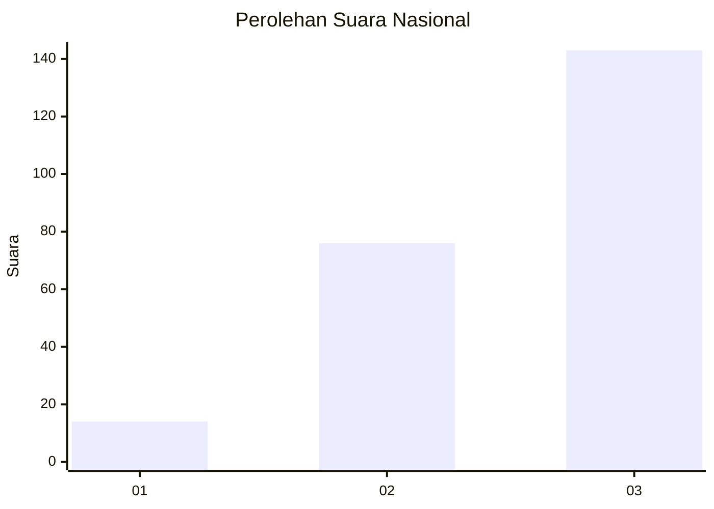
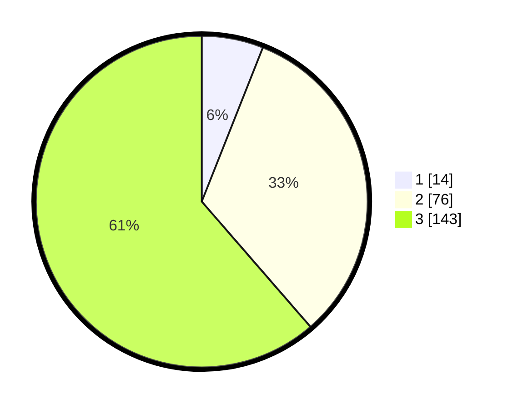

# Hasil

## Grafik

## Tabel

| No.    | Nama Paslon    | Suara | Suara (raw) | Persentase |
|:------ |:-------------- | -----:| -----------:| ----------:|
| 100025 | ANIES MUHAIMIN | 14    | [14][p-1]   | 6,01       |
| 100026 | PRABOWO GIBRAN | 76    | [76][p-2]   | 32,62      |
| 100027 | GANJAR MAHFUD  | 143   | [143][p-3]  | 61,37      |

[p-1]: https://github.com/gigit-pemilu/pemilu-2024/blob/main/pilpres/hitung-suara/sub/31-dki-jakarta/sub/72-jakarta-utara/sub/06-kelapa-gading/sub/1002-pegangsaan-dua/sub/097-tps/sub/paslon-1.txt
[p-2]: https://github.com/gigit-pemilu/pemilu-2024/blob/main/pilpres/hitung-suara/sub/31-dki-jakarta/sub/72-jakarta-utara/sub/06-kelapa-gading/sub/1002-pegangsaan-dua/sub/097-tps/sub/paslon-2.txt
[p-3]: https://github.com/gigit-pemilu/pemilu-2024/blob/main/pilpres/hitung-suara/sub/31-dki-jakarta/sub/72-jakarta-utara/sub/06-kelapa-gading/sub/1002-pegangsaan-dua/sub/097-tps/sub/paslon-3.txt

## Foto C Plano

https://sirekap-obj-formc.kpu.go.id/0757/pemilu/ppwp/31/72/06/10/02/3172061002097-20240225-143457--f69f6c73-88e1-4434-b614-6f6a3f5ec339.jpg

https://sirekap-obj-formc.kpu.go.id/0757/pemilu/ppwp/31/72/06/10/02/3172061002097-20240225-143518--5dcd13b0-c7cf-4a98-bc5e-fb843c7ba2e5.jpg

https://sirekap-obj-formc.kpu.go.id/0757/pemilu/ppwp/31/72/06/10/02/3172061002097-20240225-143535--1489c9d7-e593-473d-bb3d-f68020f4703f.jpg

## Metadata

| Key        | Value               |
| ---------- | ------------------- |
| Time Stamp | 2024-02-26 10:00:00 |

