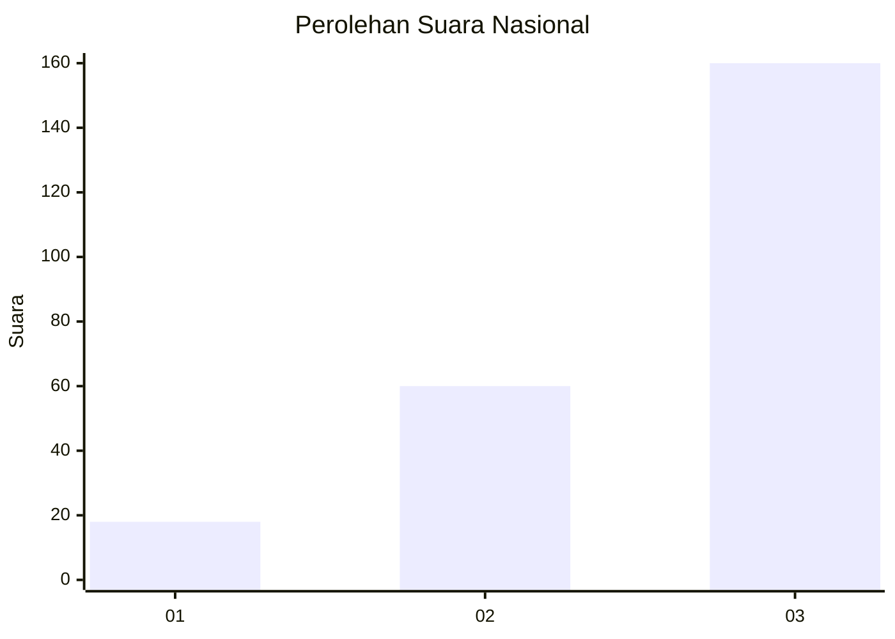
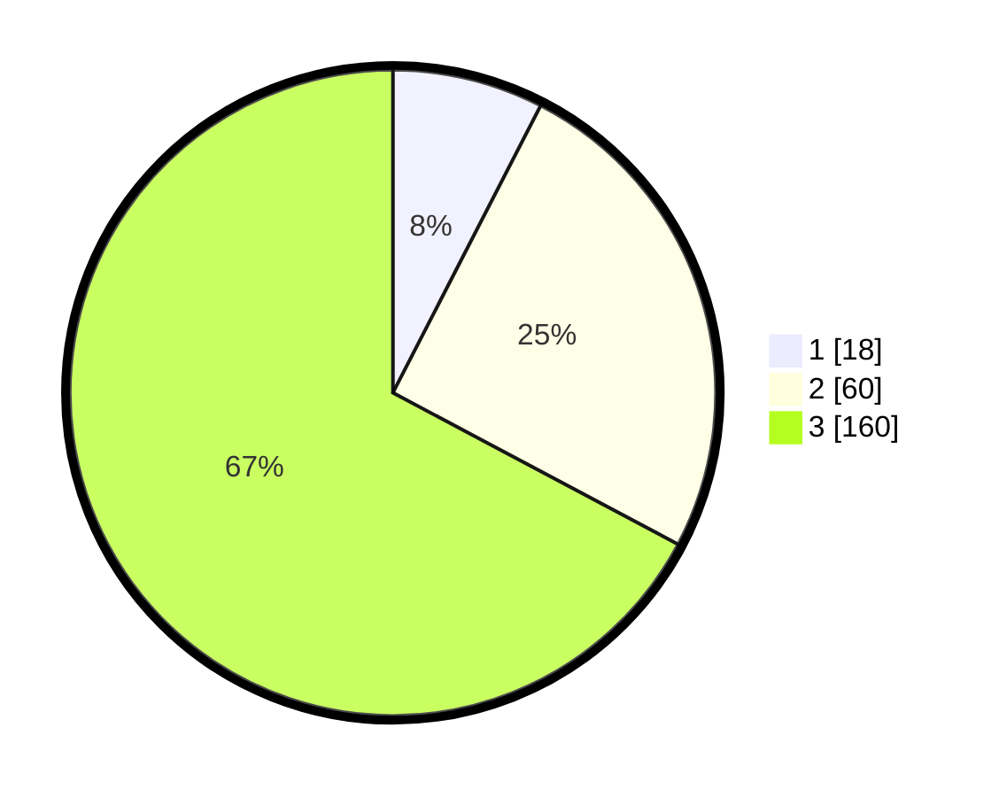

# Hasil

## Grafik

## Tabel

| No. | Nama Paslon    | Suara | Suara (raw) | Persentase |
|:--- |:-------------- | -----:| -----------:| ----------:|
| 1   | ANIES MUHAIMIN | 18    | [18][p-1]   | 7,56       |
| 2   | PRABOWO GIBRAN | 60    | [60][p-2]   | 25,21      |
| 3   | GANJAR MAHFUD  | 160   | [160][p-3]  | 67,23      |

[p-1]: https://github.com/gigit-pemilu/pemilu-2024/blob/main/pilpres/hitung-suara/sub/31-dki-jakarta/sub/72-jakarta-utara/sub/06-kelapa-gading/sub/1002-pegangsaan-dua/sub/105-tps/sub/paslon-1.txt
[p-2]: https://github.com/gigit-pemilu/pemilu-2024/blob/main/pilpres/hitung-suara/sub/31-dki-jakarta/sub/72-jakarta-utara/sub/06-kelapa-gading/sub/1002-pegangsaan-dua/sub/105-tps/sub/paslon-2.txt
[p-3]: https://github.com/gigit-pemilu/pemilu-2024/blob/main/pilpres/hitung-suara/sub/31-dki-jakarta/sub/72-jakarta-utara/sub/06-kelapa-gading/sub/1002-pegangsaan-dua/sub/105-tps/sub/paslon-3.txt

## Foto C Plano

https://sirekap-obj-formc.kpu.go.id/366f/pemilu/ppwp/31/72/06/10/02/3172061002105-20240225-174048--85451ce7-265e-4ec9-9533-e6edbe9eacf4.jpg

https://sirekap-obj-formc.kpu.go.id/366f/pemilu/ppwp/31/72/06/10/02/3172061002105-20240225-174100--d2bffe78-d252-486e-aad4-33cbdbcdb846.jpg

https://sirekap-obj-formc.kpu.go.id/366f/pemilu/ppwp/31/72/06/10/02/3172061002105-20240225-174126--a95f5cbc-4b24-4f16-b288-18bcc1a4df8a.jpg

## Metadata

| Key        | Value               |
| ---------- | ------------------- |
| Time Stamp | 2024-02-26 10:00:00 |

