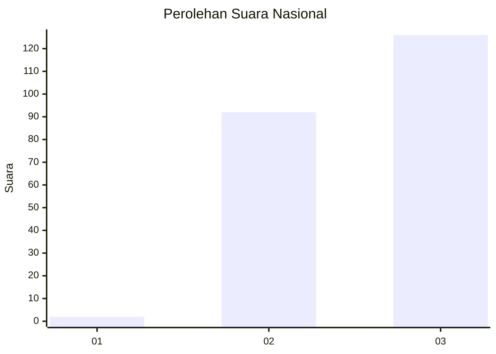
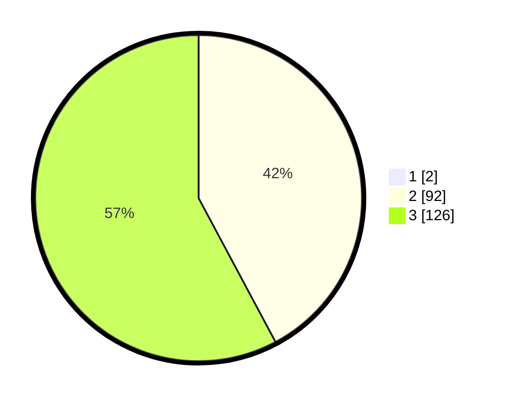

# Hasil

## Grafik

## Tabel

| No.    | Nama Paslon    | Suara | Suara (raw) | Persentase |
|:------ |:-------------- | -----:| -----------:| ----------:|
| 100025 | ANIES MUHAIMIN | 2     | [2][p-1]    | 0,91       |
| 100026 | PRABOWO GIBRAN | 92    | [92][p-2]   | 41,82      |
| 100027 | GANJAR MAHFUD  | 126   | [126][p-3]  | 57,27      |

[p-1]: https://github.com/gigit-pemilu/pemilu-2024/blob/main/pilpres/hitung-suara/sub/31-dki-jakarta/sub/72-jakarta-utara/sub/06-kelapa-gading/sub/1002-pegangsaan-dua/sub/107-tps/sub/paslon-1.txt
[p-2]: https://github.com/gigit-pemilu/pemilu-2024/blob/main/pilpres/hitung-suara/sub/31-dki-jakarta/sub/72-jakarta-utara/sub/06-kelapa-gading/sub/1002-pegangsaan-dua/sub/107-tps/sub/paslon-2.txt
[p-3]: https://github.com/gigit-pemilu/pemilu-2024/blob/main/pilpres/hitung-suara/sub/31-dki-jakarta/sub/72-jakarta-utara/sub/06-kelapa-gading/sub/1002-pegangsaan-dua/sub/107-tps/sub/paslon-3.txt

## Foto C Plano

https://sirekap-obj-formc.kpu.go.id/ef4a/pemilu/ppwp/31/72/06/10/02/3172061002107-20240225-194730--1e15c36a-5eba-486d-b020-1c7ad2585aed.jpg

https://sirekap-obj-formc.kpu.go.id/ef4a/pemilu/ppwp/31/72/06/10/02/3172061002107-20240225-194740--80162b03-9047-45a5-a846-6afd94a556de.jpg

https://sirekap-obj-formc.kpu.go.id/ef4a/pemilu/ppwp/31/72/06/10/02/3172061002107-20240225-194753--7eaf81e4-23fd-4aff-a646-b25245922e89.jpg

## Metadata

| Key        | Value               |
| ---------- | ------------------- |
| Time Stamp | 2024-02-26 10:00:00 |

