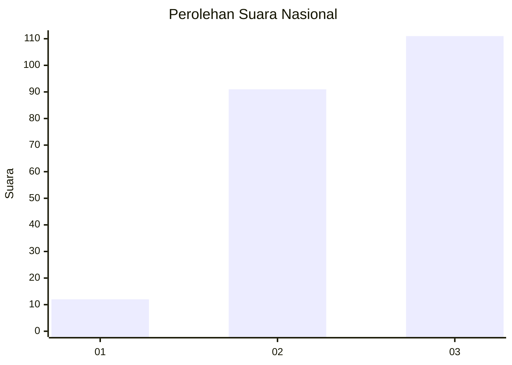
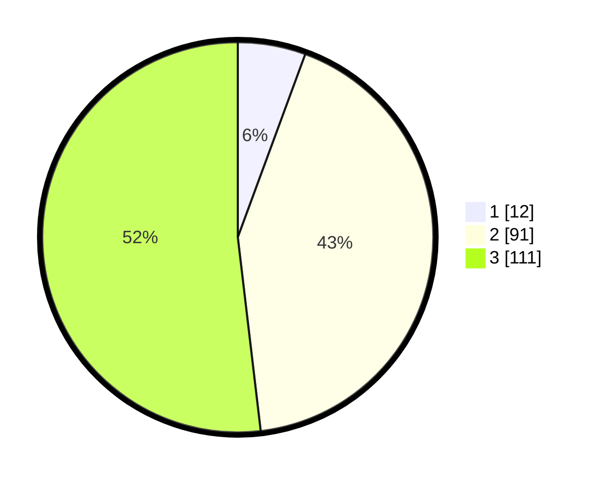

# Hasil

## Grafik

## Tabel

| No.    | Nama Paslon    | Suara | Suara (raw) | Persentase |
|:------ |:-------------- | -----:| -----------:| ----------:|
| 100025 | ANIES MUHAIMIN | 12    | [12][p-1]   | 5,61       |
| 100026 | PRABOWO GIBRAN | 91    | [91][p-2]   | 42,52      |
| 100027 | GANJAR MAHFUD  | 111   | [111][p-3]  | 51,87      |

[p-1]: https://github.com/gigit-pemilu/pemilu-2024/blob/main/pilpres/hitung-suara/sub/31-dki-jakarta/sub/72-jakarta-utara/sub/06-kelapa-gading/sub/1002-pegangsaan-dua/sub/112-tps/sub/paslon-1.txt
[p-2]: https://github.com/gigit-pemilu/pemilu-2024/blob/main/pilpres/hitung-suara/sub/31-dki-jakarta/sub/72-jakarta-utara/sub/06-kelapa-gading/sub/1002-pegangsaan-dua/sub/112-tps/sub/paslon-2.txt
[p-3]: https://github.com/gigit-pemilu/pemilu-2024/blob/main/pilpres/hitung-suara/sub/31-dki-jakarta/sub/72-jakarta-utara/sub/06-kelapa-gading/sub/1002-pegangsaan-dua/sub/112-tps/sub/paslon-3.txt

## Foto C Plano

https://sirekap-obj-formc.kpu.go.id/c6a9/pemilu/ppwp/31/72/06/10/02/3172061002112-20240226-103518--5ccf7ee4-00c0-4f1f-8713-d89437039385.jpg

https://sirekap-obj-formc.kpu.go.id/c6a9/pemilu/ppwp/31/72/06/10/02/3172061002112-20240226-103558--a8c2b96f-c63c-4162-8b90-51fad6980496.jpg

https://sirekap-obj-formc.kpu.go.id/c6a9/pemilu/ppwp/31/72/06/10/02/3172061002112-20240226-103622--b61e47ae-bc86-4123-aa60-7032be41a225.jpg

## Metadata

| Key        | Value               |
| ---------- | ------------------- |
| Time Stamp | 2024-02-26 11:00:00 |

