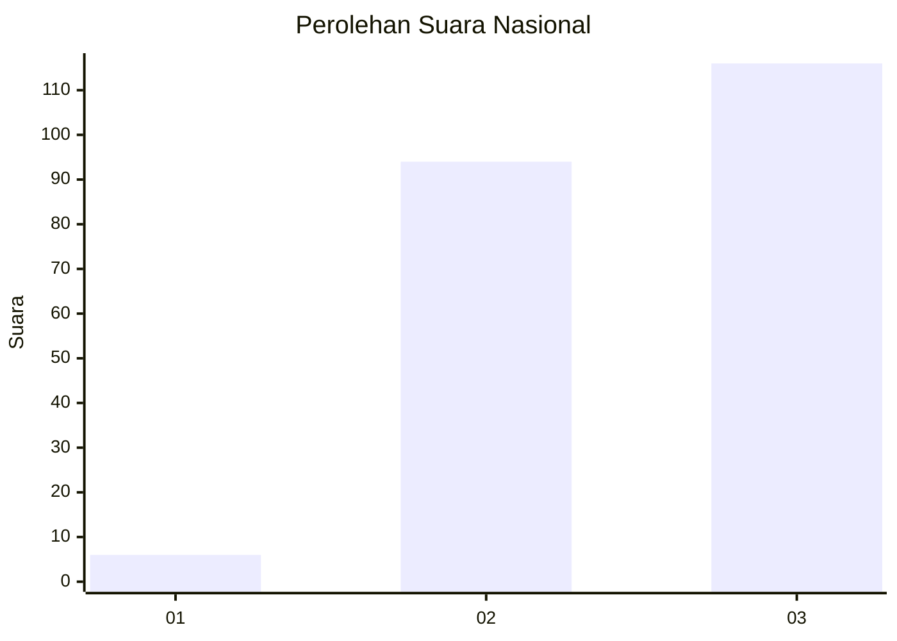
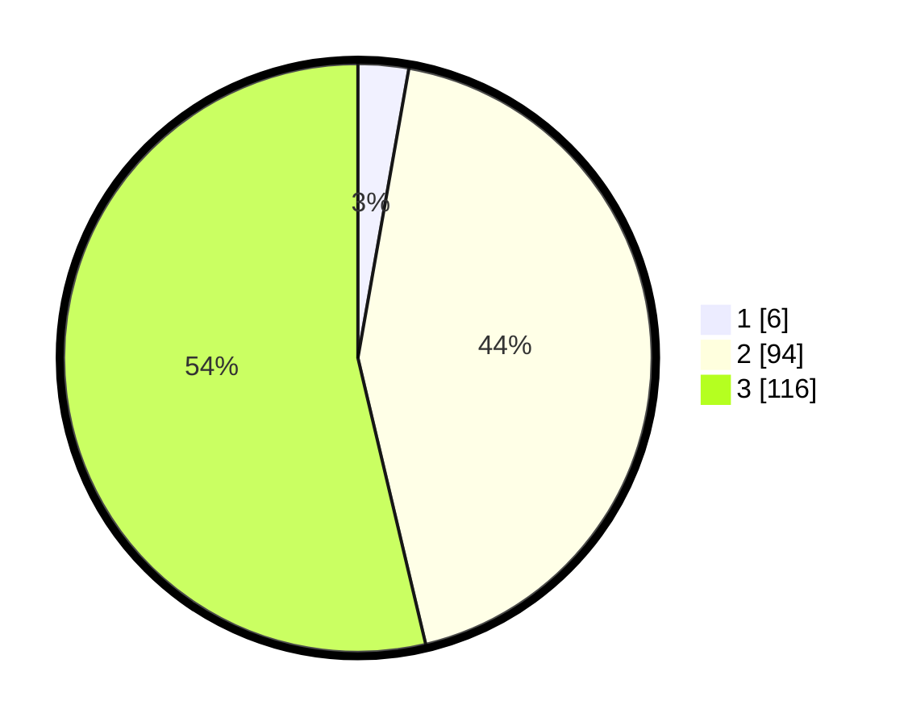

# Hasil

## Grafik

## Tabel

| No.    | Nama Paslon    | Suara | Suara (raw) | Persentase |
|:------ |:-------------- | -----:| -----------:| ----------:|
| 100025 | ANIES MUHAIMIN | 6     | [6][p-1]    | 2,78       |
| 100026 | PRABOWO GIBRAN | 94    | [94][p-2]   | 43,52      |
| 100027 | GANJAR MAHFUD  | 116   | [116][p-3]  | 53,70      |

[p-1]: https://github.com/gigit-pemilu/pemilu-2024/blob/main/pilpres/hitung-suara/sub/31-dki-jakarta/sub/72-jakarta-utara/sub/06-kelapa-gading/sub/1002-pegangsaan-dua/sub/123-tps/sub/paslon-1.txt
[p-2]: https://github.com/gigit-pemilu/pemilu-2024/blob/main/pilpres/hitung-suara/sub/31-dki-jakarta/sub/72-jakarta-utara/sub/06-kelapa-gading/sub/1002-pegangsaan-dua/sub/123-tps/sub/paslon-2.txt
[p-3]: https://github.com/gigit-pemilu/pemilu-2024/blob/main/pilpres/hitung-suara/sub/31-dki-jakarta/sub/72-jakarta-utara/sub/06-kelapa-gading/sub/1002-pegangsaan-dua/sub/123-tps/sub/paslon-3.txt

## Foto C Plano

https://sirekap-obj-formc.kpu.go.id/08f8/pemilu/ppwp/31/72/06/10/02/3172061002123-20240226-173903--0a4d00df-7dd3-4d7c-ac1f-cc89cf01814f.jpg

https://sirekap-obj-formc.kpu.go.id/08f8/pemilu/ppwp/31/72/06/10/02/3172061002123-20240226-174100--47d0eebb-043a-45fc-b3cb-66546a1b5a0a.jpg

https://sirekap-obj-formc.kpu.go.id/08f8/pemilu/ppwp/31/72/06/10/02/3172061002123-20240226-174129--35deb5e8-4c09-402d-a708-8da9f0e609f5.jpg

## Metadata

| Key        | Value               |
| ---------- | ------------------- |
| Time Stamp | 2024-02-28 19:00:00 |

