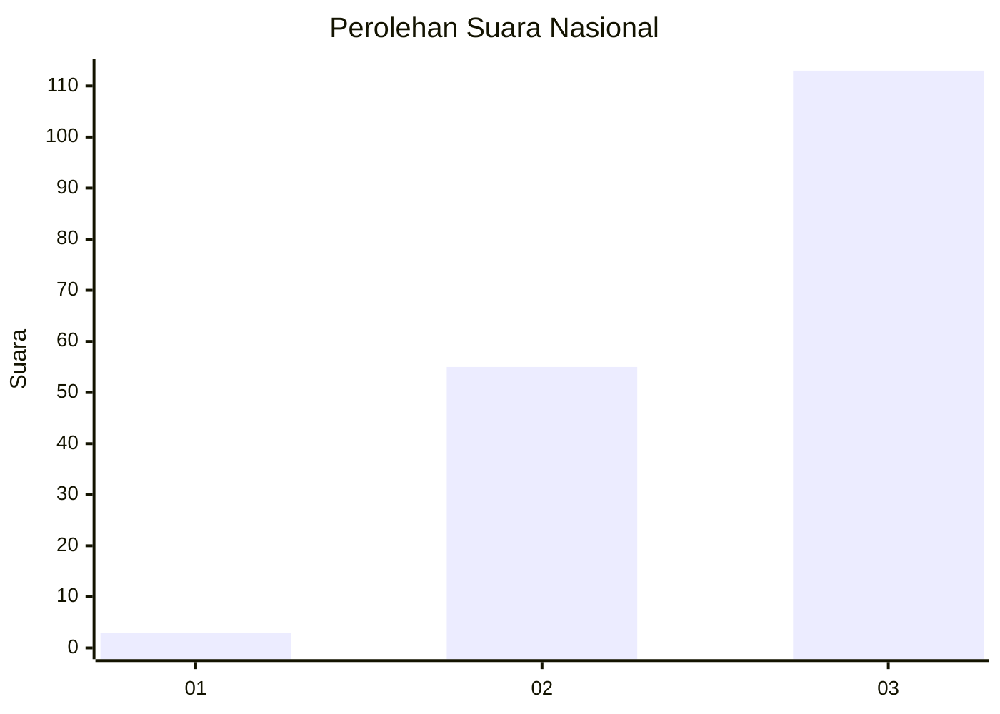
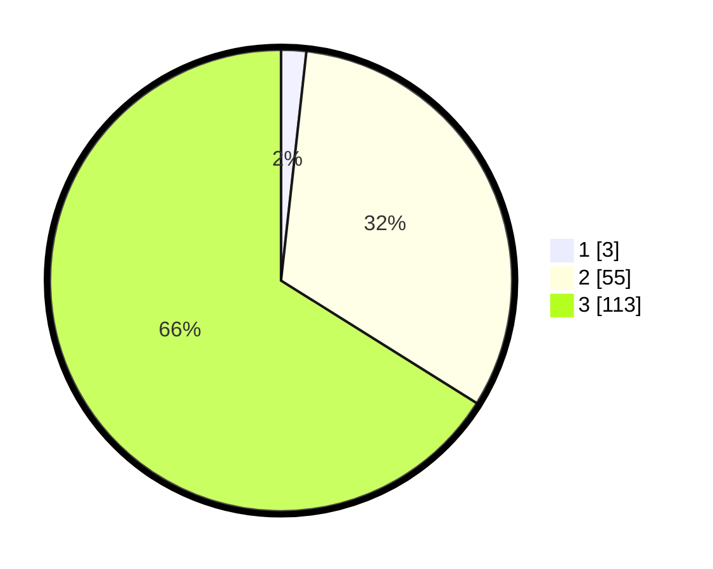

# Hasil

## Grafik

## Tabel

| No.    | Nama Paslon    | Suara | Suara (raw) | Persentase |
|:------ |:-------------- | -----:| -----------:| ----------:|
| 100025 | ANIES MUHAIMIN | 3     | [3][p-1]    | 1,75       |
| 100026 | PRABOWO GIBRAN | 55    | [55][p-2]   | 32,16      |
| 100027 | GANJAR MAHFUD  | 113   | [113][p-3]  | 66,08      |

[p-1]: https://github.com/gigit-pemilu/pemilu-2024/blob/main/pilpres/hitung-suara/sub/31-dki-jakarta/sub/72-jakarta-utara/sub/06-kelapa-gading/sub/1002-pegangsaan-dua/sub/124-tps/sub/paslon-1.txt
[p-2]: https://github.com/gigit-pemilu/pemilu-2024/blob/main/pilpres/hitung-suara/sub/31-dki-jakarta/sub/72-jakarta-utara/sub/06-kelapa-gading/sub/1002-pegangsaan-dua/sub/124-tps/sub/paslon-2.txt
[p-3]: https://github.com/gigit-pemilu/pemilu-2024/blob/main/pilpres/hitung-suara/sub/31-dki-jakarta/sub/72-jakarta-utara/sub/06-kelapa-gading/sub/1002-pegangsaan-dua/sub/124-tps/sub/paslon-3.txt

## Foto C Plano

https://sirekap-obj-formc.kpu.go.id/14a2/pemilu/ppwp/31/72/06/10/02/3172061002124-20240226-172808--9d5cc1ec-1b80-48b1-8b8e-5ade242a3b0f.jpg

https://sirekap-obj-formc.kpu.go.id/14a2/pemilu/ppwp/31/72/06/10/02/3172061002124-20240226-172902--6c61afe2-4ccb-4826-86e8-3ed9b35b9e08.jpg

https://sirekap-obj-formc.kpu.go.id/14a2/pemilu/ppwp/31/72/06/10/02/3172061002124-20240226-172932--e8996215-dec8-475d-88bf-67fa9d44fca1.jpg

## Metadata

| Key        | Value               |
| ---------- | ------------------- |
| Time Stamp | 2024-02-28 21:00:00 |

