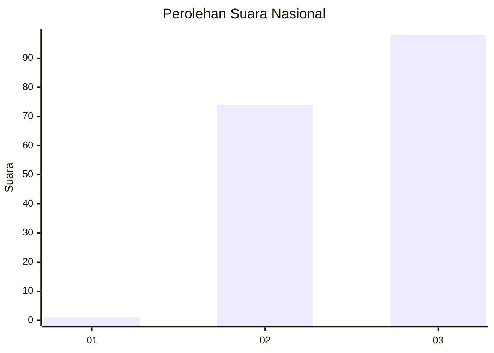
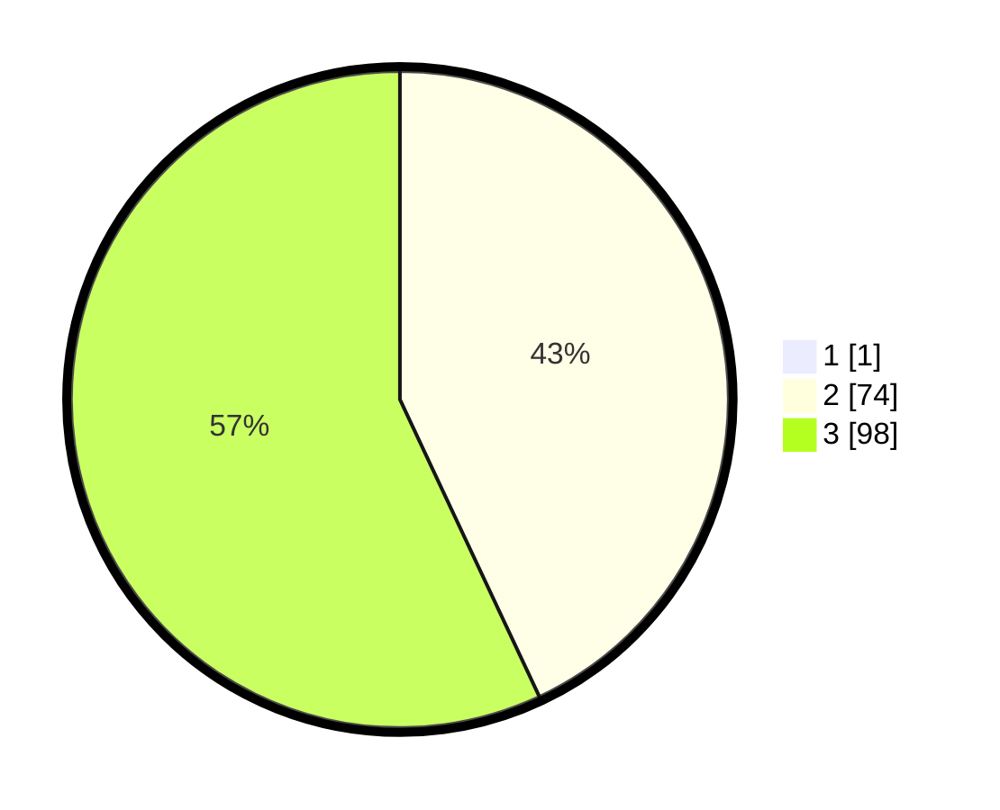

# Hasil

## Grafik

## Tabel

| No.    | Nama Paslon    | Suara | Suara (raw) | Persentase |
|:------ |:-------------- | -----:| -----------:| ----------:|
| 100025 | ANIES MUHAIMIN | 1     | [1][p-1]    | 0,58       |
| 100026 | PRABOWO GIBRAN | 74    | [74][p-2]   | 42,77      |
| 100027 | GANJAR MAHFUD  | 98    | [98][p-3]   | 56,65      |

[p-1]: https://github.com/gigit-pemilu/pemilu-2024/blob/main/pilpres/hitung-suara/sub/31-dki-jakarta/sub/72-jakarta-utara/sub/06-kelapa-gading/sub/1002-pegangsaan-dua/sub/126-tps/sub/paslon-1.txt
[p-2]: https://github.com/gigit-pemilu/pemilu-2024/blob/main/pilpres/hitung-suara/sub/31-dki-jakarta/sub/72-jakarta-utara/sub/06-kelapa-gading/sub/1002-pegangsaan-dua/sub/126-tps/sub/paslon-2.txt
[p-3]: https://github.com/gigit-pemilu/pemilu-2024/blob/main/pilpres/hitung-suara/sub/31-dki-jakarta/sub/72-jakarta-utara/sub/06-kelapa-gading/sub/1002-pegangsaan-dua/sub/126-tps/sub/paslon-3.txt

## Foto C Plano

https://sirekap-obj-formc.kpu.go.id/bbf1/pemilu/ppwp/31/72/06/10/02/3172061002126-20240226-190523--8d071e3e-695f-46d0-a7b8-de6e7a44845f.jpg

https://sirekap-obj-formc.kpu.go.id/bbf1/pemilu/ppwp/31/72/06/10/02/3172061002126-20240226-190612--ca99fef9-ef30-47e4-827b-fb202f5a969b.jpg

https://sirekap-obj-formc.kpu.go.id/bbf1/pemilu/ppwp/31/72/06/10/02/3172061002126-20240226-190633--3f156e69-c277-4ede-8ffc-bd2ed58d6f99.jpg

## Metadata

| Key        | Value               |
| ---------- | ------------------- |
| Time Stamp | 2024-02-28 20:00:00 |

