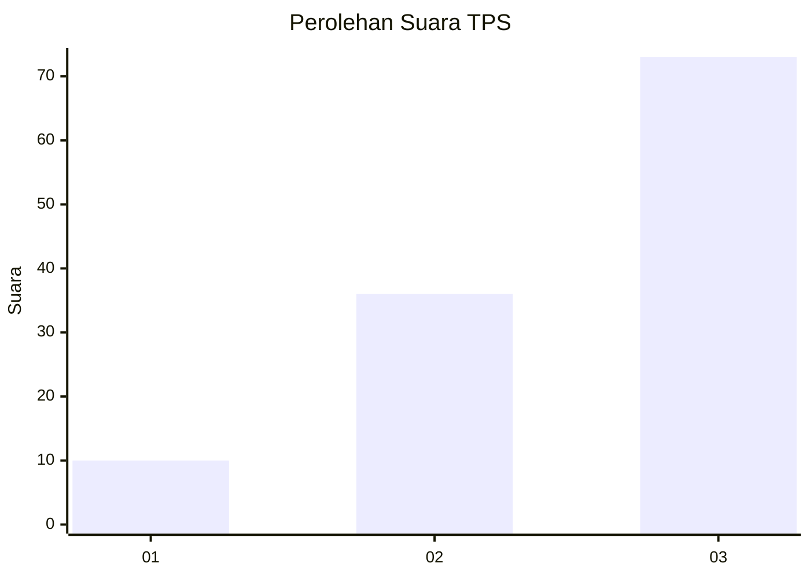
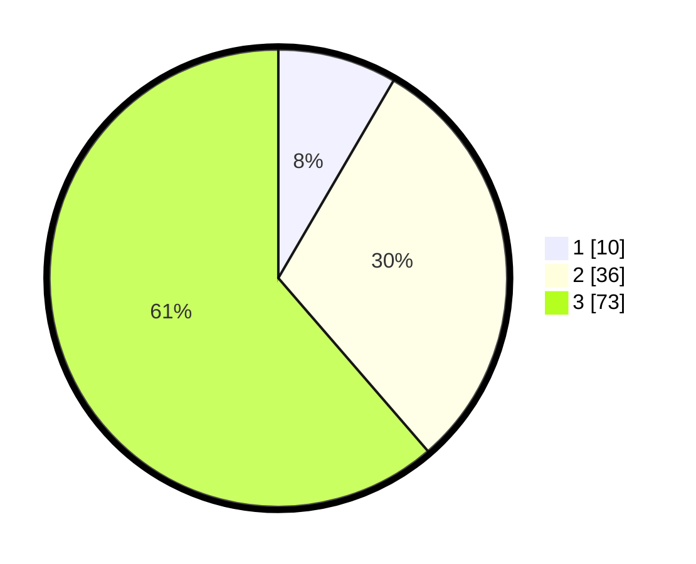

# Hasil

## Grafik

## Tabel

| No. | Nama Paslon    | Suara | Suara (raw) | Persentase |
|:--- |:-------------- | -----:| -----------:| ----------:|
| 1   | ANIES MUHAIMIN | 10    | [10][p-1]   | 8,40       |
| 2   | PRABOWO GIBRAN | 36    | [36][p-2]   | 30,25      |
| 3   | GANJAR MAHFUD  | 73    | [73][p-3]   | 61,34      |

[p-1]: https://github.com/gigit-pemilu/pemilu-2024-31-dki-jakarta/blob/main/pilpres/hitung-suara/sub/31-dki-jakarta/sub/72-jakarta-utara/sub/06-kelapa-gading/sub/1002-pegangsaan-dua/sub/132-tps/sub/paslon-1.txt
[p-2]: https://github.com/gigit-pemilu/pemilu-2024-31-dki-jakarta/blob/main/pilpres/hitung-suara/sub/31-dki-jakarta/sub/72-jakarta-utara/sub/06-kelapa-gading/sub/1002-pegangsaan-dua/sub/132-tps/sub/paslon-2.txt
[p-3]: https://github.com/gigit-pemilu/pemilu-2024-31-dki-jakarta/blob/main/pilpres/hitung-suara/sub/31-dki-jakarta/sub/72-jakarta-utara/sub/06-kelapa-gading/sub/1002-pegangsaan-dua/sub/132-tps/sub/paslon-3.txt

## Foto C Plano

https://sirekap-obj-formc.kpu.go.id/9d79/pemilu/ppwp/31/72/06/10/02/3172061002132-20240226-222101--877772c9-7725-4579-a5c1-c5b1862f1842.jpg

https://sirekap-obj-formc.kpu.go.id/9d79/pemilu/ppwp/31/72/06/10/02/3172061002132-20240226-222144--d800c719-7ca4-4d1f-ba67-0431491c05da.jpg

https://sirekap-obj-formc.kpu.go.id/9d79/pemilu/ppwp/31/72/06/10/02/3172061002132-20240226-222200--729a7432-49ce-4cbe-93ec-6ce7fe8de893.jpg

## Metadata

| Key        | Value               |
| ---------- | ------------------- |
| Time Stamp | 2024-02-28 20:00:00 |

