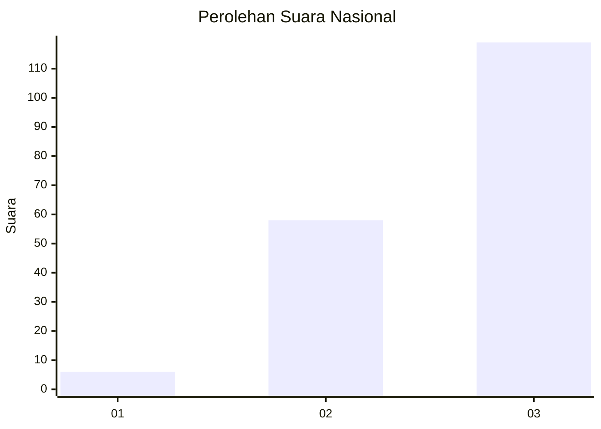
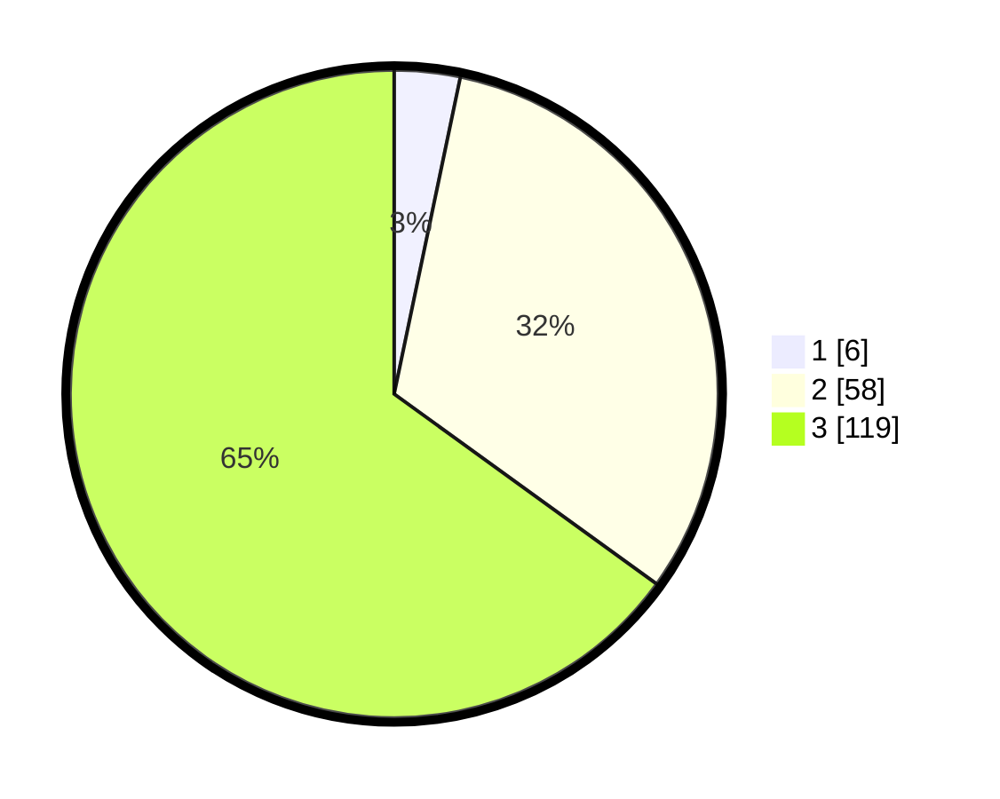

# Hasil

## Grafik

## Tabel

| No.    | Nama Paslon    | Suara | Suara (raw) | Persentase |
|:------ |:-------------- | -----:| -----------:| ----------:|
| 100025 | ANIES MUHAIMIN | 6     | [6][p-1]    | 3,28       |
| 100026 | PRABOWO GIBRAN | 58    | [58][p-2]   | 31,69      |
| 100027 | GANJAR MAHFUD  | 119   | [119][p-3]  | 65,03      |

[p-1]: https://github.com/gigit-pemilu/pemilu-2024/blob/main/pilpres/hitung-suara/sub/31-dki-jakarta/sub/72-jakarta-utara/sub/06-kelapa-gading/sub/1002-pegangsaan-dua/sub/134-tps/sub/paslon-1.txt
[p-2]: https://github.com/gigit-pemilu/pemilu-2024/blob/main/pilpres/hitung-suara/sub/31-dki-jakarta/sub/72-jakarta-utara/sub/06-kelapa-gading/sub/1002-pegangsaan-dua/sub/134-tps/sub/paslon-2.txt
[p-3]: https://github.com/gigit-pemilu/pemilu-2024/blob/main/pilpres/hitung-suara/sub/31-dki-jakarta/sub/72-jakarta-utara/sub/06-kelapa-gading/sub/1002-pegangsaan-dua/sub/134-tps/sub/paslon-3.txt

## Foto C Plano

https://sirekap-obj-formc.kpu.go.id/599a/pemilu/ppwp/31/72/06/10/02/3172061002134-20240227-113241--38030c96-1100-4912-bef6-2f0c1cc42f97.jpg

https://sirekap-obj-formc.kpu.go.id/599a/pemilu/ppwp/31/72/06/10/02/3172061002134-20240227-113359--6dcf2758-7428-43b8-88cf-889931adb610.jpg

https://sirekap-obj-formc.kpu.go.id/599a/pemilu/ppwp/31/72/06/10/02/3172061002134-20240227-113453--a3a9a2a8-5aa8-41d7-befd-13650f0a4349.jpg

## Metadata

| Key        | Value               |
| ---------- | ------------------- |
| Time Stamp | 2024-02-28 21:00:00 |

