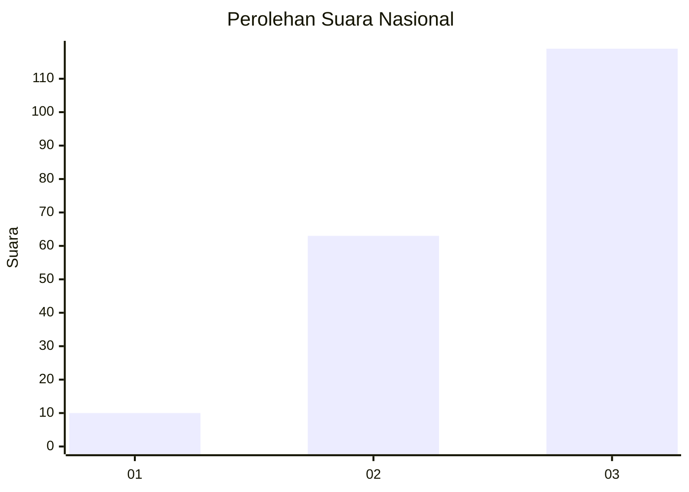
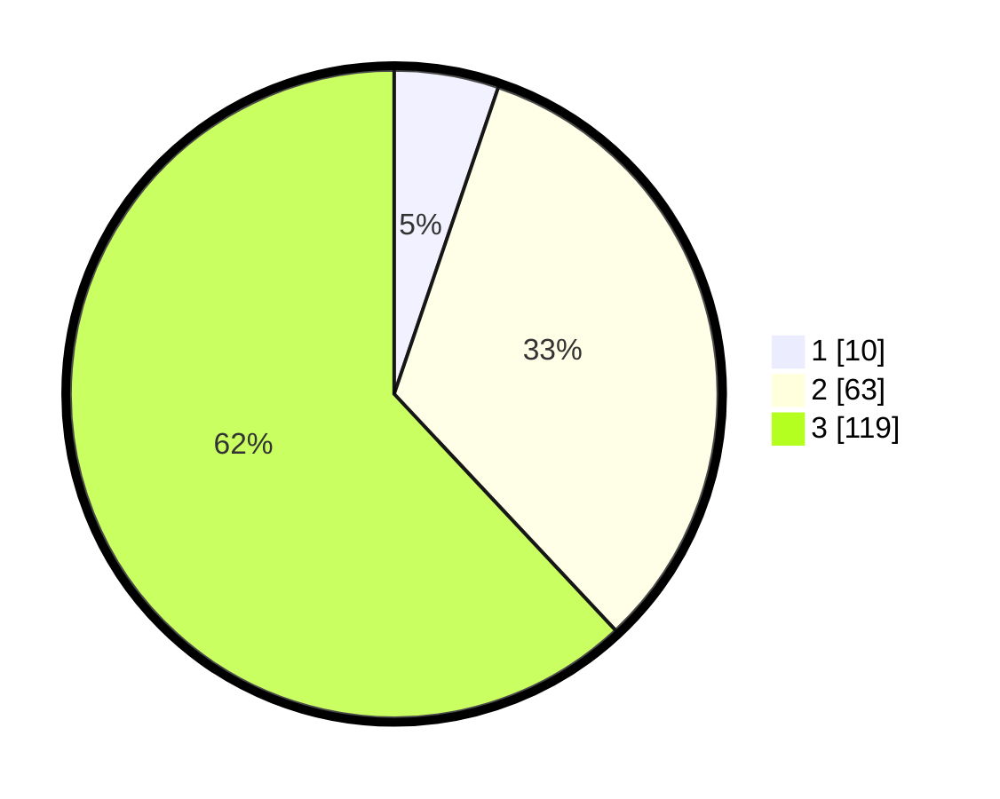

# Hasil

## Grafik

## Tabel

| No.    | Nama Paslon    | Suara | Suara (raw) | Persentase |
|:------ |:-------------- | -----:| -----------:| ----------:|
| 100025 | ANIES MUHAIMIN | 10    | [10][p-1]   | 5,21       |
| 100026 | PRABOWO GIBRAN | 63    | [63][p-2]   | 32,81      |
| 100027 | GANJAR MAHFUD  | 119   | [119][p-3]  | 61,98      |

[p-1]: https://github.com/gigit-pemilu/pemilu-2024/blob/main/pilpres/hitung-suara/sub/31-dki-jakarta/sub/72-jakarta-utara/sub/06-kelapa-gading/sub/1002-pegangsaan-dua/sub/137-tps/sub/paslon-1.txt
[p-2]: https://github.com/gigit-pemilu/pemilu-2024/blob/main/pilpres/hitung-suara/sub/31-dki-jakarta/sub/72-jakarta-utara/sub/06-kelapa-gading/sub/1002-pegangsaan-dua/sub/137-tps/sub/paslon-2.txt
[p-3]: https://github.com/gigit-pemilu/pemilu-2024/blob/main/pilpres/hitung-suara/sub/31-dki-jakarta/sub/72-jakarta-utara/sub/06-kelapa-gading/sub/1002-pegangsaan-dua/sub/137-tps/sub/paslon-3.txt

## Foto C Plano

https://sirekap-obj-formc.kpu.go.id/6048/pemilu/ppwp/31/72/06/10/02/3172061002137-20240227-134422--6e4601a8-b8e8-4db2-b5b0-ff4015967081.jpg

https://sirekap-obj-formc.kpu.go.id/6048/pemilu/ppwp/31/72/06/10/02/3172061002137-20240227-134445--7eaf011b-7dac-4e4f-82c7-0b7dc49b577f.jpg

https://sirekap-obj-formc.kpu.go.id/6048/pemilu/ppwp/31/72/06/10/02/3172061002137-20240227-134512--9423db89-63cd-4e0a-bfc4-333d5a29ba6e.jpg

## Metadata

| Key        | Value               |
| ---------- | ------------------- |
| Time Stamp | 2024-02-28 21:00:00 |

