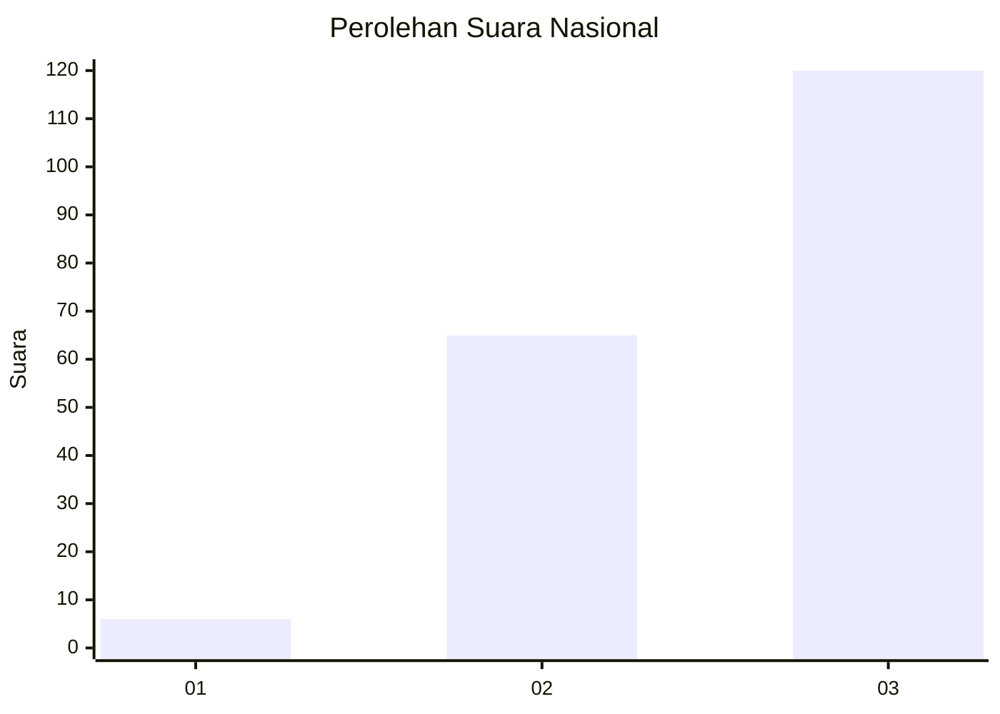
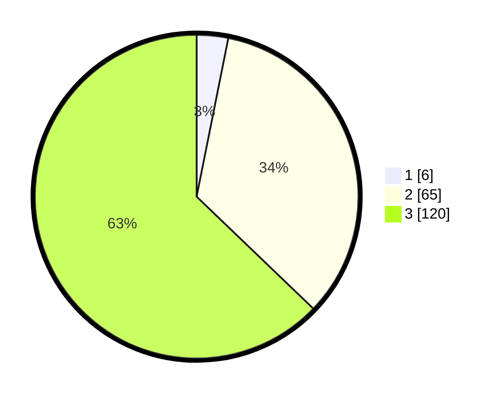

# Hasil

## Grafik

## Tabel

| No.    | Nama Paslon    | Suara | Suara (raw) | Persentase |
|:------ |:-------------- | -----:| -----------:| ----------:|
| 100025 | ANIES MUHAIMIN | 6     | [6][p-1]    | 3,14       |
| 100026 | PRABOWO GIBRAN | 65    | [65][p-2]   | 34,03      |
| 100027 | GANJAR MAHFUD  | 120   | [120][p-3]  | 62,83      |

[p-1]: https://github.com/gigit-pemilu/pemilu-2024/blob/main/pilpres/hitung-suara/sub/31-dki-jakarta/sub/72-jakarta-utara/sub/06-kelapa-gading/sub/1002-pegangsaan-dua/sub/138-tps/sub/paslon-1.txt
[p-2]: https://github.com/gigit-pemilu/pemilu-2024/blob/main/pilpres/hitung-suara/sub/31-dki-jakarta/sub/72-jakarta-utara/sub/06-kelapa-gading/sub/1002-pegangsaan-dua/sub/138-tps/sub/paslon-2.txt
[p-3]: https://github.com/gigit-pemilu/pemilu-2024/blob/main/pilpres/hitung-suara/sub/31-dki-jakarta/sub/72-jakarta-utara/sub/06-kelapa-gading/sub/1002-pegangsaan-dua/sub/138-tps/sub/paslon-3.txt

## Foto C Plano

https://sirekap-obj-formc.kpu.go.id/9668/pemilu/ppwp/31/72/06/10/02/3172061002138-20240227-141205--5e73388f-a24c-4ae8-a4b5-84903fd247a4.jpg

https://sirekap-obj-formc.kpu.go.id/9668/pemilu/ppwp/31/72/06/10/02/3172061002138-20240227-141222--20fcc1c1-d950-46bd-a41d-a3146d16361c.jpg

https://sirekap-obj-formc.kpu.go.id/9668/pemilu/ppwp/31/72/06/10/02/3172061002138-20240227-141309--828441b5-ba58-48d0-8326-bd0e6a531328.jpg

## Metadata

| Key        | Value               |
| ---------- | ------------------- |
| Time Stamp | 2024-02-28 19:00:00 |

