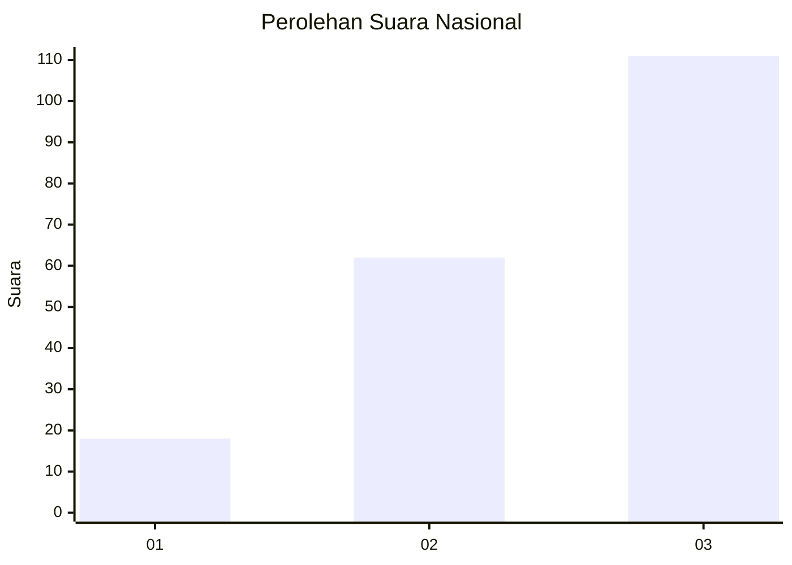
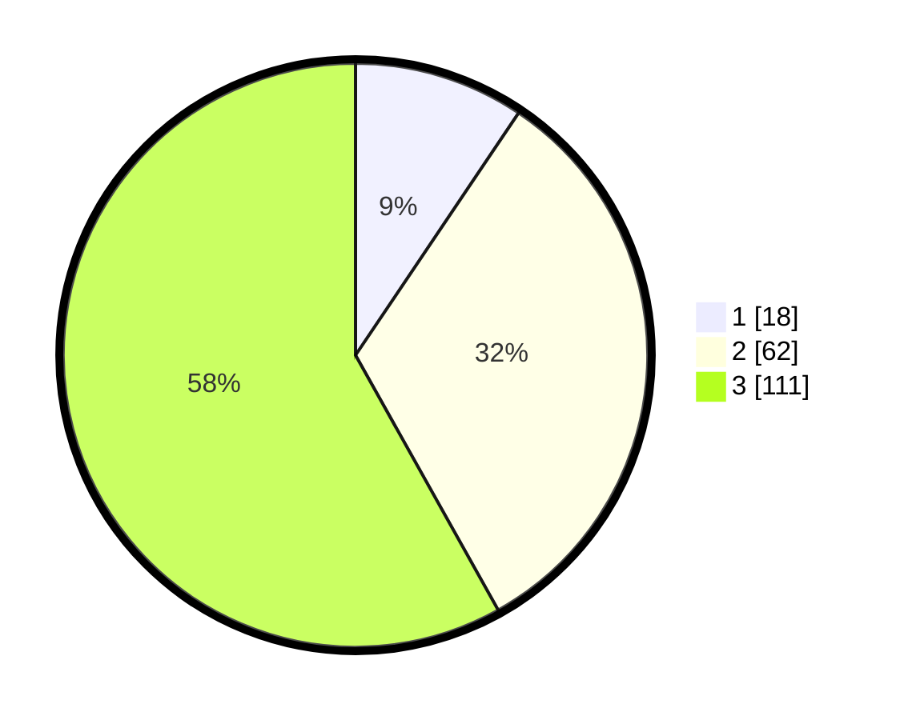

# Hasil

## Grafik

## Tabel

| No.    | Nama Paslon    | Suara | Suara (raw) | Persentase |
|:------ |:-------------- | -----:| -----------:| ----------:|
| 100025 | ANIES MUHAIMIN | 18    | [18][p-1]   | 9,42       |
| 100026 | PRABOWO GIBRAN | 62    | [62][p-2]   | 32,46      |
| 100027 | GANJAR MAHFUD  | 111   | [111][p-3]  | 58,12      |

[p-1]: https://github.com/gigit-pemilu/pemilu-2024/blob/main/pilpres/hitung-suara/sub/31-dki-jakarta/sub/72-jakarta-utara/sub/06-kelapa-gading/sub/1002-pegangsaan-dua/sub/139-tps/sub/paslon-1.txt
[p-2]: https://github.com/gigit-pemilu/pemilu-2024/blob/main/pilpres/hitung-suara/sub/31-dki-jakarta/sub/72-jakarta-utara/sub/06-kelapa-gading/sub/1002-pegangsaan-dua/sub/139-tps/sub/paslon-2.txt
[p-3]: https://github.com/gigit-pemilu/pemilu-2024/blob/main/pilpres/hitung-suara/sub/31-dki-jakarta/sub/72-jakarta-utara/sub/06-kelapa-gading/sub/1002-pegangsaan-dua/sub/139-tps/sub/paslon-3.txt

## Foto C Plano

https://sirekap-obj-formc.kpu.go.id/9fa3/pemilu/ppwp/31/72/06/10/02/3172061002139-20240227-143625--2e7bd952-546e-4a8c-a34e-92a48dada2b8.jpg

https://sirekap-obj-formc.kpu.go.id/9fa3/pemilu/ppwp/31/72/06/10/02/3172061002139-20240227-143651--b217c318-4f16-4bbf-a882-37a87e9b993c.jpg

https://sirekap-obj-formc.kpu.go.id/9fa3/pemilu/ppwp/31/72/06/10/02/3172061002139-20240227-143717--21592b9f-13f5-4f8d-bf62-b58989300770.jpg

## Metadata

| Key        | Value               |
| ---------- | ------------------- |
| Time Stamp | 2024-02-28 19:00:00 |

