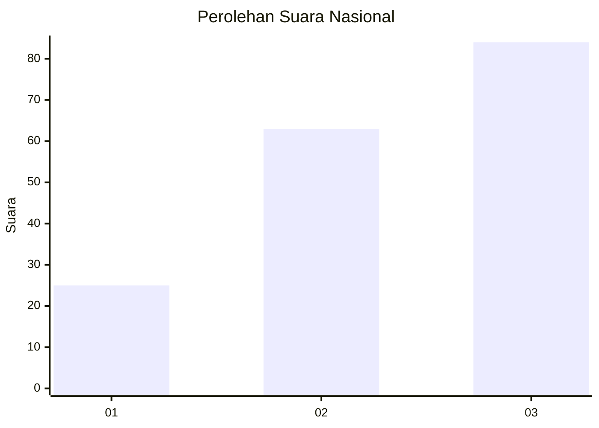
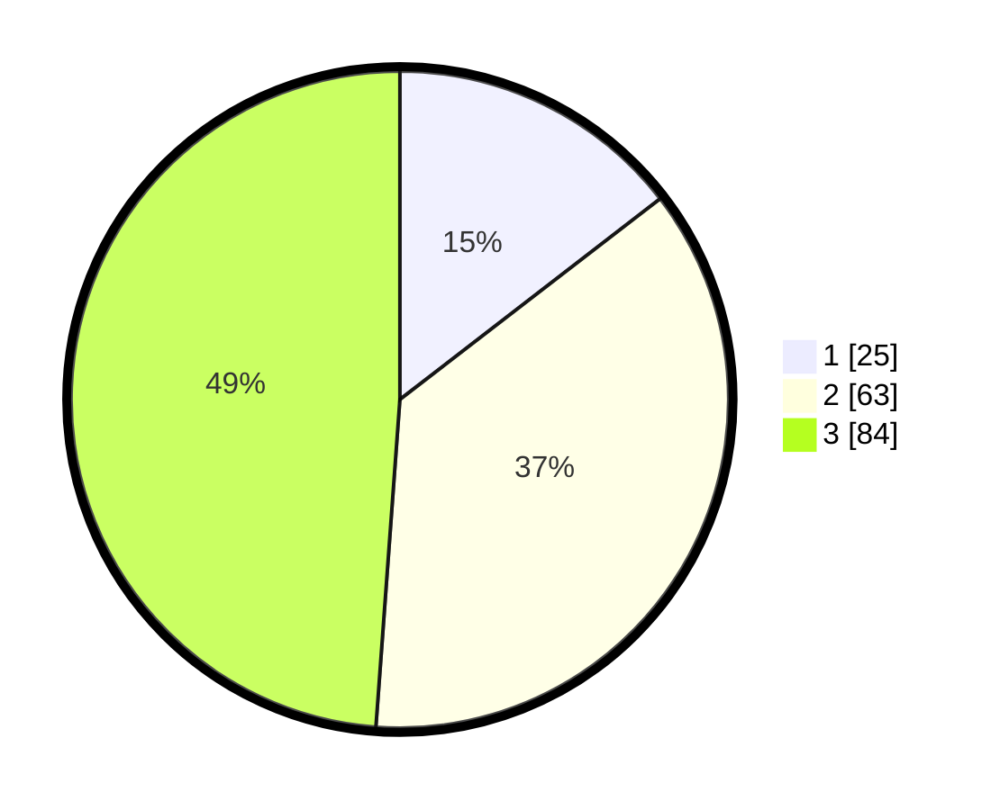

# Hasil

## Grafik

## Tabel

| No.    | Nama Paslon    | Suara | Suara (raw) | Persentase |
|:------ |:-------------- | -----:| -----------:| ----------:|
| 100025 | ANIES MUHAIMIN | 25    | [25][p-1]   | 14,53      |
| 100026 | PRABOWO GIBRAN | 63    | [63][p-2]   | 36,63      |
| 100027 | GANJAR MAHFUD  | 84    | [84][p-3]   | 48,84      |

[p-1]: https://github.com/gigit-pemilu/pemilu-2024/blob/main/pilpres/hitung-suara/sub/31-dki-jakarta/sub/72-jakarta-utara/sub/06-kelapa-gading/sub/1002-pegangsaan-dua/sub/147-tps/sub/paslon-1.txt
[p-2]: https://github.com/gigit-pemilu/pemilu-2024/blob/main/pilpres/hitung-suara/sub/31-dki-jakarta/sub/72-jakarta-utara/sub/06-kelapa-gading/sub/1002-pegangsaan-dua/sub/147-tps/sub/paslon-2.txt
[p-3]: https://github.com/gigit-pemilu/pemilu-2024/blob/main/pilpres/hitung-suara/sub/31-dki-jakarta/sub/72-jakarta-utara/sub/06-kelapa-gading/sub/1002-pegangsaan-dua/sub/147-tps/sub/paslon-3.txt

## Foto C Plano

https://sirekap-obj-formc.kpu.go.id/fc1b/pemilu/ppwp/31/72/06/10/02/3172061002147-20240227-201606--d03700fb-8a2a-490c-805a-d75d543c305e.jpg

https://sirekap-obj-formc.kpu.go.id/fc1b/pemilu/ppwp/31/72/06/10/02/3172061002147-20240227-201642--cd2fe07a-e7b5-4e35-ba3b-2cbf6ec37e6a.jpg

https://sirekap-obj-formc.kpu.go.id/fc1b/pemilu/ppwp/31/72/06/10/02/3172061002147-20240227-201715--691adcea-2568-4a71-b4ab-47491faf488c.jpg

## Metadata

| Key        | Value               |
| ---------- | ------------------- |
| Time Stamp | 2024-02-28 19:00:00 |

