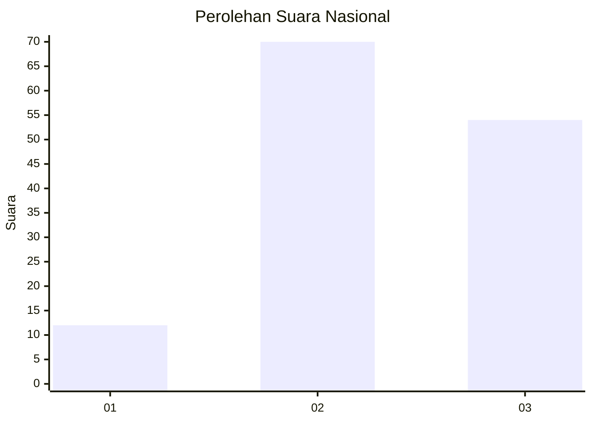
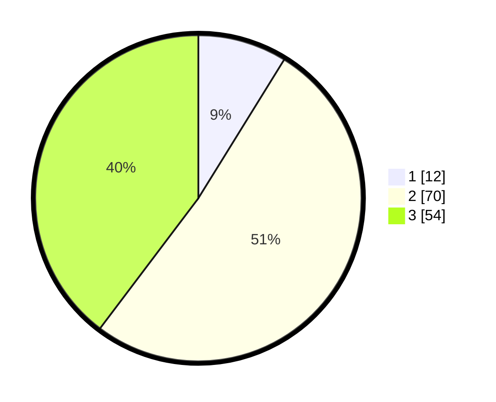

# Hasil

## Grafik

## Tabel

| No.    | Nama Paslon    | Suara | Suara (raw) | Persentase |
|:------ |:-------------- | -----:| -----------:| ----------:|
| 100025 | ANIES MUHAIMIN | 12    | [12][p-1]   | 8,82       |
| 100026 | PRABOWO GIBRAN | 70    | [70][p-2]   | 51,47      |
| 100027 | GANJAR MAHFUD  | 54    | [54][p-3]   | 39,71      |

[p-1]: https://github.com/gigit-pemilu/pemilu-2024/blob/main/pilpres/hitung-suara/sub/31-dki-jakarta/sub/72-jakarta-utara/sub/06-kelapa-gading/sub/1002-pegangsaan-dua/sub/150-tps/sub/paslon-1.txt
[p-2]: https://github.com/gigit-pemilu/pemilu-2024/blob/main/pilpres/hitung-suara/sub/31-dki-jakarta/sub/72-jakarta-utara/sub/06-kelapa-gading/sub/1002-pegangsaan-dua/sub/150-tps/sub/paslon-2.txt
[p-3]: https://github.com/gigit-pemilu/pemilu-2024/blob/main/pilpres/hitung-suara/sub/31-dki-jakarta/sub/72-jakarta-utara/sub/06-kelapa-gading/sub/1002-pegangsaan-dua/sub/150-tps/sub/paslon-3.txt

## Foto C Plano

https://sirekap-obj-formc.kpu.go.id/8f39/pemilu/ppwp/31/72/06/10/02/3172061002150-20240227-202205--733fea53-4775-4072-9c53-8137c48b597e.jpg

https://sirekap-obj-formc.kpu.go.id/8f39/pemilu/ppwp/31/72/06/10/02/3172061002150-20240227-202223--cc15de86-dfa5-48f2-9905-af5895b13d33.jpg

https://sirekap-obj-formc.kpu.go.id/8f39/pemilu/ppwp/31/72/06/10/02/3172061002150-20240227-202241--28dc84a2-7388-4045-ab4e-5fda8608233c.jpg

## Metadata

| Key        | Value               |
| ---------- | ------------------- |
| Time Stamp | 2024-02-28 18:00:00 |

