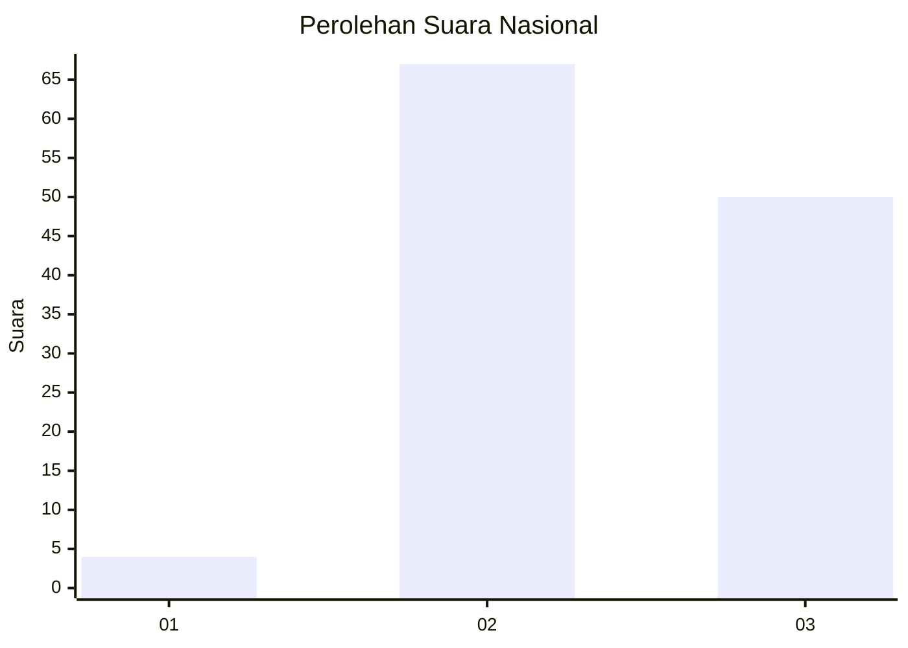
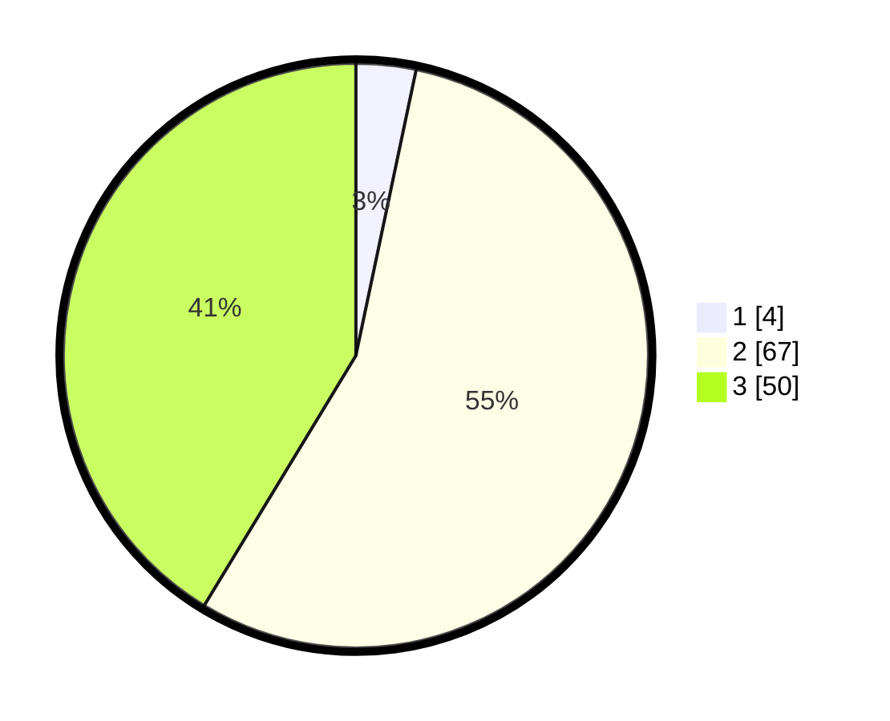

# Hasil

## Grafik

## Tabel

| No.    | Nama Paslon    | Suara | Suara (raw) | Persentase |
|:------ |:-------------- | -----:| -----------:| ----------:|
| 100025 | ANIES MUHAIMIN | 4     | [4][p-1]    | 3,31       |
| 100026 | PRABOWO GIBRAN | 67    | [67][p-2]   | 55,37      |
| 100027 | GANJAR MAHFUD  | 50    | [50][p-3]   | 41,32      |

[p-1]: https://github.com/gigit-pemilu/pemilu-2024/blob/main/pilpres/hitung-suara/sub/31-dki-jakarta/sub/72-jakarta-utara/sub/06-kelapa-gading/sub/1002-pegangsaan-dua/sub/152-tps/sub/paslon-1.txt
[p-2]: https://github.com/gigit-pemilu/pemilu-2024/blob/main/pilpres/hitung-suara/sub/31-dki-jakarta/sub/72-jakarta-utara/sub/06-kelapa-gading/sub/1002-pegangsaan-dua/sub/152-tps/sub/paslon-2.txt
[p-3]: https://github.com/gigit-pemilu/pemilu-2024/blob/main/pilpres/hitung-suara/sub/31-dki-jakarta/sub/72-jakarta-utara/sub/06-kelapa-gading/sub/1002-pegangsaan-dua/sub/152-tps/sub/paslon-3.txt

## Foto C Plano

https://sirekap-obj-formc.kpu.go.id/c3da/pemilu/ppwp/31/72/06/10/02/3172061002152-20240227-203439--b1af7319-fd24-4b20-b339-4aab8243a617.jpg

https://sirekap-obj-formc.kpu.go.id/c3da/pemilu/ppwp/31/72/06/10/02/3172061002152-20240227-203520--70872683-1f9e-4137-a205-e3aae4630170.jpg

https://sirekap-obj-formc.kpu.go.id/c3da/pemilu/ppwp/31/72/06/10/02/3172061002152-20240227-203723--a0e28a89-8532-4ad0-b495-2154598d853d.jpg

## Metadata

| Key        | Value               |
| ---------- | ------------------- |
| Time Stamp | 2024-02-28 19:00:00 |

