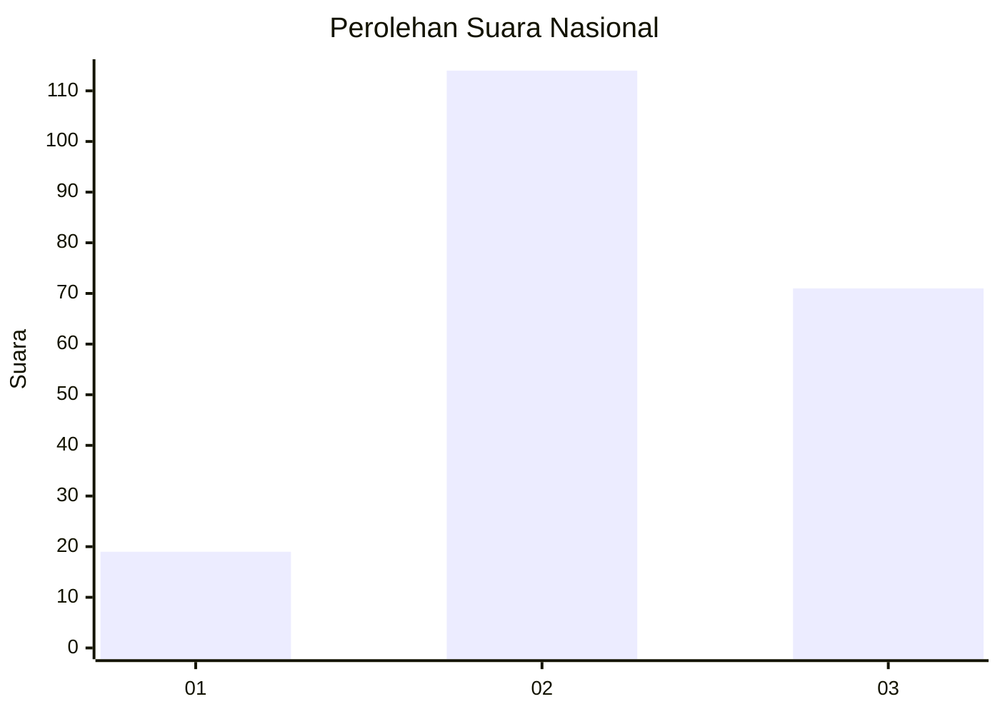
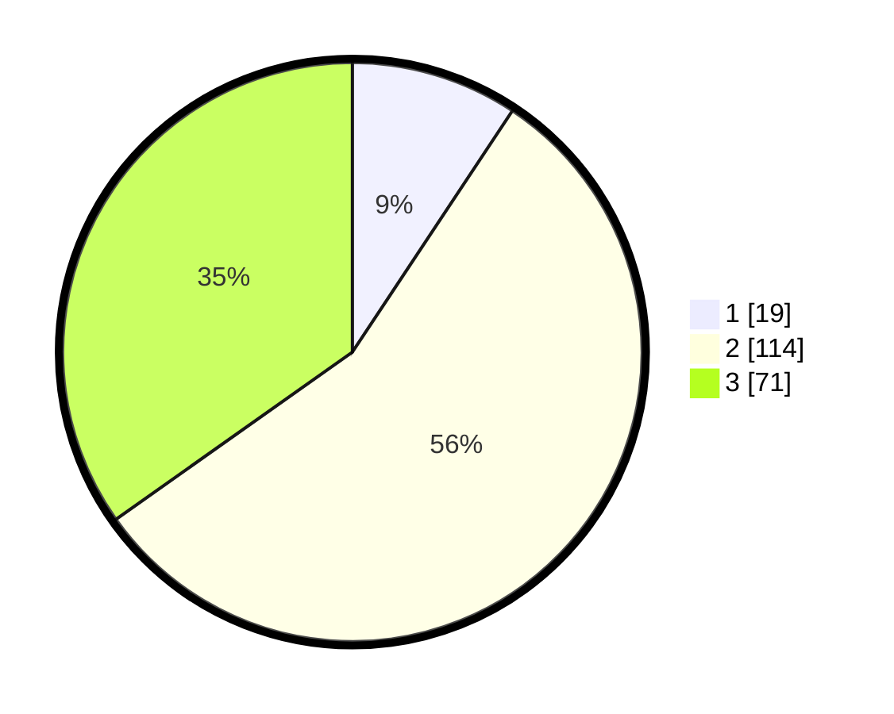

# Hasil

## Grafik

## Tabel

| No.    | Nama Paslon    | Suara | Suara (raw) | Persentase |
|:------ |:-------------- | -----:| -----------:| ----------:|
| 100025 | ANIES MUHAIMIN | 19    | [19][p-1]   | 9,31       |
| 100026 | PRABOWO GIBRAN | 114   | [114][p-2]  | 55,88      |
| 100027 | GANJAR MAHFUD  | 71    | [71][p-3]   | 34,80      |

[p-1]: https://github.com/gigit-pemilu/pemilu-2024/blob/main/pilpres/hitung-suara/sub/31-dki-jakarta/sub/72-jakarta-utara/sub/06-kelapa-gading/sub/1002-pegangsaan-dua/sub/167-tps/sub/paslon-1.txt
[p-2]: https://github.com/gigit-pemilu/pemilu-2024/blob/main/pilpres/hitung-suara/sub/31-dki-jakarta/sub/72-jakarta-utara/sub/06-kelapa-gading/sub/1002-pegangsaan-dua/sub/167-tps/sub/paslon-2.txt
[p-3]: https://github.com/gigit-pemilu/pemilu-2024/blob/main/pilpres/hitung-suara/sub/31-dki-jakarta/sub/72-jakarta-utara/sub/06-kelapa-gading/sub/1002-pegangsaan-dua/sub/167-tps/sub/paslon-3.txt

## Foto C Plano

https://sirekap-obj-formc.kpu.go.id/fbd7/pemilu/ppwp/31/72/06/10/02/3172061002167-20240214-215702--0d70c388-8bfe-4eb7-8ca8-7cc4530bd853.jpg

https://sirekap-obj-formc.kpu.go.id/fbd7/pemilu/ppwp/31/72/06/10/02/3172061002167-20240214-194122--f9a705e8-efaa-45e2-954c-def112b48374.jpg

https://sirekap-obj-formc.kpu.go.id/fbd7/pemilu/ppwp/31/72/06/10/02/3172061002167-20240214-194154--48a20726-fb7f-4688-be43-44b771e985f9.jpg

## Metadata

| Key        | Value               |
| ---------- | ------------------- |
| Time Stamp | 2024-02-15 07:00:44 |

