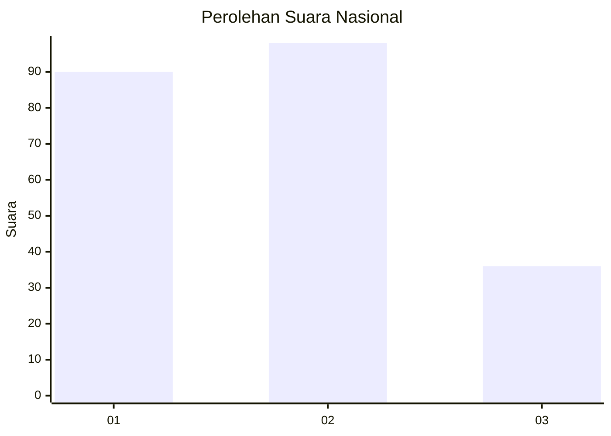
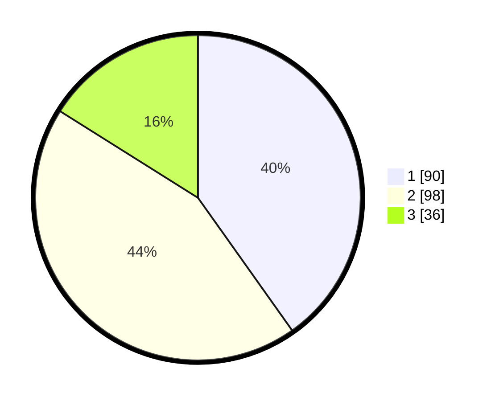

# Hasil

## Grafik

## Tabel

| No.    | Nama Paslon    | Suara | Suara (raw) | Persentase |
|:------ |:-------------- | -----:| -----------:| ----------:|
| 100025 | ANIES MUHAIMIN | 90    | [90][p-1]   | 40,18      |
| 100026 | PRABOWO GIBRAN | 98    | [98][p-2]   | 43,75      |
| 100027 | GANJAR MAHFUD  | 36    | [36][p-3]   | 16,07      |

[p-1]: https://github.com/gigit-pemilu/pemilu-2024/blob/main/pilpres/hitung-suara/sub/31-dki-jakarta/sub/72-jakarta-utara/sub/06-kelapa-gading/sub/1003-kelapa-gading-barat/sub/002-tps/sub/paslon-1.txt
[p-2]: https://github.com/gigit-pemilu/pemilu-2024/blob/main/pilpres/hitung-suara/sub/31-dki-jakarta/sub/72-jakarta-utara/sub/06-kelapa-gading/sub/1003-kelapa-gading-barat/sub/002-tps/sub/paslon-2.txt
[p-3]: https://github.com/gigit-pemilu/pemilu-2024/blob/main/pilpres/hitung-suara/sub/31-dki-jakarta/sub/72-jakarta-utara/sub/06-kelapa-gading/sub/1003-kelapa-gading-barat/sub/002-tps/sub/paslon-3.txt

## Foto C Plano

https://sirekap-obj-formc.kpu.go.id/451f/pemilu/ppwp/31/72/06/10/03/3172061003002-20240217-210411--bbd18c0c-3a6c-47dd-85fb-63a4f01aea67.jpg

https://sirekap-obj-formc.kpu.go.id/451f/pemilu/ppwp/31/72/06/10/03/3172061003002-20240217-210802--9844cb98-1efe-4c0c-8a99-ce33b88f0a99.jpg

https://sirekap-obj-formc.kpu.go.id/451f/pemilu/ppwp/31/72/06/10/03/3172061003002-20240217-210818--d75e5bb7-ef04-4c38-9e52-0cf941646ae9.jpg

## Metadata

| Key        | Value               |
| ---------- | ------------------- |
| Time Stamp | 2024-02-19 06:16:00 |

