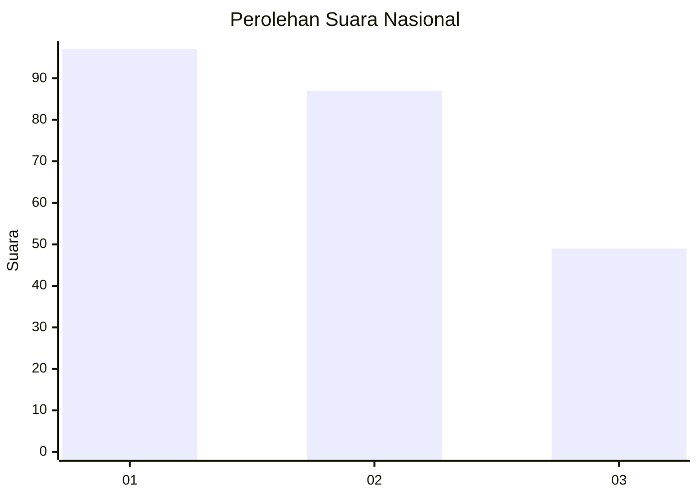
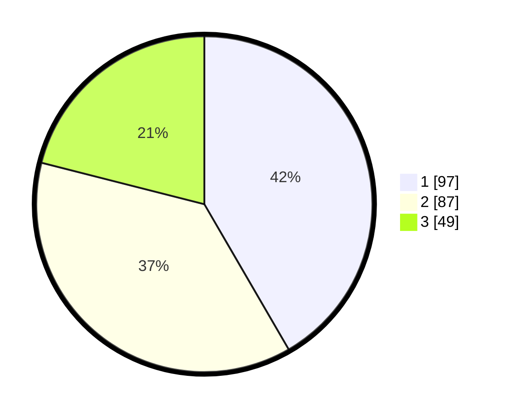

# Hasil

## Grafik

## Tabel

| No.    | Nama Paslon    | Suara | Suara (raw) | Persentase |
|:------ |:-------------- | -----:| -----------:| ----------:|
| 100025 | ANIES MUHAIMIN | 97    | [97][p-1]   | 41,63      |
| 100026 | PRABOWO GIBRAN | 87    | [87][p-2]   | 37,34      |
| 100027 | GANJAR MAHFUD  | 49    | [49][p-3]   | 21,03      |

[p-1]: https://github.com/gigit-pemilu/pemilu-2024/blob/main/pilpres/hitung-suara/sub/31-dki-jakarta/sub/72-jakarta-utara/sub/06-kelapa-gading/sub/1003-kelapa-gading-barat/sub/015-tps/sub/paslon-1.txt
[p-2]: https://github.com/gigit-pemilu/pemilu-2024/blob/main/pilpres/hitung-suara/sub/31-dki-jakarta/sub/72-jakarta-utara/sub/06-kelapa-gading/sub/1003-kelapa-gading-barat/sub/015-tps/sub/paslon-2.txt
[p-3]: https://github.com/gigit-pemilu/pemilu-2024/blob/main/pilpres/hitung-suara/sub/31-dki-jakarta/sub/72-jakarta-utara/sub/06-kelapa-gading/sub/1003-kelapa-gading-barat/sub/015-tps/sub/paslon-3.txt

## Foto C Plano

https://sirekap-obj-formc.kpu.go.id/8192/pemilu/ppwp/31/72/06/10/03/3172061003015-20240214-204506--70744578-ea88-4657-ba2c-b1ce7ea4d917.jpg

https://sirekap-obj-formc.kpu.go.id/8192/pemilu/ppwp/31/72/06/10/03/3172061003015-20240214-200838--c74ecd60-bdb8-44da-83d3-25550704bce0.jpg

https://sirekap-obj-formc.kpu.go.id/8192/pemilu/ppwp/31/72/06/10/03/3172061003015-20240214-200936--f3760d69-4a25-4ad1-931b-4882d7a22e3d.jpg

## Metadata

| Key        | Value               |
| ---------- | ------------------- |
| Time Stamp | 2024-02-20 16:00:00 |

