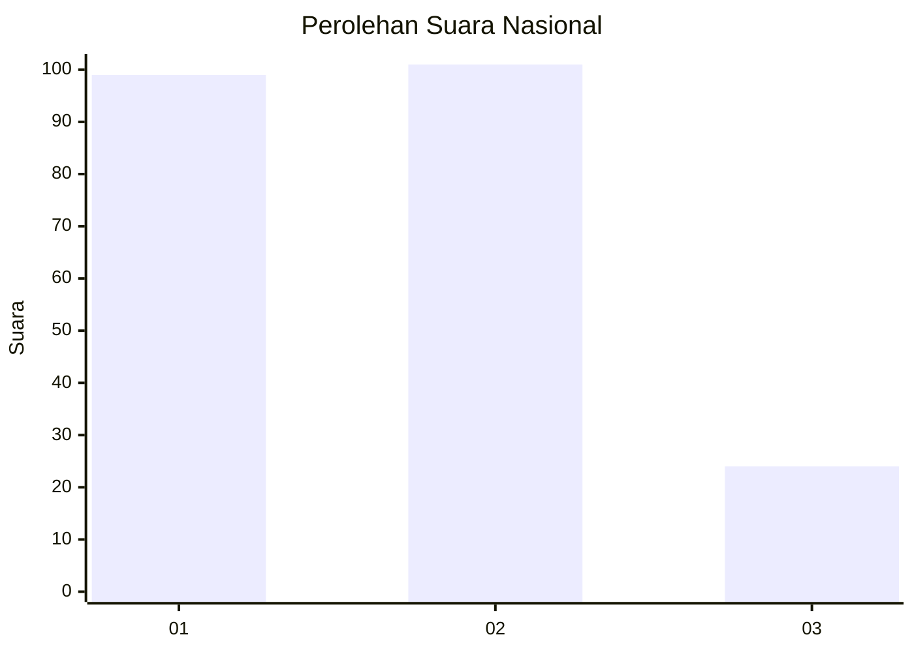
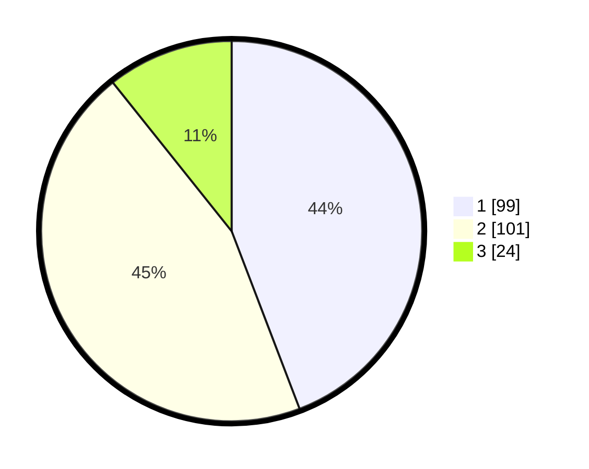

# Hasil

## Grafik

## Tabel

| No.    | Nama Paslon    | Suara | Suara (raw) | Persentase |
|:------ |:-------------- | -----:| -----------:| ----------:|
| 100025 | ANIES MUHAIMIN | 99    | [99][p-1]   | 44,20      |
| 100026 | PRABOWO GIBRAN | 101   | [101][p-2]  | 45,09      |
| 100027 | GANJAR MAHFUD  | 24    | [24][p-3]   | 10,71      |

[p-1]: https://github.com/gigit-pemilu/pemilu-2024/blob/main/pilpres/hitung-suara/sub/31-dki-jakarta/sub/72-jakarta-utara/sub/06-kelapa-gading/sub/1003-kelapa-gading-barat/sub/027-tps/sub/paslon-1.txt
[p-2]: https://github.com/gigit-pemilu/pemilu-2024/blob/main/pilpres/hitung-suara/sub/31-dki-jakarta/sub/72-jakarta-utara/sub/06-kelapa-gading/sub/1003-kelapa-gading-barat/sub/027-tps/sub/paslon-2.txt
[p-3]: https://github.com/gigit-pemilu/pemilu-2024/blob/main/pilpres/hitung-suara/sub/31-dki-jakarta/sub/72-jakarta-utara/sub/06-kelapa-gading/sub/1003-kelapa-gading-barat/sub/027-tps/sub/paslon-3.txt

## Foto C Plano

https://sirekap-obj-formc.kpu.go.id/8c9e/pemilu/ppwp/31/72/06/10/03/3172061003027-20240221-120112--b3ac52a5-915c-46b9-9063-eeabfb445a94.jpg

https://sirekap-obj-formc.kpu.go.id/8c9e/pemilu/ppwp/31/72/06/10/03/3172061003027-20240221-120153--bd5b374c-8f59-4970-a417-a492ab9eaf4b.jpg

https://sirekap-obj-formc.kpu.go.id/8c9e/pemilu/ppwp/31/72/06/10/03/3172061003027-20240221-120233--c71ea32f-7a3e-476b-b297-b30105ec6fc5.jpg

## Metadata

| Key        | Value               |
| ---------- | ------------------- |
| Time Stamp | 2024-02-21 20:00:00 |

