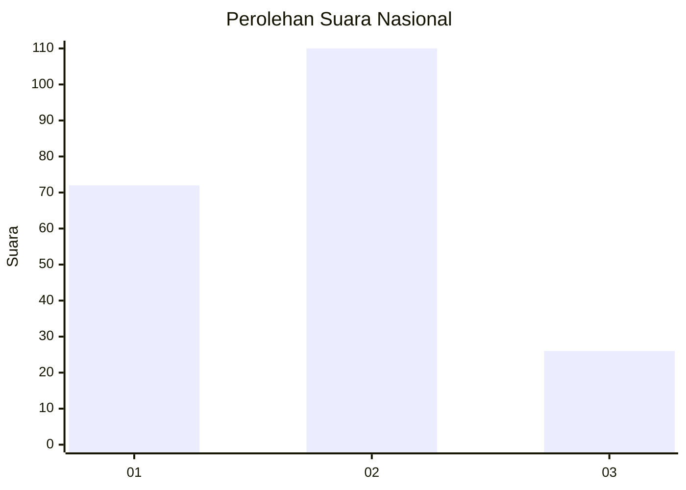
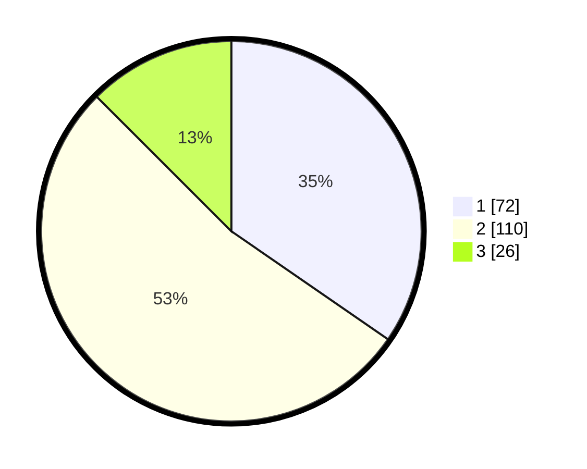

# Hasil

## Grafik

## Tabel

| No.    | Nama Paslon    | Suara | Suara (raw) | Persentase |
|:------ |:-------------- | -----:| -----------:| ----------:|
| 100025 | ANIES MUHAIMIN | 72    | [72][p-1]   | 34,62      |
| 100026 | PRABOWO GIBRAN | 110   | [110][p-2]  | 52,88      |
| 100027 | GANJAR MAHFUD  | 26    | [26][p-3]   | 12,50      |

[p-1]: https://github.com/gigit-pemilu/pemilu-2024/blob/main/pilpres/hitung-suara/sub/31-dki-jakarta/sub/72-jakarta-utara/sub/06-kelapa-gading/sub/1003-kelapa-gading-barat/sub/031-tps/sub/paslon-1.txt
[p-2]: https://github.com/gigit-pemilu/pemilu-2024/blob/main/pilpres/hitung-suara/sub/31-dki-jakarta/sub/72-jakarta-utara/sub/06-kelapa-gading/sub/1003-kelapa-gading-barat/sub/031-tps/sub/paslon-2.txt
[p-3]: https://github.com/gigit-pemilu/pemilu-2024/blob/main/pilpres/hitung-suara/sub/31-dki-jakarta/sub/72-jakarta-utara/sub/06-kelapa-gading/sub/1003-kelapa-gading-barat/sub/031-tps/sub/paslon-3.txt

## Foto C Plano

https://sirekap-obj-formc.kpu.go.id/e180/pemilu/ppwp/31/72/06/10/03/3172061003031-20240214-234353--9161817a-af03-4671-b7f9-cefedd246a60.jpg

https://sirekap-obj-formc.kpu.go.id/e180/pemilu/ppwp/31/72/06/10/03/3172061003031-20240214-235300--e5021caf-f8ee-478b-9fe9-aea5fe17f287.jpg

https://sirekap-obj-formc.kpu.go.id/e180/pemilu/ppwp/31/72/06/10/03/3172061003031-20240214-235354--1402ffd8-569c-4cf8-9394-084eb03c3960.jpg

## Metadata

| Key        | Value               |
| ---------- | ------------------- |
| Time Stamp | 2024-02-21 20:00:00 |

