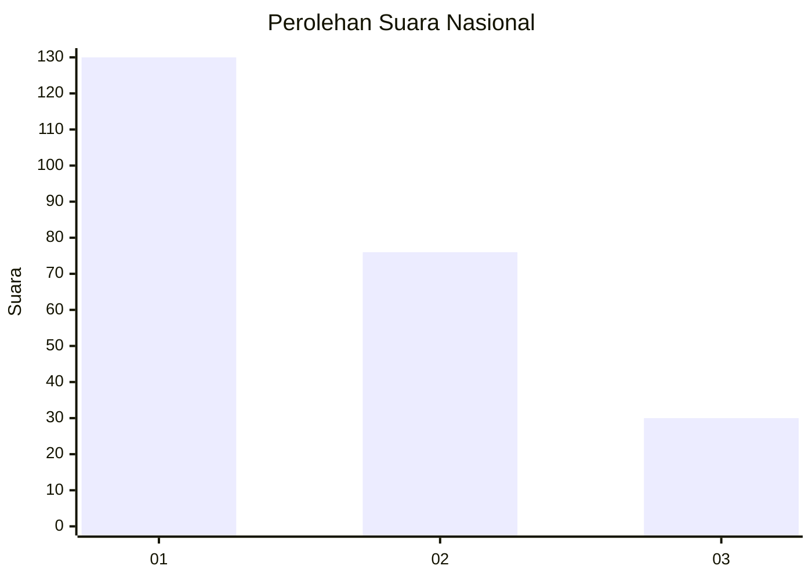
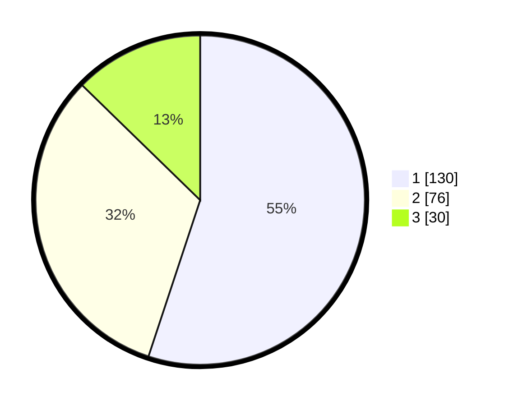

# Hasil

## Grafik

## Tabel

| No.    | Nama Paslon    | Suara | Suara (raw) | Persentase |
|:------ |:-------------- | -----:| -----------:| ----------:|
| 100025 | ANIES MUHAIMIN | 130   | [130][p-1]  | 55,08      |
| 100026 | PRABOWO GIBRAN | 76    | [76][p-2]   | 32,20      |
| 100027 | GANJAR MAHFUD  | 30    | [30][p-3]   | 12,71      |

[p-1]: https://github.com/gigit-pemilu/pemilu-2024/blob/main/pilpres/hitung-suara/sub/31-dki-jakarta/sub/72-jakarta-utara/sub/06-kelapa-gading/sub/1003-kelapa-gading-barat/sub/034-tps/sub/paslon-1.txt
[p-2]: https://github.com/gigit-pemilu/pemilu-2024/blob/main/pilpres/hitung-suara/sub/31-dki-jakarta/sub/72-jakarta-utara/sub/06-kelapa-gading/sub/1003-kelapa-gading-barat/sub/034-tps/sub/paslon-2.txt
[p-3]: https://github.com/gigit-pemilu/pemilu-2024/blob/main/pilpres/hitung-suara/sub/31-dki-jakarta/sub/72-jakarta-utara/sub/06-kelapa-gading/sub/1003-kelapa-gading-barat/sub/034-tps/sub/paslon-3.txt

## Foto C Plano

https://sirekap-obj-formc.kpu.go.id/ecde/pemilu/ppwp/31/72/06/10/03/3172061003034-20240215-161837--ad9e9f8c-3316-488c-9442-c4b909c41376.jpg

https://sirekap-obj-formc.kpu.go.id/ecde/pemilu/ppwp/31/72/06/10/03/3172061003034-20240215-161634--9e3d8d4d-26cd-4e8d-aadd-dfe906b5f6ef.jpg

https://sirekap-obj-formc.kpu.go.id/ecde/pemilu/ppwp/31/72/06/10/03/3172061003034-20240215-224201--e8d9f802-1503-44be-aac2-0dfd1f151ac2.jpg

## Metadata

| Key        | Value               |
| ---------- | ------------------- |
| Time Stamp | 2024-02-21 20:00:00 |

