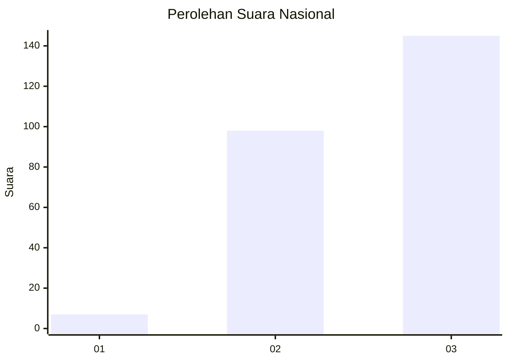
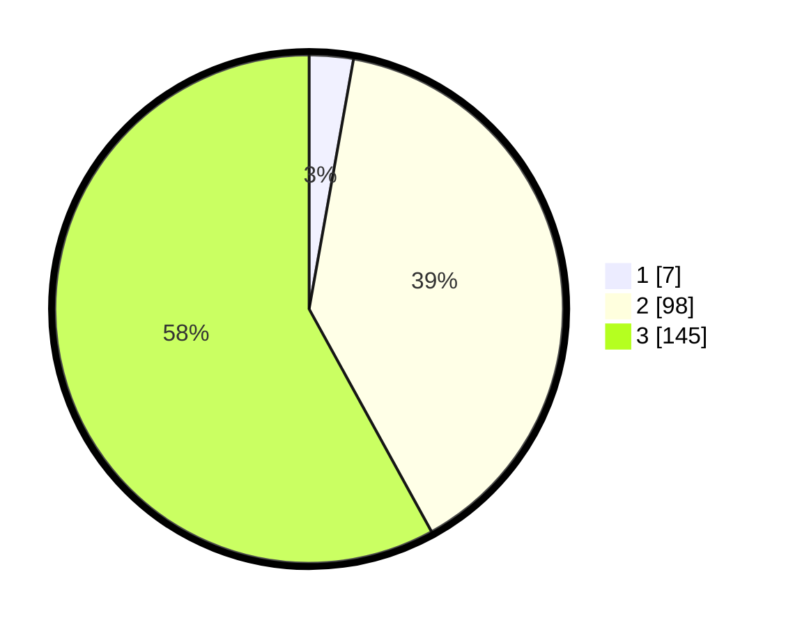

# Hasil

## Grafik

## Tabel

| No.    | Nama Paslon    | Suara | Suara (raw) | Persentase |
|:------ |:-------------- | -----:| -----------:| ----------:|
| 100025 | ANIES MUHAIMIN | 7     | [7][p-1]    | 2,80       |
| 100026 | PRABOWO GIBRAN | 98    | [98][p-2]   | 39,20      |
| 100027 | GANJAR MAHFUD  | 145   | [145][p-3]  | 58,00      |

[p-1]: https://github.com/gigit-pemilu/pemilu-2024/blob/main/pilpres/hitung-suara/sub/31-dki-jakarta/sub/72-jakarta-utara/sub/06-kelapa-gading/sub/1003-kelapa-gading-barat/sub/052-tps/sub/paslon-1.txt
[p-2]: https://github.com/gigit-pemilu/pemilu-2024/blob/main/pilpres/hitung-suara/sub/31-dki-jakarta/sub/72-jakarta-utara/sub/06-kelapa-gading/sub/1003-kelapa-gading-barat/sub/052-tps/sub/paslon-2.txt
[p-3]: https://github.com/gigit-pemilu/pemilu-2024/blob/main/pilpres/hitung-suara/sub/31-dki-jakarta/sub/72-jakarta-utara/sub/06-kelapa-gading/sub/1003-kelapa-gading-barat/sub/052-tps/sub/paslon-3.txt

## Foto C Plano

https://sirekap-obj-formc.kpu.go.id/d54a/pemilu/ppwp/31/72/06/10/03/3172061003052-20240222-124619--458a5cc3-68b5-4195-866a-aea0d7ab1400.jpg

https://sirekap-obj-formc.kpu.go.id/d54a/pemilu/ppwp/31/72/06/10/03/3172061003052-20240222-124548--6c32998e-a54e-41b9-97c7-02bdbb577900.jpg

https://sirekap-obj-formc.kpu.go.id/d54a/pemilu/ppwp/31/72/06/10/03/3172061003052-20240222-124414--abf33f49-0a38-461b-a27f-c8dbfbfc538f.jpg

## Metadata

| Key        | Value               |
| ---------- | ------------------- |
| Time Stamp | 2024-02-22 14:00:00 |

