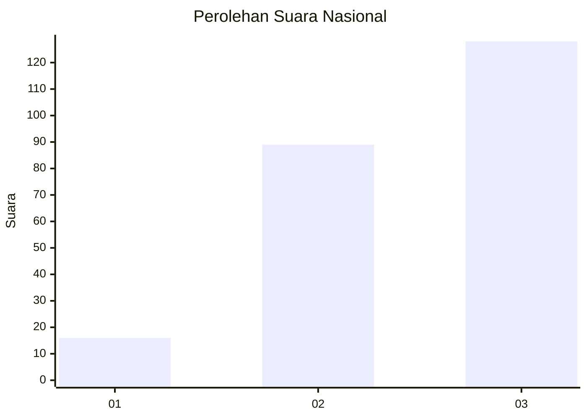
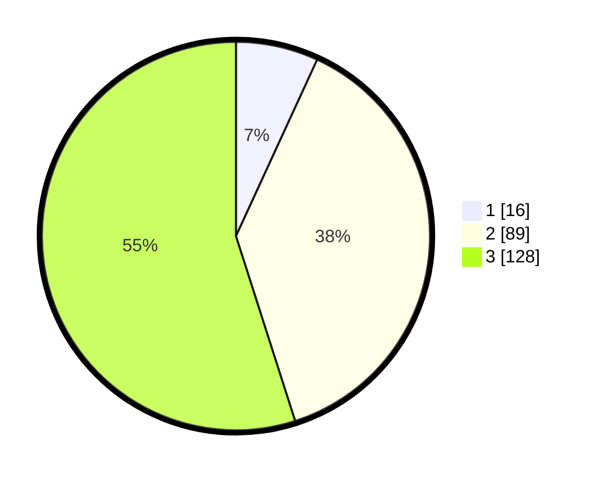

# Hasil

## Grafik

## Tabel

| No.    | Nama Paslon    | Suara | Suara (raw) | Persentase |
|:------ |:-------------- | -----:| -----------:| ----------:|
| 100025 | ANIES MUHAIMIN | 16    | [16][p-1]   | 6,87       |
| 100026 | PRABOWO GIBRAN | 89    | [89][p-2]   | 38,20      |
| 100027 | GANJAR MAHFUD  | 128   | [128][p-3]  | 54,94      |

[p-1]: https://github.com/gigit-pemilu/pemilu-2024/blob/main/pilpres/hitung-suara/sub/31-dki-jakarta/sub/72-jakarta-utara/sub/06-kelapa-gading/sub/1003-kelapa-gading-barat/sub/053-tps/sub/paslon-1.txt
[p-2]: https://github.com/gigit-pemilu/pemilu-2024/blob/main/pilpres/hitung-suara/sub/31-dki-jakarta/sub/72-jakarta-utara/sub/06-kelapa-gading/sub/1003-kelapa-gading-barat/sub/053-tps/sub/paslon-2.txt
[p-3]: https://github.com/gigit-pemilu/pemilu-2024/blob/main/pilpres/hitung-suara/sub/31-dki-jakarta/sub/72-jakarta-utara/sub/06-kelapa-gading/sub/1003-kelapa-gading-barat/sub/053-tps/sub/paslon-3.txt

## Foto C Plano

https://sirekap-obj-formc.kpu.go.id/b30b/pemilu/ppwp/31/72/06/10/03/3172061003053-20240214-191606--b1c22b5f-eb47-4dd8-abd2-25e50a57558b.jpg

https://sirekap-obj-formc.kpu.go.id/b30b/pemilu/ppwp/31/72/06/10/03/3172061003053-20240214-191648--bd0ebc90-4a9c-49ec-9bbb-d51f432a86df.jpg

https://sirekap-obj-formc.kpu.go.id/b30b/pemilu/ppwp/31/72/06/10/03/3172061003053-20240214-191722--f7fc9d52-0c87-47fb-9583-28aecfc57b8b.jpg

## Metadata

| Key        | Value               |
| ---------- | ------------------- |
| Time Stamp | 2024-02-21 21:00:04 |

