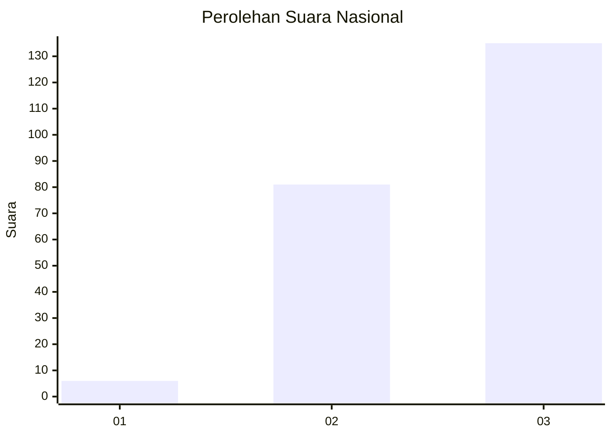
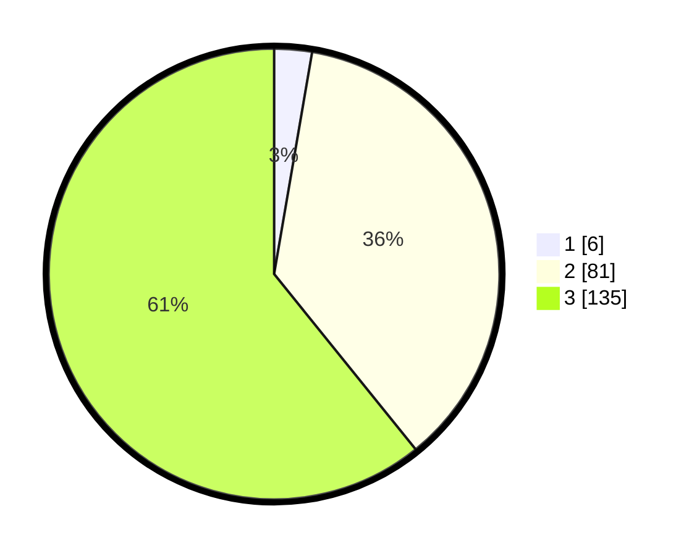

# Hasil

## Grafik

## Tabel

| No.    | Nama Paslon    | Suara | Suara (raw) | Persentase |
|:------ |:-------------- | -----:| -----------:| ----------:|
| 100025 | ANIES MUHAIMIN | 6     | [6][p-1]    | 2,70       |
| 100026 | PRABOWO GIBRAN | 81    | [81][p-2]   | 36,49      |
| 100027 | GANJAR MAHFUD  | 135   | [135][p-3]  | 60,81      |

[p-1]: https://github.com/gigit-pemilu/pemilu-2024/blob/main/pilpres/hitung-suara/sub/31-dki-jakarta/sub/72-jakarta-utara/sub/06-kelapa-gading/sub/1003-kelapa-gading-barat/sub/055-tps/sub/paslon-1.txt
[p-2]: https://github.com/gigit-pemilu/pemilu-2024/blob/main/pilpres/hitung-suara/sub/31-dki-jakarta/sub/72-jakarta-utara/sub/06-kelapa-gading/sub/1003-kelapa-gading-barat/sub/055-tps/sub/paslon-2.txt
[p-3]: https://github.com/gigit-pemilu/pemilu-2024/blob/main/pilpres/hitung-suara/sub/31-dki-jakarta/sub/72-jakarta-utara/sub/06-kelapa-gading/sub/1003-kelapa-gading-barat/sub/055-tps/sub/paslon-3.txt

## Foto C Plano

https://sirekap-obj-formc.kpu.go.id/98fe/pemilu/ppwp/31/72/06/10/03/3172061003055-20240214-214211--f944a260-fee5-442f-814f-2b2e87bc8bc9.jpg

https://sirekap-obj-formc.kpu.go.id/98fe/pemilu/ppwp/31/72/06/10/03/3172061003055-20240214-201944--daa67a1f-3c77-4a76-9768-8fcce5090c1c.jpg

https://sirekap-obj-formc.kpu.go.id/98fe/pemilu/ppwp/31/72/06/10/03/3172061003055-20240214-202101--53d7049e-d27c-4560-a8d9-a4e290794776.jpg

## Metadata

| Key        | Value               |
| ---------- | ------------------- |
| Time Stamp | 2024-02-21 14:00:00 |

